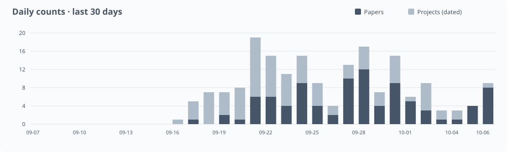
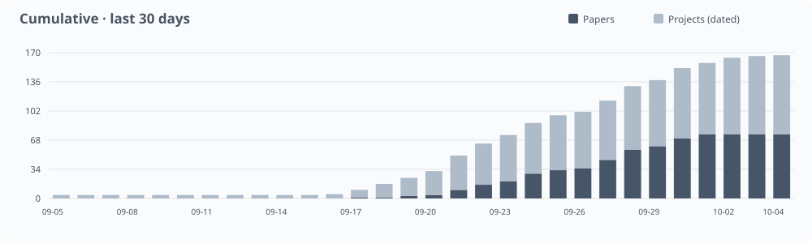

<p align="center"></p>

<p align="center"><a href="https://dongtsi.github.io/awesome-trustworthy-jev/?lang=en"></a></p>

<p align="center">Search papers · Filter resources · Explore charts</p>

[](https://awesome.re)

[English](README.md) · [Chinese](README.zh-CN.md)

Papers, models, projects and documentation on Jev foundations, trustworthiness, and cybersecurity applications.

`382` resources · `106` papers · `243` projects · `23` official documents · `10` articles

**[Explore the Web Library →](https://dongtsi.github.io/awesome-trustworthy-jev/?lang=en)** · [Daily papers](daily/README.md) · [RSS](feed.xml) · [Contributing](CONTRIBUTING.md)

**For AI agents**: [Read & contribute](AGENTS.md) ([Catalog](data/catalog.json) · [Taxonomy](data/taxonomy.json))

## Contents

- [Research library](#research)
  - [Foundations](#foundations)
    - [Architecture & Training](#architecture--training)
    - [Decision Interfaces](#decision-interfaces)
    - [Inference & Efficiency](#inference--efficiency)
    - [Decision Frameworks](#decision-frameworks)
  - [Trustworthiness](#trustworthiness)
    - [Security](#security)
    - [Safety](#safety)
    - [Reliability](#reliability)
    - [Privacy](#privacy)
    - [Fairness](#fairness)
    - [Transparency & Accountability](#transparency--accountability)
  - [Cybersecurity Applications](#applications)
    - [Agent & Tool Security](#agent--tool-security)
    - [Code & Supply-chain Security](#code--supply-chain-security)
    - [Intrusion & Anomaly Detection](#intrusion--anomaly-detection)
    - [Phishing & Fraud Detection](#phishing--fraud-detection)
    - [Access Control](#access-control)
    - [Industrial & Infrastructure Security](#industrial--infrastructure-security)
    - [Security Operations](#security-operations)
- [Open models](#open-models)
- [Datasets and benchmarks](#datasets)
- [Daily updates and activity](#activity)
- [Contributing](#contributing)
- [Citation](#citation)
- [Related lists](#related)
- [License](#license)

<a id="research"></a>

## Research library

<a id="foundations"></a>

<details open>
<summary><strong>Foundations</strong></summary>

<a id="foundations-architecture"></a>

### Architecture & Training

- [Bongard: Training Machine Intuition](https://arxiv.org/abs/2609.39111) — Trains an open System One model with outcome feedback. `Method` · [PDF](https://arxiv.org/pdf/2609.39111v1)
- [OpenJev-RLCD: A Working RLCD Implementation](https://arxiv.org/abs/2609.38850) — Implements a third-party calibrated-decision reinforcement objective. `Method` · [PDF](https://arxiv.org/pdf/2609.38850v1) · [Code](https://github.com/ZimmyGao/openjev-rlcd)
- [Chinese-Jev: Bringing System One Model to Chinese-Language Tasks](https://arxiv.org/abs/2609.36965) — Develops a System One model for Chinese-language tasks. `Method` · [PDF](https://arxiv.org/pdf/2609.36965v1)
- [LAVOIR: Teaching a Single-Pass Decision Encoder When and What to Ask with Amortized Value of Information](https://arxiv.org/abs/2609.30706) — Learns which missing information is worth asking for. `Method` · [PDF](https://arxiv.org/pdf/2609.30706v1)
- [Universal Fractal Natural Language Decision Map: Real-Time Edge Triage Across Heterogeneous Domains](https://arxiv.org/abs/2609.25498) — Reports an alternative edge decision implementation and benchmark comparison. `Method` · [PDF](https://arxiv.org/pdf/2609.25498v2)
- [this-that-model-1.0: A typed decision model that decides in 30 ms, for a millionth of a cent](https://arxiv.org/abs/2609.23886) — Provides an open model with a native typed decision interface. `Method` · [PDF](https://arxiv.org/pdf/2609.23886v1)
- [Dyad: Extending Large Language Models with Native Typed Decision-Making](https://arxiv.org/abs/2609.36116) — Adds an action-description encoder to an LLM and evaluates frozen-backbone and joint reinforcement learning for typed decisions. `Evaluation` · [PDF](https://arxiv.org/pdf/2609.36116v1)
- [OmniMed-Jev: Calibrating LVLM Confidence for Trustworthy Medical Multimodal Decisions via System One](https://arxiv.org/abs/2610.00381) — Studies candidate-conditioned multimodal decisions against a matched generative baseline, reporting improved calibration with task-dependent accuracy trade-offs. `Evaluation` · [PDF](https://arxiv.org/pdf/2610.00381v1)
- [Tron-1B: Fast, Calibrated Typed Decisions with a Set-Attention Option Head](https://zenodo.org/records/23066522) — Introduces a bidirectional encoder with a set-attention option head; benchmark-trained results are compared with a zero-shot hosted service. `Model` · [PDF](https://zenodo.org/api/records/23066522/files/tron-1b-paper.pdf/content)
- [ufakzeka-karar: An Open Turkish Typed-Decision Model with Order-Invariant Option Scoring](https://arxiv.org/abs/2610.06744) — Scores Turkish answer options independently at shared positions to remove order effects; supervised training beats the tested REINFORCE variant, while temperature calibration degrades on held-out question types. `Evaluation` · [PDF](https://arxiv.org/pdf/2610.06744v1)
- [SanSi: A Looped Typed Decision Model for System 1.5 Thinking](https://arxiv.org/abs/2610.07730) — Trains typed readouts after repeated backbone loops; eight loops improve accuracy at fixed model shape, but cost more compute and calibrate worse than three loops. `Evaluation` · [PDF](https://arxiv.org/pdf/2610.07730v1)
- [Visual Jev Rewards: Reference-Bound Verification for Multi-Subject Image Generation](https://arxiv.org/abs/2610.09328) — Trains a local Qwen verifier for joint reference identity and image conditions, then averages binary probabilities as an image-generation reward. `Evaluation` · [PDF](https://arxiv.org/pdf/2610.09328v1)
- [MetaEncoder: Exploring the Limit of Bi-Encoders for Multimodal System One Decision Making with Natural Language Interface](https://arxiv.org/abs/2610.11316) — Trains a multimodal bi-encoder with request-to-candidate contrastive learning; including options in requests improves closed-set decisions while retaining cached candidate embeddings. `Evaluation` · [PDF](https://arxiv.org/pdf/2610.11316v1)

**Projects and resources**

- [takzen/kanari-decision-bench](https://github.com/takzen/kanari-decision-bench) — Can a small typed-decision model judge a chatbot security audit? Jev vs open models on Polish chatbot answers. `Tool · Evaluation`
- [agrogov/jev-system-one-study](https://github.com/agrogov/jev-system-one-study) — Black-box study of Jev plus controlled replays of the same ~8,300-request suites against open models Laya and SemIf (Qwen3.5-4B). `Tool`
- [alperiox/audio-jevlike](https://github.com/alperiox/audio-jevlike) — Audio-native 'System One' reproduction (Prosodia). `Tool`
- [convaiinnovations/laya](https://huggingface.co/convaiinnovations/laya) — Scores typed questions with a non-autoregressive encoder and decision head. `Model`
- [convaiinnovations/laya-multilingual](https://huggingface.co/convaiinnovations/laya-multilingual) — Uses a multilingual encoder for typed decisions across languages. `Model`
- [convaiinnovations/laya-typed-decisions](https://huggingface.co/convaiinnovations/laya-typed-decisions) — Fine-tunes Laya for service, invoice, agent-trace and security-incident decisions. `Model`
- [AlexWortega/openjev](https://huggingface.co/AlexWortega/openjev) — Uses Qwen-based entailment scoring for candidate ranking and typed decisions. `Model`
- [Contrastive-LM/CLM-v0.1-8B](https://huggingface.co/Contrastive-LM/CLM-v0.1-8B) — Learns state and action projection heads on a frozen encoder, allowing candidate embeddings to be cached. `Model`
- [akhilaaa3/Jev-Omni](https://huggingface.co/akhilaaa3/Jev-Omni) — Scores candidate answers from text, images, audio and video using a multimodal decision classifier. `Model`
- [SupersonicLabs/Julia-1](https://huggingface.co/SupersonicLabs/Julia-1) — Provides a compact multilingual checkpoint for choices, Boolean decisions and ordered scores. `Model`
- [interfaze-ai/lev](https://huggingface.co/interfaze-ai/lev) — Adds a typed-decision LoRA adapter to Qwen with a Jev-compatible serving interface. `Model`
- [cua-ai/cua-s1-forms](https://huggingface.co/cua-ai/cua-s1-forms) — Uses a small option scorer to select form actions; execution order is handled by external code. `Model`
- [AgentBull/bongard-mini](https://huggingface.co/AgentBull/bongard-mini) — Uses an encoder-decoder backbone to score multiple text or image decisions from a shared context. `Model`
- [flock-io/this-that-model-1.2](https://huggingface.co/flock-io/this-that-model-1.2) — Makes typed decisions in one pass, with evaluations of composed rules and wording changes. `Model`
- [autotrust/JEV-9B](https://huggingface.co/autotrust/JEV-9B) — Distills typed-decision distributions from a Jev teacher while retaining a separate generation path. `Model`
- [autotrust/JEV-27B](https://huggingface.co/autotrust/JEV-27B) — Scales the teacher-distilled decision model with separate decision and generation paths. `Model`
- [autotrust/JEV-27B-VL](https://huggingface.co/autotrust/JEV-27B-VL) — Extends the decision interface to image-conditioned questions alongside text generation. `Model`
- [ZefanCai/Open-Jev-2B](https://huggingface.co/ZefanCai/Open-Jev-2B) — Pairs a Qwen LoRA adapter with a scalar decision head for caller-supplied candidates. `Model`
- [ZefanCai/Open-Jev-9B](https://huggingface.co/ZefanCai/Open-Jev-9B) — Provides a larger adapter and decision head for choice, Boolean and ordinal questions. `Model`
- [ZefanCai/Open-Jev-27B-v1.1](https://huggingface.co/ZefanCai/Open-Jev-27B-v1.1) — Releases a trained adapter and scalar head with separate in-distribution and out-of-distribution evaluations. `Model`
- [Maincode/matilda-jev-v1](https://huggingface.co/Maincode/matilda-jev-v1) — Bundles a backbone and decision readout for typed questions over text, JSON and optional images. `Model`
- [TokenRhythm/NeoHorse-Jev-4B](https://huggingface.co/TokenRhythm/NeoHorse-Jev-4B) — Uses prefill-only inference for choices, Boolean decisions and scores in agent workflows. `Model`
- [tasksource/tasksource-jev-nano-v0](https://huggingface.co/tasksource/tasksource-jev-nano-v0) — Uses token-level late interaction to reuse state representations and score variable candidate sets. `Model`
- [HIT-TMG/JevEmbed-Qwen3-Embedding-0.6B](https://huggingface.co/HIT-TMG/JevEmbed-Qwen3-Embedding-0.6B) — Fine-tunes an embedding model for typed decisions using a separate prompting and scoring layer. `Model`
- [chaoliangUNSW/Jev-Style-2B-Decision-v3](https://huggingface.co/chaoliangUNSW/Jev-Style-2B-Decision-v3) — Provides a local decision checkpoint and runtime with a System One-compatible API. `Model`
- [tarsur385/djev-distill-v4](https://huggingface.co/tarsur385/djev-distill-v4) — Distills longer reasoning distributions into one-step typed decisions on DiffusionGemma. `Model`
- [Camellia86/Canopy-Jev-27B](https://huggingface.co/Camellia86/Canopy-Jev-27B) — Publishes an adapter and probability prior for shared-prefix, isolated-branch decisions on a frozen Qwen3.8-27B backbone; benchmark scores are model-card claims. `Model`
- [nickprock/archai-jev-zagreus-0.4b-ita](https://huggingface.co/nickprock/archai-jev-zagreus-0.4b-ita) — Releases an Italian 0.4B decision adapter trained with cross-entropy and Brier loss; reported calibration and latency require independent evaluation. `Model`
- [shgao/rsi-jev-v5.0-vl-3b](https://huggingface.co/shgao/rsi-jev-v5.0-vl-3b) — Releases a self-contained multimodal typed-decision checkpoint using 20 Qwen3.5-4B layers, an option head and calibration tensors. `Model`
- [BricksDisplay/jevling-e2b-v1](https://huggingface.co/BricksDisplay/jevling-e2b-v1) — Publishes a Gemma-based checkpoint for parallel typed decisions with folded temperature scaling; reported Chinese kiosk evaluation uses synthetic-derived data. `Model`

(See also: [LLM2Jev](https://arxiv.org/abs/2610.02076) · [PACT](https://arxiv.org/abs/2609.35865) · [PixelJev](https://arxiv.org/abs/2609.29283) · [laya-jev-eval](https://github.com/yuvrajrox/laya-jev-eval) · [jev-vs-ml](https://github.com/vianaR25/jev-vs-ml) · [jevlike](https://github.com/mustafasemi-ai/jevlike) · [SecJev](https://arxiv.org/abs/2610.03073))

<a id="foundations-interfaces"></a>

### Decision Interfaces

- [LLM2Jev: LLMs Are Already Jev-Style Decision Models -- When and How to Fine-Tune Them](https://arxiv.org/abs/2610.02076) — Studies when existing LLMs already support Jev-style decisions. `Evaluation` · [PDF](https://arxiv.org/pdf/2610.02076v1)
- [Benchmarking System One decision models against trained classifiers and language models for automated decision gates](https://arxiv.org/abs/2610.00346) — Compares typed models, trained classifiers and LLM readouts under matched requests. `Evaluation` · [PDF](https://arxiv.org/pdf/2610.00346v1)
- [Koa-action: Fast and Consistent Structured Decision Making with Generative LLMs](https://arxiv.org/abs/2609.36115) — Uses atomic output tokens for fast structured decisions. `Method` · [PDF](https://arxiv.org/pdf/2609.36115v1)
- [From Text Decisions to Pixels: An Study of Jev-Style Visual Choice Model](https://arxiv.org/abs/2609.29283) — Studies visual choice readouts with matched generation baselines. `Method` · [PDF](https://arxiv.org/pdf/2609.29283v1)
- [Jev in Practice: A Composable Python Toolkit for TypeSafe’s System One Decision Model](https://zenodo.org/records/22921974) — Provides composable tooling, calibration utilities and recorded API experiments. `Tool` · [PDF](https://zenodo.org/api/records/22921974/files/daf-jev_combined.pdf/content)
- [NumericJev: Jev-like LLM Numerical Decoding with Multiway Decision Trees](https://arxiv.org/abs/2609.28587) — Uses multiway decision trees for numerical readout. `Method` · [PDF](https://arxiv.org/pdf/2609.28587v1)
- [AnyJev Technical Report](https://arxiv.org/abs/2610.00831) — Reads option probabilities from pretrained LLMs and corrects label and position bias with prior normalization and cyclic option rotations. `Evaluation` · [PDF](https://arxiv.org/pdf/2610.00831v1)
- [System One Models for Wireless Decision-Making:Applications and Performance Evaluation](https://arxiv.org/abs/2610.04345) — Measures the quality/latency trade-off in antenna selection and RAN slicing: Jev responds faster, while utility gains depend on the task and execution costs. `Evaluation` · [PDF](https://arxiv.org/pdf/2610.04345v1)

**Projects and resources**

- [dtduc-git/jevnav](https://github.com/dtduc-git/jevnav) — Browser-automation tool using Jev to pick page elements, with several small measured benchmarks. `Tool · Evaluation`
- [simonmesmith/jev-arc-agi-v1-experiment](https://github.com/simonmesmith/jev-arc-agi-v1-experiment) — Jev fully solved 4/400 ARC-AGI-1 public eval tasks (1.125% score) via per-cell Choice decisions, at $2.32 total cost. `Tool · Evaluation`
- [Introducing System One Models & Jev](https://typesafe.ai/blog/introducing-system-one-models-and-jev) — Official launch, RLCD claims, workflow evaluation and stated limitations. `Documentation`
- [TypeSafe · noul](https://docs.typesafe.ai/primitives/noul.md) — Official interface documentation and deployment guidance. `Documentation`
- [PerryLink/llm-jev-laya-bench](https://github.com/PerryLink/llm-jev-laya-bench) — Research paper/artifact: Jev and Laya as judgment layers score 0.225-0.90 on a 77-class battery; both fail tasks needing absence-detection. `Tool`
- [evals.typesafe.ai](https://evals.typesafe.ai) — TypeSafe's four-workflow comparison of Jev against frontier models, 61.7% to 76.0% agreement. `Documentation`
- [TypeSafe · citation_check](https://docs.typesafe.ai/cookbooks/citation_check.md) — Official interface documentation and deployment guidance. `Documentation`
- [TypeSafe · choice](https://docs.typesafe.ai/primitives/choice.md) — Official interface documentation and deployment guidance. `Documentation`
- [gdchaochao/lunar-terminal](https://github.com/gdchaochao/lunar-terminal) — Measured 327 randomized Robocode decisions show Jev's action choice near-random (Pearson r=-0.099) while its yes/no judgments score 0.94-0.96 on atomic questions. `Tool · Evaluation`
- [TypeSafe · fan-out](https://docs.typesafe.ai/patterns/fan-out.md) — Official interface documentation and deployment guidance. `Documentation`
- [jev-typesafe-system-one-model-benchmark-2026](https://thoughts.jock.pl/p/jev-typesafe-system-one-model-benchmark-2026) — 40 hand-labeled tickets, routing, urgency and anger, against Haiku, Fable, Astra and Gemini Flash. `Analysis · Evaluation`
- [TypeSafe · legal](https://docs.typesafe.ai/legal.md) — Official interface documentation and deployment guidance. `Documentation`
- [TypeSafe · sdk](https://docs.typesafe.ai/sdk.md) — Official interface documentation and deployment guidance. `Documentation`
- [TypeSafe · score](https://docs.typesafe.ai/primitives/score.md) — Official interface documentation and deployment guidance. `Documentation`
- [TypeSafe · system-one](https://docs.typesafe.ai/concepts/system-one.md) — Official interface documentation and deployment guidance. `Documentation`
- [TypeSafe · primitives](https://docs.typesafe.ai/primitives.md) — Official interface documentation and deployment guidance. `Documentation`
- [TypeSafe · state](https://docs.typesafe.ai/concepts/state.md) — Official interface documentation and deployment guidance. `Documentation`
- [TypeSafe · sde_cascade](https://docs.typesafe.ai/cookbooks/sde_cascade.md) — Official interface documentation and deployment guidance. `Documentation`
- [TypeSafe · models](https://docs.typesafe.ai/models.md) — Official interface documentation and deployment guidance. `Documentation`
- [TypeSafe · api](https://docs.typesafe.ai/api.md) — Official interface documentation and deployment guidance. `Documentation`
- [TypeSafe · how-to-build-with-system-one](https://docs.typesafe.ai/concepts/how-to-build-with-system-one.md) — Official interface documentation and deployment guidance. `Documentation`
- [TypeSafe · introduction](https://docs.typesafe.ai/introduction.md) — Official interface documentation and deployment guidance. `Documentation`

(See also: [calfram-bench](https://github.com/lorenzofamiglini/calfram-bench) · [Traffic Classification](https://arxiv.org/abs/2610.00376) · [Ordinal Bias](https://arxiv.org/abs/2609.38827) · [jev-dice](https://github.com/pobooo/jev-dice) · [JET](https://arxiv.org/abs/2609.33874) · [zh-decision-bench](https://github.com/CodyQin/zh-decision-bench) · [jevbench](https://github.com/GautamTalksDev/jevbench) · [Early Evidence Audit](https://arxiv.org/abs/2609.32160) · [JevOut](https://github.com/xzx34/JevOut) · [jev-field-report](https://github.com/manankumarthakkar/jev-field-report) · [jev-escalation-gate](https://github.com/manankumarthakkar/jev-escalation-gate) · [Jev in the Wild](https://arxiv.org/abs/2609.30216) · [Private Edge](https://papers.ssrn.com/sol3/papers.cfm?abstract_id=7500140) · [Jev-Persian-Benchmark](https://github.com/ArmanJR/Jev-Persian-Benchmark) · [Visual Jev](https://arxiv.org/abs/2609.25845) · [typesafe-ai-jev-example](https://github.com/ItBayMax/typesafe-ai-jev-example) · [jevshield](https://github.com/lgy1027/jevshield) · [this-that-model](https://arxiv.org/abs/2609.23886) · [jev-as-a-judge](https://github.com/danielgshea/jev-as-a-judge) · [jev-guard](https://github.com/leepokai/jev-guard) · [can-you-trust-jev-confidence](https://anth.us/blog/can-you-trust-jev-confidence) · [typesafe-jev-pre-registered-test](https://primeline.cc/blog/typesafe-jev-pre-registered-test) · [jev-arena](https://github.com/meetr1912/jev-arena) · [jev-noul-vs-choice](https://github.com/TakumiNoguchi2004/jev-noul-vs-choice) · [jev-deterministic-benchmark](https://github.com/etsabary/jev-deterministic-benchmark) · [jev-playground](https://github.com/kobashi/jev-playground) · [jev-audit](https://github.com/phuthuycoding/jev-audit) · [browser-jev](https://github.com/DowLucas/browser-jev) · [jev-synthetic-survey](https://github.com/jjd-lab/jev-synthetic-survey) · [jev-heart-risk-bench](https://github.com/rubinagentagi-tech/jev-heart-risk-bench) · [jev-behavior-study](https://github.com/RINNECODER/jev-behavior-study) · [jev-calibrate](https://github.com/smkrv/jev-calibrate) · [structured-decision-bench](https://github.com/zhengbangbo/structured-decision-bench) · [opencode-jev-compaction](https://github.com/JLegends/opencode-jev-compaction) · [jevfuzz](https://github.com/yottayoshida/jevfuzz) · [Jev-Calibration](https://github.com/AnthusAI/Jev-Calibration) · [jev-skills](https://github.com/WanLanglin/jev-skills) · [jev-probability-experiment](https://github.com/simonmesmith/jev-probability-experiment) · [jev-biomedical-evidence-screening](https://github.com/cx295410-dot/jev-biomedical-evidence-screening) · [Dyad](https://arxiv.org/abs/2609.36116) · [Calibration composition](https://zenodo.org/records/23064668) · [GraphDecide](https://arxiv.org/abs/2610.06354) · [HVAC reasoning and shift](https://arxiv.org/abs/2610.09937) · [MetaEncoder](https://arxiv.org/abs/2610.11316) · [JevKT cold-start evaluation](https://arxiv.org/abs/2610.11135))

<a id="foundations-inference"></a>

### Inference & Efficiency

- [JET: Justification Evaluation in Transformer](https://arxiv.org/abs/2609.33874) — Tests local candidate-likelihood inference with shared computation. `Method` · [PDF](https://arxiv.org/pdf/2609.33874v2)
- [Harness Tokenomics: A Router for the Enterprise Agentic Control Plane](https://arxiv.org/abs/2609.28919) — Models routing economics with session-level cache effects. `Analysis` · [PDF](https://arxiv.org/pdf/2609.28919v2)
- [Visual Jev: Accurate and Efficient Decisions from Shared Visual Context](https://arxiv.org/abs/2609.25845) — Compares visual decision heads with matched generation baselines. Shared computation improves efficiency, while dedicated heads do not consistently improve accuracy. `Evaluation` · [PDF](https://arxiv.org/pdf/2609.25845v1)
- [Agent in a Bottle: Can LLM Agents Turn Their Capabilities Into Cheap, Scalable Artifacts?](https://arxiv.org/abs/2610.08775) — Benchmarks agents that build reusable artifacts for large workloads; most runs lose quality relative to zero-shot calls, while selected artifacts approach Jev at lower projected API cost. `Evaluation` · [PDF](https://arxiv.org/pdf/2610.08775v1) · [Code](https://github.com/aktsonthalia/bottled)
- [Readout Stability in Prefill-Only Decision Models:Zero-Label Prediction and Inference-Time Compute Allocation](https://arxiv.org/abs/2610.07716) — Tests cached first-pass rankings under candidate-menu changes and compares re-asking with model cascades; ranking stability supports computation reuse but does not itself identify unlabeled accuracy. `Evaluation` · [PDF](https://arxiv.org/pdf/2610.07716v1) · [Code](https://github.com/rlisml/jev-cascade)
- [System Switch: When Should a Fast Decision Model Stop and Think?](https://arxiv.org/abs/2610.09683) — Tests confidence-based deferral from fast decision models to a slow visual reasoner; offline gains do not translate into Doom level completion. `Evaluation` · [PDF](https://arxiv.org/pdf/2610.09683v1)
- [From Probabilities to Decisions: Search and Multi-Teacher Distillation with Jev](https://arxiv.org/abs/2610.09188) — Distills Jev and Qwen pairwise probabilities into small evaluators; matched-budget chess gains replicate, while retrieval gains remain uncertain. `Evaluation` · [PDF](https://arxiv.org/pdf/2610.09188v1)
- [FastJEV: Understanding Redundancy for Compact JEV Inference](https://arxiv.org/abs/2610.11379) — Combines context-state reuse, candidate-prefix sharing and layer pruning for OmniJev; compact execution does not consistently reduce measured latency. `Evaluation` · [PDF](https://arxiv.org/pdf/2610.11379v1)
- [JevForest: Path Voting for Budgeted Feature Acquisition](https://arxiv.org/abs/2610.10615) — Uses tree-path voting to select semantic questions under a feature budget; fewer sequential questions cost more than batching in the tested pilots. `Evaluation` · [PDF](https://arxiv.org/pdf/2610.10615v1)

**Projects and resources**

- [stillmarcus24/jev-verify](https://github.com/stillmarcus24/jev-verify) — Checks published Jev outputs against the L0/L1/L2 identities without live calls, structure-aware (multi-label and batch outputs excluded). `Tool`
- [haricharan12/jev-voice-bridge](https://github.com/haricharan12/jev-voice-bridge) — Voice instructed recon tool using jev for real time little latency work. `Tool`
- [xxlya/evaljev](https://github.com/xxlya/evaljev) — Runtime-assurance library for Jev decision workflows. `Tool`
- [rlisml/jev-cascade](https://github.com/rlisml/jev-cascade) — Provides candidate-menu interventions, cached-ranking analysis and confidence cascades for open prefill-only decision models; costs are modeled in forward-pass units. `Tool · Evaluation`

(See also: [JevSpawn](https://arxiv.org/abs/2610.00437) · [Decision Gates](https://arxiv.org/abs/2610.00346) · [Koa-action](https://arxiv.org/abs/2609.36115) · [NavJev](https://arxiv.org/abs/2609.34969) · [system-one-benchmark](https://github.com/yanng981/system-one-benchmark) · [Jev-Mobile](https://arxiv.org/abs/2609.30186) · [jev-langgraph-router](https://github.com/Sahil-coder-30/jev-langgraph-router) · [jev-router](https://github.com/Akashdb5/jev-router) · [Fractal Decision Map](https://arxiv.org/abs/2609.25498) · [jev-policy-engine](https://github.com/BhavinM/jev-policy-engine) · [jev-evaluation](https://github.com/willkelly/jev-evaluation) · [6G Orchestration](https://arxiv.org/abs/2609.23136) · [Edge Orchestration](https://arxiv.org/abs/2609.22753) · [jev-arc-agi-v1-experiment](https://github.com/simonmesmith/jev-arc-agi-v1-experiment) · [jev-as-a-judge](https://github.com/danielgshea/jev-as-a-judge) · [jev-eval](https://github.com/finnhll/jev-eval) · [jev-orderby-bench](https://github.com/yodablocks/jev-orderby-bench) · [sys1bench](https://github.com/rssr25/sys1bench) · [DddGgXuoLlL](https://www.threads.com/@ebrain.lab/post/DddGgXuoLlL) · [jev-transaction-guard](https://github.com/finrod21/jev-transaction-guard) · [jev-synthetic-survey](https://github.com/jjd-lab/jev-synthetic-survey) · [jev-korean-benchmark](https://github.com/mahlernim/jev-korean-benchmark) · [jev-calibration-audit](https://github.com/jujumilk3/jev-calibration-audit) · [jev-acento](https://github.com/marcosmartinez/jev-acento) · [pi-heed](https://github.com/nyarlathoteppppp/pi-heed) · [jev-skills](https://github.com/WanLanglin/jev-skills) · [Seven political-science replications](https://arxiv.org/abs/2610.06625) · [Semantic engines in control loops](https://arxiv.org/abs/2610.06425) · [Wireless typed decisions](https://arxiv.org/abs/2610.04345) · [S1-MAS](https://arxiv.org/abs/2610.08155) · [SanSi](https://arxiv.org/abs/2610.07730))

<a id="foundations-frameworks"></a>

### Decision Frameworks

- [JevSpawn: Adaptive Agentic Inference through Compositional Action Spaces](https://arxiv.org/abs/2610.00437) — Explores compositional action spaces for fast agent inference. `System` · [PDF](https://arxiv.org/pdf/2610.00437v1)
- [Mnemon: Raw Records, Fast Judgments, Slow Thoughts](https://arxiv.org/abs/2609.36059) — Combines raw records with fast judgments and slower reasoning. `System` · [PDF](https://arxiv.org/pdf/2609.36059v1)
- [NavJev: Efficient Vision-Language Navigation via Action-Centric Visual Compression and Discriminative Action-Semantic Memory](https://arxiv.org/abs/2609.34969) — Studies action-centric representations and decision memory for navigation. `System` · [PDF](https://arxiv.org/pdf/2609.34969v1)
- [When Does Selection Replace Extraction? A Pre-Registered Test of Agent Memory with a Typed Decision Model](https://arxiv.org/abs/2609.34227) — Tests raw-turn selection against extraction under controlled memory budgets. `Evaluation` · [PDF](https://arxiv.org/pdf/2609.34227v1)
- [Type-Safe Decision Frameworks for Agentic 5G Control: A Theory-Driven Testbed Characterization of Where They Can Be Applied](https://arxiv.org/abs/2609.33689) — Maps when typed decision gates are applicable to network control. `System` · [PDF](https://arxiv.org/pdf/2609.33689v1)
- [You Only Edit Once: Incentivizing In-Context Capability of LLMs via Local Demonstration Refinement](https://arxiv.org/abs/2609.33609) — Uses typed decisions in local demonstration refinement. `System` · [PDF](https://arxiv.org/pdf/2609.33609v1)
- [JevSoup: System-One Routing for Training-Free LoRA Composition](https://arxiv.org/abs/2609.30922) — Routes and combines LoRA experts using typed choices. `System` · [PDF](https://arxiv.org/pdf/2609.30922v1) · [Code](https://github.com/Leowang980/JevSoup.)
- [Jev in the Wild: A Data-Driven Analysis of the Jev Model's Functionality, Applications and Ecosystem](https://arxiv.org/abs/2609.30216) — Maps decision interfaces and adoption across 2,170 public projects. `Survey` · [PDF](https://arxiv.org/pdf/2609.30216v1)
- [Jev-Mobile: Jev as an Executor for Mobile GUI Agents](https://arxiv.org/abs/2609.30186) — Separates VLM planning from typed GUI execution. `System` · [PDF](https://arxiv.org/pdf/2609.30186v1)
- [REFLEX with Jev for Efficient Selective Control in LLM Agents](https://arxiv.org/abs/2609.26532) — Tests selective agent control and near-valid action alternatives. `System` · [PDF](https://arxiv.org/pdf/2609.26532v1)
- [Jev-Mem: System-One-Controlled Agentic Memory for Efficient AI Agents](https://arxiv.org/abs/2609.23986) — Places a typed decision controller inside agent memory. `System` · [PDF](https://arxiv.org/pdf/2609.23986v1)
- [Fast Intent-Driven Service Orchestration with Jev for 6G Edge Networks](https://arxiv.org/abs/2609.23136) — Studies how decision latency affects bounded service orchestration. `System` · [PDF](https://arxiv.org/pdf/2609.23136v1)
- [Replacing Large Language Models with Jev Decision Models for Low-Latency Edge Service Orchestration](https://arxiv.org/abs/2609.22753) — Measures typed decisions in deadline-constrained service admission. `System` · [PDF](https://arxiv.org/pdf/2609.22753v2)
- [SoK: Semantic Decision Engines in Network Control Loops](https://arxiv.org/abs/2610.06425) — Audits 139 network-control paper families and separates decision latency from verified service completion; queueing and coverage checks can reverse admission decisions. `Survey` · [PDF](https://arxiv.org/pdf/2610.06425v1) · [Code](https://github.com/OniReimu/SoK-JEV)
- [Token-Efficient Multi-Agent Collaboration via System One-Guided Computational Division of Labor](https://arxiv.org/abs/2610.08155) — Uses a Laya controller, compact evidence reader and bounded task menus to coordinate LLM workers; reports lower GPT token use and end-to-end latency across seven benchmarks. `Evaluation` · [PDF](https://arxiv.org/pdf/2610.08155v1)
- [When Plans Change Answers: Formalizing Cost-Accuracy Optimization for Semantic Queries](https://arxiv.org/abs/2610.08089) — Formalizes contribution-weighted semantic-query quality; v2 adds confidence-centric skipping of unscored tuples once predicted output targets are guaranteed. `Evaluation` · [PDF](https://arxiv.org/pdf/2610.08089v2)
- [Can Jev be Your Q or Policy in Reinforcement Learning?](https://arxiv.org/abs/2610.11692) — Uses frozen Jev as a policy reference, exploration judge and replay rater; gains depend on the learning role and supplied information. `Evaluation` · [PDF](https://arxiv.org/pdf/2610.11692v1)

**Projects and resources**

- [Sahil-coder-30/jev-langgraph-router](https://github.com/Sahil-coder-30/jev-langgraph-router) — ⚡ Autonomous Multi-Model Routing Engine powered by TypeSafe Jev System One (<250ms, 97.4% cost savings), LangGraph State Machine, Dual-Tier In-Path Security Firewall, and real-time Mistral Large & Google Gemini execution. `Tool`
- [Akashdb5/jev-router](https://github.com/Akashdb5/jev-router) — Jev-powered security screening and cost-aware routing for OpenAI, Anthropic, and OpenRouter LLMs. `Tool`
- [somoore/interlock](https://github.com/somoore/interlock) — The kernel the LLM is not allowed to talk to. Capability kernel for untrusted agents — canaries, closed action space, Jev as the sensor. `Tool`
- [m0rphtail/triagedy](https://github.com/m0rphtail/triagedy) — Alert triage as a UNIX filter: JSONL security alerts in, typed decisions out. Runs on TypeSafe Jev or a local model; policy routing stays in code. `Tool`

(See also: [typesafe-quilts](https://github.com/SuperInstance/typesafe-quilts) · [system1-system2](https://github.com/Iskandeur/system1-system2) · [jevshield](https://github.com/lgy1027/jevshield) · [jev-evaluation](https://github.com/willkelly/jev-evaluation) · [jev-typesafe-system-one-model-benchmark-2026](https://thoughts.jock.pl/p/jev-typesafe-system-one-model-benchmark-2026) · [jevaluate](https://github.com/ElshinQ/jevaluate) · [jev-certify](https://github.com/nikkoxgonzales/jev-certify) · [jev-vs-sovereign-benchmark](https://github.com/azterizm/jev-vs-sovereign-benchmark))

</details>

<a id="trustworthiness"></a>

<details open>
<summary><strong>Trustworthiness</strong></summary>

<a id="trustworthiness-security"></a>

### Security

- [JevAdvBench: A Benchmark and Black-Box Attacks for Reinforcement Learning for Calibrated Decisions Models](https://arxiv.org/abs/2609.31142) — Introduces an adversarial benchmark that compares single-field perturbations with repeated clean requests, separating attack effects from output noise. `Evaluation · Benchmark` · [PDF](https://arxiv.org/pdf/2609.31142v1)
- [JevOut: Natural Context Can Flip Decision Models](https://arxiv.org/abs/2609.30243) — Optimizes ordinary-looking context to redirect initially correct decisions. `Attack · Evaluation` · [PDF](https://arxiv.org/pdf/2609.30243v1)
- [Decision Hijacking: Prompt Injection Attacks on Jev's Typed Probabilistic Decisions](https://arxiv.org/abs/2609.28613) — Measures injection-driven probability shifts and validated targeted decisions. `Attack · Evaluation` · [PDF](https://arxiv.org/pdf/2609.28613v1)
- [Hidden Risks of Jev: An Empirical Study of Security, Privacy, and Dual Use](https://arxiv.org/abs/2610.04985) — Studies input manipulation, constrained-output privacy and defensive detection; official Jev API experiments and controlled NanoJev training experiments expose distinct risks. `Evaluation` · [PDF](https://arxiv.org/pdf/2610.04985v1) · [Code](https://github.com/shihe98/Security_Privacy_Jev)
- [One Word Opens the Gate: The Option-Channel Attack on Typed Decision Models as Agent Guardrails](https://arxiv.org/abs/2610.12292) — Separates fail-open and fail-closed errors in open decision-model guardrails; misleading option names can reverse decisions when labels enter the model input. `Evaluation` · [PDF](https://arxiv.org/pdf/2610.12292v1) · [Code](https://github.com/ArminAzizi98/option-channel-attack)
- [Adversarial Cues in Decision Models Used as Judges: The Role of Request Presentation](https://arxiv.org/abs/2610.11436) — A colon edit increases false acceptance of explicitly wrong final answers under sorted request keys, while insertion-order requests reject both variants. `Evaluation` · [PDF](https://arxiv.org/pdf/2610.11436v1)

**Projects and resources**

- [FrancoisChastel/skill-scanner](https://github.com/FrancoisChastel/skill-scanner) — Scan Agent Skills before your coding agent installs them. `Tool`
- [cwhy/decision-injection-bench](https://github.com/cwhy/decision-injection-bench) — Prompt-injection attack suite on Jev, Winnow, SemIf and Laya classifiers. `Tool`
- [zkousama/jagged](https://github.com/zkousama/jagged) — Pre-registered study on 486 Wikipedia deletion discussions finds Jev 1.13.0 96.5% accurate/0.230 ECE at baseline, collapses to 26.5% accuracy under a one-line prompt injection, and shows a mirrored-question probability gap. `Tool`
- [Iskandeur/system1-system2](https://github.com/Iskandeur/system1-system2) — Confidence-gated Jev-then-LLM routing measured. `Tool · Evaluation`
- [fly2abhishek/jev-field-tests](https://github.com/fly2abhishek/jev-field-tests) — Twelve field tests plus follow-ups on Jev: 89% accuracy/0.03 ECE on 400 BoolQ items, overconfident 4-way calibration (0.998 stated vs 0.90 actual), counting/date weaknesses, and 27/28 SQL-injection and guardrail detection. `Tool · Defense`
- [willkelly/jev-evaluation](https://github.com/willkelly/jev-evaluation) — Preregistered adversarial evaluation of jev-1.13.0 (123,805 requests). `Tool · Evaluation`
- [KiishiAD/jev-loan-identity-benchmark](https://github.com/KiishiAD/jev-loan-identity-benchmark) — Synthetic bitemporal loan-matching benchmark with noisy/adversarial-style perturbations (typos, OCR corruption, sponsor confusion). `Tool · Evaluation`
- [Foshowithit/jev-rcos-study](https://github.com/Foshowithit/jev-rcos-study) — Falsification-first study of Jev as a capability router. `Tool`
- [typesafe-jev-pre-registered-test](https://primeline.cc/blog/typesafe-jev-pre-registered-test) — About 9,750 calls with pass/fail bars written before the runs. `Analysis`
- [phuthuycoding/jev-audit](https://github.com/phuthuycoding/jev-audit) — Pre-commit auditor using Jev to catch secrets/vulnerabilities in code diffs. `Tool · Evaluation`
- [DowLucas/browser-jev](https://github.com/DowLucas/browser-jev) — Adversarial browser-exploration tool found narrow oracle questions score far better than broad ones (0.99 vs 0.30) and the same page state can score 0.72-0.87 across repeat calls. `Tool`
- [anisselbd/jev-phishing-bench](https://github.com/anisselbd/jev-phishing-bench) — Jev vs Claude Haiku on 2,000 phishing emails: single verdict 62.6% vs 81.3% accuracy, but Jev's 5 decomposed signal questions fed into a logistic regression reach 95.0% vs Haiku's 93.2% (not statistically significant). `Tool`
- [dopeCape/typesafe-ai-test](https://github.com/dopeCape/typesafe-ai-test) — Six-track stress test of Jev (~8,400 calls): confirms documented API limits exactly, finds it overconfident at low confidence bands but well-calibrated above 0.9, largely immune to prompt injection, and unable to count/sort/add. `Tool`
- [heddendorp/jev-sort](https://github.com/heddendorp/jev-sort) — Jev-powered pairwise "fuzzy sort" library; a live 100-ticket benchmark got 92.85-98.38% pairwise-ordering agreement with a stated priority policy, and found non-transitive judgments. `Tool · Evaluation`
- [0xshin0221/openpoke-meets-jev](https://github.com/0xshin0221/openpoke-meets-jev) — Jev vs Claude Sonnet 4 in an email-triage/guardrail fork of OpenPoke. `Tool · Defense`
- [leepokai/llm-prompt-techniques-on-jev](https://github.com/leepokai/llm-prompt-techniques-on-jev) — Ports LLM prompting techniques (CoT, self-consistency, few-shot, GEPA) to Jev via DSPy and measures effect across LegalBench, BBH, MMLU-Pro and CLERC. `Tool`
- [azterizm/jev-vs-sovereign-benchmark](https://github.com/azterizm/jev-vs-sovereign-benchmark) — Benchmarks Jev System One against a specialized sovereign RAG stack (DistilBERT/ColBERT/DeBERTa) on UK legal RAG. `Tool · Evaluation`
- [mertkayacs/jevoss](https://github.com/mertkayacs/jevoss) — Probes Jev-compatible endpoints for option-order effects, injected instructions, distractors, decision-type consistency and repeated-call stability. `Benchmark · Tool`
- [ankushchadha/system-one-security](https://github.com/ankushchadha/system-one-security) — Tests state truncation, instruction injection and fact edits in a synthetic citation-checking setting for Jev and Clef; results concern served APIs and partial public evidence. `Evaluation · Attack`

(See also: [jev-security-playground](https://github.com/jeremymungai/jev-security-playground) · [lisa](https://github.com/turenlabs/lisa) · [Immune-Harness](https://github.com/Jalil-g/Immune-Harness) · [jev-security-scan](https://github.com/fukuda-deltax/jev-security-scan) · [jev-mail-safety-lab](https://github.com/JKasteele/jev-mail-safety-lab) · [jev-skill-router](https://github.com/aleksvega/jev-skill-router) · [Jev-Defense](https://github.com/prestonkakukdev/Jev-Defense) · [jev-engineering](https://github.com/eugeniughelbur/jev-engineering) · [jev-guard](https://github.com/leepokai/jev-guard) · [jev-benchmark](https://github.com/themsquared/jev-benchmark) · [jev-sec-bench](https://github.com/Gaurav-Gosain/jev-sec-bench) · [jev-transaction-guard](https://github.com/finrod21/jev-transaction-guard) · [jevfuzz](https://github.com/yottayoshida/jevfuzz) · [Laya Cybersec](https://huggingface.co/TextCortex/laya-cybersec) · [Laya Prompt Guard](https://huggingface.co/16sulphur/laya-prompt-guard) · [Jev guardrail benchmark](https://github.com/raxITlabs/jev-as-a-guardrails) · [TypedBench](https://arxiv.org/abs/2610.11392))

<a id="trustworthiness-safety"></a>

### Safety

(See also: [RLCDAlignBench](https://arxiv.org/abs/2609.29429) · [opencode-jev-guard](https://github.com/CogFlux/opencode-jev-guard) · [System One online moderation](https://arxiv.org/abs/2610.07953))

<a id="trustworthiness-reliability"></a>

### Reliability

- [Code Owns the Simulation, Jev Owns the Evaluation](https://arxiv.org/abs/2610.01834) — Separates evaluating supplied consequences from simulating missing ones. `Evaluation` · [PDF](https://arxiv.org/pdf/2610.01834v1)
- [Beyond Answer Confidence: A Controlled Audit of Self-Knowledge in a Black-Box Decision Model](https://arxiv.org/abs/2610.01006) — Audits missing knowledge with paired evidence interventions. `Evaluation` · [PDF](https://arxiv.org/pdf/2610.01006v1) · [Code](https://github.com/Syntheme/beyond-answer-confidence.)
- [A First Glance at Jev for Network Traffic Classification: Accuracy, Processing Time, and Cost](https://arxiv.org/abs/2610.00376) — Jev is faster than the tested LLM but trails trained trees on traffic classification. `Evaluation` · [PDF](https://arxiv.org/pdf/2610.00376v1)
- [When the Right Answer Is Missing: An Arithmetic-Dependent Rejection Bottleneck in Jev](https://arxiv.org/abs/2609.39496) — Finds an arithmetic rejection bottleneck despite an explicit fallback option. `Evaluation` · [PDF](https://arxiv.org/pdf/2609.39496v1)
- [More Choices, Fewer Decisions: Ordinal-Scale Bias in JEV-like Direct-Decision Models](https://arxiv.org/abs/2609.38827) — Measures ordinal scale compression as candidate counts grow. `Evaluation` · [PDF](https://arxiv.org/pdf/2609.38827v1) · [Code](https://github.com/Glax147/jev_ordinal_scale_bia)
- [Confident Where People Disagree: A preregistered, bias-corrected test of whether TypeSafe AI’s Jev lowers its confidence when humans disagree, on ChaosNLI](https://zenodo.org/records/23032384) — Tests confidence under human disagreement with bias-corrected calibration. `Evaluation` · [PDF](https://zenodo.org/api/records/23032384/files/jevbench_paper_Khosla_2026_v1.1.pdf/content)
- [Evaluating and Benchmarking the System One Model Jev](https://arxiv.org/abs/2609.37647) — Evaluates Jev across public classification, routing and reasoning datasets. Calibration and selective prediction vary with the task and decision interface. `Evaluation · Benchmark` · [PDF](https://arxiv.org/pdf/2609.37647v1)
- [A Noul Log Does Not Identify the Policy](https://papers.ssrn.com/sol3/papers.cfm?abstract_id=7525901) — Shows why marginal Noul probabilities do not identify a conjunction policy. `Analysis` · [PDF](https://papers.ssrn.com/sol3/Delivery.cfm/7525901.pdf?abstractid=7525901&mirid=1)
- [Jev thinks "I don't know'', but doesn't say it: Introducing Sys1Cal-v1 Dataset for Probability Calibration](https://arxiv.org/abs/2609.35342) — Introduces Sys1Cal-v1 with probabilities known by construction, exposing differences between Choice, Noul and Score outputs. `Evaluation · Benchmark · Dataset` · [PDF](https://arxiv.org/pdf/2609.35342v1)
- [Probability Contracts: Accuracy, Coherence, and Decisions Across LLM Interfaces](https://arxiv.org/abs/2609.37470) — Links exact posteriors, equivalent requests and action-sensitive loss. `Evaluation` · [PDF](https://arxiv.org/pdf/2609.37470v1)
- [Do System One Decisions Add Up? A Study of Probabilistic Coherence](https://arxiv.org/abs/2609.33971) — Compares direct and hierarchical decisions on matched items. `Evaluation` · [PDF](https://arxiv.org/pdf/2609.33971v1)
- [Laya as a Typed Probabilistic Assessor: An Independent Reproduction and a Preregistered Study of Calibration and Selective Escalation](https://arxiv.org/abs/2609.33843) — Audits calibration and selective escalation in an open decision model. `Evaluation` · [PDF](https://arxiv.org/pdf/2609.33843v1)
- [Beyond Calibration: Do a Typed-Decision Model's Probabilities Obey the Probability Axioms?](https://arxiv.org/abs/2609.33209) — Tests logical probability coherence without needing class labels. `Evaluation` · [PDF](https://arxiv.org/pdf/2609.33209v1)
- [PACT: Pairwise-Anchored Calibrated Tuning for Single-Token Typed Decisions](https://arxiv.org/abs/2609.35865) — Uses paired evidence and permutation constraints to improve typed-readout robustness. `Method` · [PDF](https://arxiv.org/pdf/2609.35865v1) · [Code](https://github.com/BennyLinntu/PACT-Pairwise-Anchored-Calibrated-Tuning-for-Single-Token-Typed-Decisions.)
- [Typed Decision Models: An Early Evidence Audit and Evaluation Checklist](https://arxiv.org/abs/2609.32160) — Audits the first research wave and its evaluation practices. `Survey` · [PDF](https://arxiv.org/pdf/2609.32160v1)
- [How far can a commercial decision model’s probabilities be trusted? A calibration audit of Jev against open and general-purpose classifiers](https://escholarship.org/uc/item/4t4449jv) — Audits task-specific calibration and label-wording sensitivity. `Evaluation` · [PDF](https://escholarship.org/content/qt4t4449jv/qt4t4449jv.pdf)
- [JEV vs. LLMs as Rubric Judges: Cheaper, Faster, and Wrong in the Same Places](https://arxiv.org/abs/2609.29769) — Correlated errors limit the accuracy benefit of judge cascades. `Evaluation` · [PDF](https://arxiv.org/pdf/2609.29769v2)
- [Same Scores, Different Decisions: Evaluating JEV and Language Models for Legal Document Understanding](https://arxiv.org/abs/2609.27678) — Shows that aggregate accuracy and repeated agreement hide item-level failures. `Evaluation` · [PDF](https://arxiv.org/pdf/2609.27678v1) · [Code](https://github.com/ZF-Utokyo/Jev-Benchmark)
- [When a Judgment Layer's Self-Reported Fields Lie: Cost, Latency and the Failure Boundary of Three Judgment Layers on the Same Items](https://doi.org/10.5281/zenodo.22901853) — Audits judgment-layer costs, latency and self-reported fields; separates access-layer defects from model errors and tests paired error complementarity. `Evaluation` · [PDF](https://zenodo.org/api/records/22901853/files/paper-en.pdf/content) · [Code](https://doi.org/10.5281/zenodo.22901248)
- [Type-Safe Is Not Error-Free: A Constrained Decision Head Follows the Option Name, Not the Rubric Bound to It](https://arxiv.org/abs/2609.26758) — Tests whether option names override their attached rubrics. `Evaluation` · [PDF](https://arxiv.org/pdf/2609.26758v2)
- [JEV-as-a-Judge: Accept When Confident, Escalate When Unsure](https://arxiv.org/abs/2609.26550) — Studies confidence-based acceptance and escalation for model judging. `Evaluation` · [PDF](https://arxiv.org/pdf/2609.26550v3)
- [Jev for Scientific Decisions: Evaluating Semantic Choices and Their Consequences](https://arxiv.org/abs/2609.24965) — Separates semantic choices, intermediate calculations and final labels to reveal errors that a final-answer score can hide. `Evaluation` · [PDF](https://arxiv.org/pdf/2609.24965v2)
- [Evaluating Decision Models for Text Annotation in Computational Social Science](https://arxiv.org/abs/2609.24574) — Compares decision models with LLMs on text annotation; confidence-based routing helps on some tasks but high confidence can conceal task-specific errors. `Evaluation` · [PDF](https://arxiv.org/pdf/2609.24574v2) · [Code](https://github.com/hazemibrahim97/decision-models-css)
- [Calibrated Decisions at Scale: Converting Police Crash Narratives into Probabilistic Crash Variables with a System One Model (Jev)](https://arxiv.org/abs/2609.24052) — Audits Jev probabilities against blinded human labels and tests recalibration, probability-grid resolution and review-budget allocation. `Evaluation` · [PDF](https://arxiv.org/pdf/2609.24052v1) · [Code](https://github.com/pozapas/jev-calibrated-narrative-coding)
- [Jev in Medicine: A Benchmark Evaluation](https://arxiv.org/abs/2609.34024) — Audits Jev 1.13 accuracy, calibration, selective prediction and unanswerable-question handling across four medical benchmarks. `Evaluation` · [PDF](https://arxiv.org/pdf/2609.34024v2)
- [Calibration Does Not Compose, Types Destroy Vagueness: The Hidden-Markov and Fuzzy Primitives Missing from System-One Decision Models](https://zenodo.org/records/23064668) — Analyzes how latent regime shifts and repeated thresholds can invalidate composed decision pipelines, using formal assumptions and synthetic experiments. `Analysis` · [PDF](https://zenodo.org/api/records/23064668/files/paper.pdf/content)
- [Benchmarking Candidate Coverage in Typed Decision Models](https://arxiv.org/abs/2610.03387) — Pairs present and omitted reference labels at matched candidate counts; Jev and Laya show task-dependent detection versus false-rejection trade-offs. `Evaluation` · [PDF](https://arxiv.org/pdf/2610.03387v1)
- [JEV versus LLMs: Accuracy, Cost and Calibration on Seven Political Science Replications](https://arxiv.org/abs/2610.06625) — Replicates seven annotation and scaling studies: Jev is faster, matches or approaches comparison models on several tasks, and has no price advantage over the reported batch-rate baseline. `Evaluation` · [PDF](https://arxiv.org/pdf/2610.06625v2)
- [GraphDecide: Benchmarking System One Models on Graph Tasks](https://arxiv.org/abs/2610.06354) — Benchmarks graph structure, graph-text evidence and sequential optimization across fourteen model-interface configurations; Jev benefits from heuristic proposals but gains over fixed rules depend on the task. `Evaluation` · [PDF](https://arxiv.org/pdf/2610.06354v1) · [Code](https://github.com/VictorYXL/JevGraphBench)
- [Calibrated Decisions Are Not Calibrated Probabilities: An Exact-Target Audit of Jev and Three Open Decision Models](https://zenodo.org/records/23179064) — Audits exact probability targets and human disagreement: normalized Noul better tracks stated base rates, while per-task calibration narrows the gap on human-vote distributions. `Evaluation` · [PDF](https://zenodo.org/api/records/23179064/files/velu-jev-calibration-audit.pdf/content) · [Code](https://github.com/MohitSV/jev-calibration-audit)
- [Same-Number Citation Swaps: Stress-Testing Jev as a Financial Evidence Judge](https://arxiv.org/abs/2610.08675) — Holds arithmetic and operand values fixed while swapping financial citations; Jev misses some wrong-role evidence and rejects some equivalent evidence, with column rendering changing the trade-off. `Evaluation` · [PDF](https://arxiv.org/pdf/2610.08675v1)
- [Benchmarking System One Models in Online Moderation](https://arxiv.org/abs/2610.07953) — Separates moderation rules, retrieved precedents and answer inventories across five benchmarks; Jev benefits from precedents in matched settings, while Laya often changes its operating point without better discrimination. `Evaluation` · [PDF](https://arxiv.org/pdf/2610.07953v1) · [Code](https://github.com/FedericoMz/som-moderation-benchmark)
- [Where Can a Decision Model Diagnose HVAC Faults? Reasoning Demand, Physical Representation, and Robustness Under Shift](https://arxiv.org/abs/2610.09937) — Separates physical representation from reasoning in fault diagnosis; engineered features improve consistency, but stable shift performance does not imply superior absolute accuracy or useful detection. `Evaluation` · [PDF](https://arxiv.org/pdf/2610.09937v1)
- [Specialized Decision Models vs. General-Purpose LLMs: Benchmarking Jev Across Knowledge, Reasoning, and Multilingual Tasks](https://arxiv.org/abs/2610.11978) — Compares Jev with 19 LLMs on 13 benchmarks; strong knowledge scores coexist with a marked weakness on mathematical word problems. `Evaluation` · [PDF](https://arxiv.org/pdf/2610.11978v1)
- [Can Decision Models Understand Stance? Evaluating Jev Against General-Purpose LLMs](https://arxiv.org/abs/2610.11901) — Jev matches GPT-5.6 on English VAST stance labels but trails stronger models on Chinese conversational stance, especially favor-versus-against distinctions. `Evaluation` · [PDF](https://arxiv.org/pdf/2610.11901v1)
- [TypedBench: A Benchmark for Calibration, Framing Sensitivity, and Cost in System One Decision Models](https://arxiv.org/abs/2610.11392) — Uses policy-driven generators to test calibration, framing, abstention and cost; good error ranking does not ensure calibrated or evidence-sensitive confidence. `Evaluation` · [PDF](https://arxiv.org/pdf/2610.11392v1)
- [Can a System-One LLM Perform Knowledge Tracing When Few or No Learners Are Logged?](https://arxiv.org/abs/2610.11135) — Tests cold-start knowledge tracing with reader swaps and matched typed inputs; Jev benefits mainly from its model prior, while supervised methods catch up with more learners. `Evaluation` · [PDF](https://arxiv.org/pdf/2610.11135v1)

**Projects and resources**

- [sohithk10/jev-trace-evaluator](https://github.com/sohithk10/jev-trace-evaluator) — CLI trace evaluation with JEV, LangChain integration, security checks, and confidence-based review. `Tool · Evaluation`
- [lorenzofamiglini/calfram-bench](https://github.com/lorenzofamiglini/calfram-bench) — External calibration audit of Jev on 25 public benchmarks at natural prevalence using CalFram (ECE, ECI, Brier, log score), with contamination annotation, a GLiClass baseline and a cross-fitted recalibration study. `Tool · Evaluation`
- [andre-langchain/calibration-probe](https://github.com/andre-langchain/calibration-probe) — Does a System One model's confidence drop when the evidence cannot answer the question? Each question asked with and without an explicit insufficient_evidence abstain option (Jev, SemIf, Claude Sonnet 5 baseline). `Tool`
- [SuperInstance/typesafe-quilts](https://github.com/SuperInstance/typesafe-quilts) — Zero-dependency System One calibration instrument live against jev-1.13.0. `Tool`
- [pobooo/jev-dice](https://github.com/pobooo/jev-dice) — Does Jev play dice? Tests non-determinism and option-position bias on Choice, with and without a single correct answer. `Tool`
- [Mazukriez/Jev-AI-Security-Architecture-](https://github.com/Mazukriez/Jev-AI-Security-Architecture-) — Security project using typed decisions. `Tool · Evaluation`
- [CodyQin/zh-decision-bench](https://github.com/CodyQin/zh-decision-bench) — First Chinese-language calibration benchmark for Jev-class System One decision models, asking not just whether the answer is right but whether the reported probabilities can be trusted. `Tool · Evaluation`
- [yanng981/system-one-benchmark](https://github.com/yanng981/system-one-benchmark) — Zero-shot accuracy, calibration (ECE) and latency of System One decision models (Jev 1.13, Kev-0.8B, Von 1.2, Laya English/multilingual/router, GLiNER2.5) put through one common Jev-style POST /v1/systemone contract with the same examples and typed questions. `Tool · Evaluation`
- [GautamTalksDev/jevbench](https://github.com/GautamTalksDev/jevbench) — Preregistered, bias-corrected test of whether Jev lowers its confidence where humans disagree. `Tool`
- [zachlandes/jev-dialect-bias](https://github.com/zachlandes/jev-dialect-bias) — Reproduces Hofmann et al. (Nature 2024) dialect-prejudice probes on Jev. `Tool`
- [xzx34/JevOut](https://github.com/xzx34/JevOut) — JevOut ('Natural Context Can Flip Decision Models'). `Tool`
- [manankumarthakkar/jev-field-report](https://github.com/manankumarthakkar/jev-field-report) — Why eleven audits of one model report 44.7% to 95.9% accuracy and ECE 0.023 to 0.793. `Tool · Evaluation`
- [gazelle93/decision-models-under-pressure](https://github.com/gazelle93/decision-models-under-pressure) — Seven decision models compared as the same task gets harder three ways. `Tool`
- [san3ncrypt3d/jev-security-prioritization](https://github.com/san3ncrypt3d/jev-security-prioritization) — Reproducible experiment: can TypeSafe's Jev decision model prioritize SCA and SAST findings from context? Frozen benchmark, 50k scale run, frontier-model comparison, raw data and blog. `Tool · Evaluation`
- [SupratimSircar05/jev-zig-cli](https://github.com/SupratimSircar05/jev-zig-cli) — Unofficial Jev-powered Zig terminal agent with deterministic policy gates and encrypted audit trails. `Tool · Evaluation`
- [JoasASantos/Raze](https://github.com/JoasASantos/Raze) — Offensive-security agent built on Raze, a System One model in the Jev family — turns target state into typed, calibrated judgments (exploitability, impact, novelty, next action) gated by deterministic validators. `Tool`
- [manankumarthakkar/jev-escalation-gate](https://github.com/manankumarthakkar/jev-escalation-gate) — Examines how negative-example construction changes a decision gate’s measured accuracy and calibration. `Tool`
- [BeyondModels/requirements-deep-agent](https://github.com/BeyondModels/requirements-deep-agent) — Security requirements analysis with JEV, LangChain Deep Agent review via LLM, and deterministic Python reporting. `Tool`
- [pawarbi/jev-bias-audit](https://github.com/pawarbi/jev-bias-audit) — Counterfactual bias audit; on a value-laden binary question the first-listed option gains 0.37; BBQ 1,012 items 98.7% ambiguous / 96.5% disambiguated. `Tool · Evaluation`
- [brida-ai/reflexbench](https://github.com/brida-ai/reflexbench) — Harness reporting semantic accuracy, calibration, language consistency and option-order robustness separately on a frozen 111-case cohort. `Tool`
- [gkastanis/d3code-calibration](https://github.com/gkastanis/d3code-calibration) — At stated 0.85 only 45% are yes; ranking holds up better than the number; calibration does not transfer across datasets. `Tool`
- [ashp15205/decision-guard](https://github.com/ashp15205/decision-guard) — Security & calibration middleware for System 1 AI models like jev & laya. `Tool`
- [intelliDean/reflexgate](https://github.com/intelliDean/reflexgate) — Ultra-fast, sub-100ms API & webhook guardrail and triage gateway powered by TypeSafe AI System One (Jev). Parallel 7-dimension speculative evaluation, deterministic policy router, zero-dependency SQLite audit trail, and automated outbound dispatch. `Tool · Evaluation · Defense`
- [treadkex1/decision-model-security](https://github.com/treadkex1/decision-model-security) — Security research on typed-decision models (Jev/Kev). `Tool · Defense`
- [bismawy/pi-jev-eye](https://github.com/bismawy/pi-jev-eye) — Ultra-lean supervisor for Pi: zero-token regex guardrails, test verification tracking, and TypeSafe Jev semantic slop gate. `Tool · Defense`
- [4nt0ineb/typed-decision-bench](https://github.com/4nt0ineb/typed-decision-bench) — English vs French intents: Jev loses 1 point where others lose 4 to 8; ECE 0.07 EN, 0.06 FR. `Tool`
- [ArmanJR/Jev-Persian-Benchmark](https://github.com/ArmanJR/Jev-Persian-Benchmark) — 480 authored Persian (Farsi + Finglish) questions. `Tool · Evaluation`
- [ringzerosec/jev-runtime-security](https://github.com/ringzerosec/jev-runtime-security) — Security project using typed decisions. `Tool · Evaluation`
- [cmd-siri-bot/llm-gateway](https://github.com/cmd-siri-bot/llm-gateway) — A Jev-powered request router: one parallel call triages every query for security risk, intent, and complexity, then routes it to a cheap model, an escalation tier, or blocks it outright. `Tool`
- [altanapps/security-sandbox-jev](https://github.com/altanapps/security-sandbox-jev) — Security project using typed decisions. `Tool · Evaluation`
- [123Satyajeet123/jev-wide](https://github.com/123Satyajeet123/jev-wide) — Measures Jev's behavior when ranking/reranking beyond its per-call limits. `Tool`
- [turenlabs/jast](https://github.com/turenlabs/jast) — JAST is an experimental SAST (static application security testing) desktop app that uses TypeSafe AI's Jev System One model. `Tool · Evaluation`
- [FlorianRiquelme/jev-kit](https://github.com/FlorianRiquelme/jev-kit) — Typed client + benchmark harness for Jev; the shipped example run against 15 real-project fixtures gets 81.7% overall accuracy but shows one question ('needs_human', an indirect compound judgment) scoring 46.7% - worse than a coin flip - which the harness itself flags. `Tool · Evaluation · Benchmark`
- [ItBayMax/typesafe-ai-jev-example](https://github.com/ItBayMax/typesafe-ai-jev-example) — Comparing hand-authored mock probabilities to 28 real Jev calls. `Tool`
- [erendikmenn/jev-rag-benchmark](https://github.com/erendikmenn/jev-rag-benchmark) — Jev vs Cohere Rerank 3.5 as a RAG reranker on 1,044 Turkish XQuAD questions; both recover the identical number of gold passages into top-5, with Jev 60.6% cheaper, but a candidate-order permutation audit shows real sensitivity (mean Spearman 0.262). `Tool · Evaluation`
- [colinmcnamara/jev-first-look](https://github.com/colinmcnamara/jev-first-look) — First-look at Jev: reproduces vendor jaggedness examples exactly, finds P(x)+P(not x) sums 0.93-1.19 over 20 negation pairs, and measures ECE ~0.09 on SST-2/AG News, comparable to a self-hosted Qwen 27B baseline that is 1.8-4.5x slower. `Tool`
- [yakubmurcek/should-i-jev](https://github.com/yakubmurcek/should-i-jev) — Recorded Jev answers matched hand-authored expectations only 6/27 at first. `Tool`
- [priorbench/jev](https://github.com/priorbench/jev) — Pre-registered independent evaluation of Jev (5,721 calls, 21 experiments). `Tool · Evaluation`
- [sshariqali/jev-abstentionbench](https://github.com/sshariqali/jev-abstentionbench) — Runs Meta's AbstentionBench against Jev and compares to 20 published 2025 LLM systems. `Tool`
- [Running-Dolphins/jev-bench](https://github.com/Running-Dolphins/jev-bench) — Calibration/accuracy benchmark of Jev on 12 public classification tasks (500 ex each); reliability tables show over/under-confidence varies sharply by task (e.g. banking77 0.9-1.0 band: stated 0.98, actual 0.90). `Tool · Evaluation`
- [tfolkman/jev-village](https://github.com/tfolkman/jev-village) — Life-sim of 60 villagers decided by live Jev: ~109x cheaper than a simulated frontier LLM, but wording of criteria flipped correct behavior entirely. `Tool`
- [scienthoon/jev-ood-calibration](https://github.com/scienthoon/jev-ood-calibration) — Audits 3,721 public-benchmark items and 900 synthetic decisions; calibration varies by question type, and fitted temperatures are sensitive to probability-zero handling. `Tool · Evaluation`
- [phuryn/experiments](https://github.com/phuryn/experiments) — Hardens TypeSafe's own invoice showcase to 50 documents. `Tool · Evaluation`
- [BhavinM/jev-policy-engine](https://github.com/BhavinM/jev-policy-engine) — Jev Policy Engine is the first universal Policy-as-Code SDK built for TypeSafe AI's Jev System One model. It allows RevOps, DevOps, and Security teams to define strict, deterministic AI governance rules in YAML, and execute them at high speed. `Tool`
- [yodablocks/duckdb-jev](https://github.com/yodablocks/duckdb-jev) — DuckDB extension gating semantic SQL functions on Jev's calibration. `Tool`
- [danielgshea/jev-as-a-judge](https://github.com/danielgshea/jev-as-a-judge) — Compares Jev, GPT-5.6 Luna/Terra and Claude Sonnet 4.6 as agent-eval judges on accuracy, repeat-score variance, cost and latency. `Tool`
- [raulahumada/security-jev](https://github.com/raulahumada/security-jev) — Security project using typed decisions. `Tool · Evaluation`
- [Maxi91f/jev_testing](https://github.com/Maxi91f/jev_testing) — Exploratory failure analysis of jev-1.13.0 from 17 to 18 September 2026. `Tool`
- [jourdanlabs/assay-001](https://github.com/jourdanlabs/assay-001) — Calibration audit: Jev's chosen-option probabilities are calibrated on CLINC150 (ECE 0.0204) but overconfident on Banking77 (ECE 0.0936), with zero type errors across 8,576 responses. `Tool · Evaluation`
- [wondertwins/jev-benchmark](https://github.com/wondertwins/jev-benchmark) — Two capability-boundary probes on Jev: chess (worse-than-random from a raw FEN board, ~950 Elo once given hand-computed tactical facts) and NPC-addressee detection (F1 0.96 clean text, 0.93 noisy speech-to-text). `Tool · Evaluation`
- [can-you-trust-jev-confidence](https://anth.us/blog/can-you-trust-jev-confidence) — Calibration by question type on 8,801 labeled sentiment examples: Noul stated 79.0% vs 72.3% actual, Choice 91.4% vs 76.1%; the 50 to 95% confidence band was only 50 to 57% correct. `Analysis`
- [finnhll/jev-eval](https://github.com/finnhll/jev-eval) — 282-trial harness testing Jev's documented claims via OpenRouter. `Tool`
- [AHTOOOXA/jev-cyrillic-audit](https://github.com/AHTOOOXA/jev-cyrillic-audit) — Jev's accuracy and calibration in Russian vs English on XNLI (n=600 paired). `Tool · Evaluation`
- [simonmesmith/jev-bbq-experiment](https://github.com/simonmesmith/jev-bbq-experiment) — Jev answers all 58,492 public BBQ bias-benchmark questions at 97.28% accuracy (99.96% on ambiguous, 94.60% on informative), with position-reversal changing only 1/484 paired answers. `Tool · Evaluation`
- [meetr1912/jev-arena](https://github.com/meetr1912/jev-arena) — Calibration arena posing questions with analytically known ground-truth probabilities. `Tool`
- [yodablocks/jev-orderby-bench](https://github.com/yodablocks/jev-orderby-bench) — Measures whether ORDER BY over a Jev probability gives a defensible sort. `Tool · Defense`
- [bro789/typed-decision-coherence](https://github.com/bro789/typed-decision-coherence) — Provides data and analysis code for testing probability coherence in typed decision models. `Tool`
- [TakumiNoguchi2004/jev-noul-vs-choice](https://github.com/TakumiNoguchi2004/jev-noul-vs-choice) — Root-causes a known Jev miscalibration (fair-die "choice" collapses to ~77% confidence on one face) and shows it is specific to the Choice primitive. `Tool`
- [KantaHayashiAI/jev-does-not-play-dice](https://github.com/KantaHayashiAI/jev-does-not-play-dice) — Jev assigns 82.9% mean probability to its chosen option on a fair 6-sided die (true rate 16.7%) while accuracy stays near chance (19.0%), showing reported probabilities do not reflect known uncertainty. `Tool`
- [etsabary/jev-deterministic-benchmark](https://github.com/etsabary/jev-deterministic-benchmark) — Tests repeated decisions across reasoning tasks, including state updates and exact counting. `Tool · Evaluation`
- [scarif-labs/jev-software-decision-benchmark](https://github.com/scarif-labs/jev-software-decision-benchmark) — Independent AUROC study of Jev vs DeepSeek Flash and static rules for dependency-update auto-merge decisions. `Tool · Evaluation`
- [Adilmp/does-jev-confidence-mean-anything](https://github.com/Adilmp/does-jev-confidence-mean-anything) — Audits Jev's stated confidence against human-annotated ground truth (civil_comments) rather than another model's opinion. `Tool · Evaluation`
- [typesafe-jev-typed-decision-model-calibration-decompo](https://beri.net/article/typesafe-jev-typed-decision-model-calibration-decompo) — Pulls together the phishing study (62.6% as one question, 95.0% decomposed into five) and the 900-ticket OOD calibration test (ECE 0.107, 4.4x the noise floor). `Analysis`
- [rssr25/sys1bench](https://github.com/rssr25/sys1bench) — Pip-installable benchmark suite (suites A-I) running Jev 1.13.0 and Laya 0.3.4 on identical generated manifests (n=500), measuring calibration, wording sensitivity, and cost/latency scaling. `Tool · Evaluation · Benchmark`
- [yuvrajrox/laya-jev-eval](https://github.com/yuvrajrox/laya-jev-eval) — Byte-identical-prompt bake-off of Laya vs Jev on email-intent classification. `Tool`
- [kobashi/jev-playground](https://github.com/kobashi/jev-playground) — Studies how input encoding and task ambiguity affect Jev judgments of musical phrases. `Tool`
- [DddGgXuoLlL](https://www.threads.com/@ebrain.lab/post/DddGgXuoLlL) — 40 Korean sentences: 40/40 when sent one per call, matching Claude Opus at about 1/24 the cost; 62% when the whole document went in one call. `Analysis`
- [ajanm007/jevrag](https://github.com/ajanm007/jevrag) — Calibration-first evaluation of Jev across five RAG mid-pipeline decisions. `Tool · Evaluation`
- [UgurcanAkkok/yks-bench](https://github.com/UgurcanAkkok/yks-bench) — Jev on the 2026 Turkish university entrance exam (593 text-only questions, contamination-free). `Tool`
- [jjd-lab/jev-synthetic-survey](https://github.com/jjd-lab/jev-synthetic-survey) — Jev vs GPT-4.1 as synthetic survey respondents on Twin-2K-500. `Tool`
- [rubinagentagi-tech/jev-heart-risk-bench](https://github.com/rubinagentagi-tech/jev-heart-risk-bench) — Jev scored on 5,000 real CDC heart-risk survey respondents vs logistic regression, a chat LLM, and base rate; Jev's AUC trails a chat LLM (0.7725 vs 0.7935) and its stated probabilities are badly miscalibrated (Brier skill -1.315). `Tool`
- [copyleftdev/jev-labs](https://github.com/copyleftdev/jev-labs) — TLA+-verified pharmacy-decision consensus kernel wrapping Jev. `Tool · Evaluation`
- [RINNECODER/jev-behavior-study](https://github.com/RINNECODER/jev-behavior-study) — 11,621-request field guide to Jev 1.13.0: arithmetic accuracy 88.0% when the correct option is listed first vs 57.4% when last, and a single wording change moved travel-choice accuracy from 0/20 to 20/20. `Tool`
- [system-one-models-jev](https://www.datacamp.com/blog/system-one-models-jev) — 500/500 agreement with a human oracle across repeated runs. `Analysis`
- [gordan-code/jev-entropy-gate](https://github.com/gordan-code/jev-entropy-gate) — Code-migration triage tool found rewriting a task's phrasing alone flipped the same code site from "auto" (0.81, deterministic) to "manual" (0.50, judgment) with no code change. `Tool`
- [mahlernim/jev-korean-benchmark](https://github.com/mahlernim/jev-korean-benchmark) — 100-question-per-cell sample check of Jev in Korean vs English and vs GPT-5.6 Luna. `Tool · Evaluation`
- [Selmar/typesafe-jev-calibrate-for-code-review](https://github.com/Selmar/typesafe-jev-calibrate-for-code-review) — Two days calibrating Jev as a C# code reviewer. `Tool`
- [ElshinQ/jevaluate](https://github.com/ElshinQ/jevaluate) — Jev integration notes: 60 multilingual routing phrases show 0 confidently-wrong answers (all misses flagged low-confidence), splitting one decision into 3 questions destroys calibration (0.55/0.42 vs merged 1.00), and Jev drives a QA walk 6.9-13.8x cheaper than a vision model. `Tool · Evaluation`
- [smkrv/jev-calibrate](https://github.com/smkrv/jev-calibrate) — CLI that grades whether a Jev question's answers are usable against labels. `Tool`
- [Zaious/jev-capability-atlas](https://github.com/Zaious/jev-capability-atlas) — Bilingual capability atlas synthesizing own tests and third-party benchmarks into an axis of "signal-sufficient vs needs-external-knowledge". `Tool · Evaluation`
- [jujumilk3/jev-calibration-audit](https://github.com/jujumilk3/jev-calibration-audit) — API-only audit: removing the abstain option collapses accuracy from 0.950 to 0.000 and ECE from 0.023 to 0.793; option order, batching and Korean-language instructions show negligible effect. `Tool · Evaluation`
- [pycodinglec/jev-csat-math-probe](https://github.com/pycodinglec/jev-csat-math-probe) — Three Korean CSAT math problems used to probe where Jev stops working as a reasoner and works only as a typed decision model. `Tool`
- [scd13150/jev-field-notes](https://github.com/scd13150/jev-field-notes) — Multi-domain measurement project (fighting game, TTS, SVG geometry) plus an 8,000-call empirical boundary study. `Tool`
- [yubol-bobo/jev-as-a-judge](https://github.com/yubol-bobo/jev-as-a-judge) — Public research artifact. `Tool`
- [zhengbangbo/structured-decision-bench](https://github.com/zhengbangbo/structured-decision-bench) — Compares Jev, Qwen and Laya on repeated typed decisions and inference latency. `Tool`
- [nikkoxgonzales/jev-certify](https://github.com/nikkoxgonzales/jev-certify) — Applies conformal prediction and prediction-powered inference to Jev's intent-routing confidence on CLINC150. `Tool`
- [sumleo/RLCDAlignBench](https://github.com/sumleo/RLCDAlignBench) — Provides benchmarks and code for detecting AI alignment failures with RLCD models. `Tool`
- [marcosmartinez/jev-acento](https://github.com/marcosmartinez/jev-acento) — Spanish-language audit: swapping only the input text from English to Spanish costs Jev 3.0-6.4pp accuracy and roughly doubles calibration error on the hardest two of four datasets; writing instructions in Spanish does not help. `Tool · Evaluation`
- [TomRichner/can-jev-bayes](https://github.com/TomRichner/can-jev-bayes) — Tests Jev on multi-armed bandit sequential decision-making against Bayesian baselines (Thompson sampling, Bayes-UCB). `Tool`
- [JLegends/opencode-jev-compaction](https://github.com/JLegends/opencode-jev-compaction) — Context-compaction plugin found noul-style judgments unreliable on subjective questions (0.996 on hard facts vs 0.003-0.28 on judgment calls) and that a statement and its negation both scored ~0.95 with noul, fixed by switching to explicit-criteria choice questions. `Tool`
- [SYED-M-HUSSAIN/jev-experimental](https://github.com/SYED-M-HUSSAIN/jev-experimental) — Test suite on jev-1.13 covering capability limits, meaning-vs-wording, accuracy/calibration and consistency. `Tool · Evaluation`
- [TypeSafe · confidence](https://docs.typesafe.ai/confidence.md) — Official interface documentation and deployment guidance. `Documentation`
- [nyarlathoteppppp/pi-heed](https://github.com/nyarlathoteppppp/pi-heed) — Runtime rule-enforcement layer for a coding agent that uses Jev for narrow judgments. `Tool · Evaluation · Defense`
- [PavelRavvich/jev-bench](https://github.com/PavelRavvich/jev-bench) — Benchmarks Jev and LLMs on accuracy, calibration, latency and cost. `Tool`
- [consistency_choice_cookbook](https://docs.typesafe.ai/cookbooks/consistency_choice_cookbook) — Repeats 8 Choice questions on one ambiguous post across seven conditions. `Documentation`
- [RastislavDujava/jev-classification-prompting](https://github.com/RastislavDujava/jev-classification-prompting) — Nine prompt-engineering ablations on jev-1.13.0. `Tool`
- [wotai-dev/typesafe-jev-tools](https://github.com/wotai-dev/typesafe-jev-tools) — Claude Code hook that judges whether code needs a model at all. `Tool · Evaluation`
- [meetr1912/jev-vickrey](https://github.com/meetr1912/jev-vickrey) — A sealed-bid auction simulator finds live TypeSafe Jev under-confident on value-threshold probes (ECE 0.1321, Brier 0.1391 vs a perfectly-calibrated oracle's 0.0132/0.0559), causing it to overbid and lose money in second-price auctions. `Tool`
- [consistency_noul_cookbook](https://docs.typesafe.ai/cookbooks/consistency_noul_cookbook) — Repeats 14 Noul questions 15 times each on one insurance claim. `Documentation`
- [vianaR25/jev-vs-ml](https://github.com/vianaR25/jev-vs-ml) — Jev and Laya (zero-shot) vs classic trained ML on three Kaggle datasets. `Tool`
- [SamuelSacco/jev-exploration](https://github.com/SamuelSacco/jev-exploration) — Evidence-ledger meta-analysis recomputing every published Jev ECE against its sampling noise floor, plus original experiments. `Tool · Evaluation`
- [Tsagaanbayr1/jev-tetris](https://github.com/Tsagaanbayr1/jev-tetris) — Jev can't judge a Tetris board from raw text (0.71 confidence on the worst option) but ranks well when given computed outcome features instead. `Tool`
- [a-first-look-at-typesafes-jev](https://lindfors.no/blog/a-first-look-at-typesafes-jev) — 24 Norwegian public-hearing documents: stance 20/24 correct, 97% agreement with a reference model at 0.7 to 0.9 confidence; a stricter question wording worsened ECE from 0.040 to 0.116. `Analysis`
- [jev-1.13](https://docs.typesafe.ai/model-jaggedness/jev-1.13) — TypeSafe's own list of nine failure modes: literal reading, counting, numeric and date comparison, indirection, distracting state, adversarial content, contradictory criteria, non-guaranteed invariants, generation. `Documentation`
- [AnthusAI/Jev-Calibration](https://github.com/AnthusAI/Jev-Calibration) — Calibration study on 8,801 labeled sentiment examples: Jev's raw Noul/Choice probabilities are overconfident (ECE 0.117 for Noul-as-P(positive), worse for Choice), isotonic regression cuts ECE to 0.008, and calibrated Jev beats Llama 3.1-8B at separating right from wrong answers. `Tool`
- [eggmasonvalue/jev-takes-mauboussin](https://github.com/eggmasonvalue/jev-takes-mauboussin) — Ran jev-latest through Mauboussin's 50-question human calibration quiz. `Tool`
- [WanLanglin/jev-skills](https://github.com/WanLanglin/jev-skills) — Coding-agent skill pack measuring Jev's own calibration. `Tool`
- [simonmesmith/jev-probability-experiment](https://github.com/simonmesmith/jev-probability-experiment) — Tested jev-1.13.0 on 68 probability problems (coins, dice, cards); Noul gives the closest probability estimate (MAE 5.56pp) vs outcome-Choice (MAE 21.14pp); numerical-answer Choice got 60/60 correct when the answer was an offered option. `Tool · Evaluation`
- [pozapas/jev-calibrated-narrative-coding](https://github.com/pozapas/jev-calibrated-narrative-coding) — Research code for 'Calibrated Decisions at Scale'. `Tool · Evaluation`
- [TypeSafe · confidence-routing](https://docs.typesafe.ai/patterns/confidence-routing.md) — Official interface documentation and deployment guidance. `Documentation`
- [orq-ai/jev-judge](https://github.com/orq-ai/jev-judge) — Judge-repeatability study scoring 12 frozen agent-run cases 100x each. `Tool`
- [cx295410-dot/jev-biomedical-evidence-screening](https://github.com/cx295410-dot/jev-biomedical-evidence-screening) — Frozen Jev predictions scored for discrimination, calibration and high-recall screening workload on SYNERGY systematic-review data. `Tool`
- [jev-poker](https://backnotprop.com/blog/jev-poker) — 30 solver-checked poker spots: matched the solver 63% of the time, 15 to 30 point probability swings from relabelling the same hand, bet into a made flush 16 of 16 times. `Analysis`
- [2100463318209048850](https://x.com/i/article/2100463318209048850) — 544 legal documents, 109 labelled yes/no judgments. `Analysis`
- [RcyuH/Jev_brainrot](https://github.com/RcyuH/Jev_brainrot) — Provides a routing-conditional calibration audit pipeline with bootstrap, multiple-testing controls and explicit dataset-discrepancy handling. `Evaluation · Tool`
- [mustafasemi-ai/jevlike](https://github.com/mustafasemi-ai/jevlike) — Tests calibration under distribution shift with a Qwen3-1.7B decision replica; reported failures concern the open replica rather than hosted Jev. `Evaluation`
- [maanik-chandela/Jev-decision-control](https://github.com/maanik-chandela/Jev-decision-control) — Explores typed probabilities for answer, defer and abstain control; the current 50-case hand-designed pilot does not validate distribution-shift robustness. `Evaluation`
- [B-Deforce/jev-clef-calibration](https://github.com/B-Deforce/jev-clef-calibration) — Compares Jev and Clef probabilities on matched sentiment and redacted-SMS samples with paired bootstrap; the code reproduces the procedure, not immutable hosted outputs. `Evaluation · Tool`
- [gbesse/jev-decisionops](https://github.com/gbesse/jev-decisionops) — Provides calibration evaluation, regression gates and a validating gateway for Jev-compatible endpoints; public-alpha tooling does not establish model accuracy. `Tool · Evaluation`
- [gbesse/jev-banc-francais](https://github.com/gbesse/jev-banc-francais) — Evaluates typed decisions on French cases with accuracy, coverage and Brier scores; included demonstrations use synthetic probabilities rather than measured Jev outputs. `Tool · Evaluation`
- [MohitSV/jev-calibration-audit](https://github.com/MohitSV/jev-calibration-audit) — Releases exact-target probability probes, human-disagreement tests and raw responses for Jev and three open decision checkpoints. `Tool · Evaluation`
- [ElyasMoshirpanahi/surety](https://github.com/ElyasMoshirpanahi/surety) — Selects automation thresholds with fixed-grid binomial tests and Bonferroni correction, then logs decisions and monitors drift for Jev-compatible models. `Tool · Evaluation`

(See also: [LLM2Jev](https://arxiv.org/abs/2610.02076) · [HydroJEV](https://arxiv.org/abs/2610.02048) · [Jev-IDS](https://arxiv.org/abs/2610.01079) · [OpenJev-RLCD](https://arxiv.org/abs/2609.38850) · [kanari-decision-bench](https://github.com/takzen/kanari-decision-bench) · [Decision Gates](https://arxiv.org/abs/2610.00346) · [Persona & Language](https://arxiv.org/abs/2609.36399) · [Argument & Letterhead](https://arxiv.org/abs/2609.35286) · [Trace Security](https://arxiv.org/abs/2609.34862) · [Selection vs Extraction](https://arxiv.org/abs/2609.34227) · [Video Anomaly Readouts](https://arxiv.org/abs/2609.34180) · [jev-secret-guard](https://github.com/BasmaAbouzied0/jev-secret-guard) · [5G Control Gates](https://arxiv.org/abs/2609.33689) · [Agent Security Decisions](https://arxiv.org/abs/2609.33401) · [jevsec](https://github.com/s3m3y4z4/jevsec) · [Authorization Boundary](https://zenodo.org/records/22952571) · [jev-security-playground](https://github.com/jeremymungai/jev-security-playground) · [lisa](https://github.com/turenlabs/lisa) · [jevgate-action](https://github.com/Tech-Byte-Frontier/jevgate-action) · [Immune-Harness](https://github.com/Jalil-g/Immune-Harness) · [JevAdvBench](https://arxiv.org/abs/2609.31142) · [LAVOIR](https://arxiv.org/abs/2609.30706) · [daf-jev](https://zenodo.org/records/22921974) · [jev-sec-audit](https://github.com/DhanushNehru/jev-sec-audit) · [jev-mail-safety-lab](https://github.com/JKasteele/jev-mail-safety-lab) · [REFLEX](https://arxiv.org/abs/2609.26532) · [jevnav](https://github.com/dtduc-git/jevnav) · [jev-skill-router](https://github.com/aleksvega/jev-skill-router) · [jagged](https://github.com/zkousama/jagged) · [system1-system2](https://github.com/Iskandeur/system1-system2) · [CallScreenBench](https://arxiv.org/abs/2609.23959) · [jevshield](https://github.com/lgy1027/jevshield) · [jev-field-tests](https://github.com/fly2abhishek/jev-field-tests) · [jev-decision-benchmarks](https://github.com/baibizhe/jev-decision-benchmarks) · [Jcyber](https://github.com/undeemed/Jcyber) · [yolo-shell](https://github.com/riz007/yolo-shell) · [jev-evaluation](https://github.com/willkelly/jev-evaluation) · [jev-loan-identity-benchmark](https://github.com/KiishiAD/jev-loan-identity-benchmark) · [jev-rcos-study](https://github.com/Foshowithit/jev-rcos-study) · [jev-shield](https://github.com/caiovicentino/jev-shield) · [jev-benchmark](https://github.com/themsquared/jev-benchmark) · [jev-sec-bench](https://github.com/Gaurav-Gosain/jev-sec-bench) · [Phoenix-MCP](https://github.com/leecaochang/Phoenix-MCP) · [typesafe-jev-pre-registered-test](https://primeline.cc/blog/typesafe-jev-pre-registered-test) · [companies-are-putting-jev-in-charge-of-ai-age](https://venturebeat.com/security/companies-are-putting-jev-in-charge-of-ai-age) · [jev-audit](https://github.com/phuthuycoding/jev-audit) · [browser-jev](https://github.com/DowLucas/browser-jev) · [jev-transaction-guard](https://github.com/finrod21/jev-transaction-guard) · [jev-bias-bench](https://github.com/Fox-Islam/jev-bias-bench) · [jev-typesafe-system-one-model-benchmark-2026](https://thoughts.jock.pl/p/jev-typesafe-system-one-model-benchmark-2026) · [typesafe-ai-test](https://github.com/dopeCape/typesafe-ai-test) · [jev-sort](https://github.com/heddendorp/jev-sort) · [openpoke-meets-jev](https://github.com/0xshin0221/openpoke-meets-jev) · [jev-vs-sovereign-benchmark](https://github.com/azterizm/jev-vs-sovereign-benchmark) · [jevfuzz](https://github.com/yottayoshida/jevfuzz) · [COGNIT-Guard](https://arxiv.org/abs/2609.33671) · [OmniMed-Jev](https://arxiv.org/abs/2610.00381) · [AnyJev](https://arxiv.org/abs/2610.00831) · [Canopy-Jev-27B](https://huggingface.co/Camellia86/Canopy-Jev-27B) · [Archai JEV Italian](https://huggingface.co/nickprock/archai-jev-zagreus-0.4b-ita) · [RSI-Jev v5.0-VL 3B](https://huggingface.co/shgao/rsi-jev-v5.0-vl-3b) · [Tron-1B](https://zenodo.org/records/23066522) · [JevOss](https://github.com/mertkayacs/jevoss) · [Jevling-E2B-v1](https://huggingface.co/BricksDisplay/jevling-e2b-v1) · [HATEDECIDE](https://arxiv.org/abs/2610.03324) · [ufakzeka-karar](https://arxiv.org/abs/2610.06744) · [Semantic engines in control loops](https://arxiv.org/abs/2610.06425) · [Wireless typed decisions](https://arxiv.org/abs/2610.04345) · [BOTTLED](https://arxiv.org/abs/2610.08775) · [Cost–accuracy semantic query plans](https://arxiv.org/abs/2610.08089) · [SanSi](https://arxiv.org/abs/2610.07730) · [Readout stability and compute allocation](https://arxiv.org/abs/2610.07716) · [Jev confidence cascades](https://github.com/rlisml/jev-cascade) · [System Switch](https://arxiv.org/abs/2610.09683) · [Visual Jev Rewards](https://arxiv.org/abs/2610.09328) · [Probabilities to Decisions](https://arxiv.org/abs/2610.09188) · [Frozen Jev in RL training](https://arxiv.org/abs/2610.11692) · [Candidate cues and request order](https://arxiv.org/abs/2610.11436))

<a id="trustworthiness-privacy"></a>

### Privacy

- [Typed Decisions at the Edge: A Privacy-Preserving Hybrid Architecture for Everyday Decision Support](https://papers.ssrn.com/sol3/papers.cfm?abstract_id=7500140) — Studies a privacy-oriented typed interface and deterministic fallback. `System` · [PDF](https://papers.ssrn.com/sol3/Delivery.cfm/7500140.pdf?abstractid=7500140&mirid=1)

**Projects and resources**

- [namazso/windows-privacy-by-jev](https://github.com/namazso/windows-privacy-by-jev) — Windows 11 privacy and security settings as graded by Jev. `Tool`
- [AlanViollier/jev-vs-pii](https://github.com/AlanViollier/jev-vs-pii) — Benchmarks word-level PII masking on synthetic text and court judgments; Jev trades more masking for higher recall and faster responses than the compared Haiku setup. `Tool · Evaluation`

(See also: [opencode-jev-guard](https://github.com/CogFlux/opencode-jev-guard) · [barmkin-mod](https://github.com/samfrmr/barmkin-mod) · [Hidden Risks of Jev](https://arxiv.org/abs/2610.04985))

<a id="trustworthiness-fairness"></a>

### Fairness

- [Calibrated to Whom? Persona and Language Effects on Cultural Values in JEV](https://arxiv.org/abs/2609.36399) — Audits persona and language effects despite highly repeatable answers. `Evaluation` · [PDF](https://arxiv.org/pdf/2609.36399v1)
- [The Argument and the Letterhead: Source-Position Coherence in AI Evaluation](https://arxiv.org/abs/2609.35286) — Separates source attribution from the quality of a fixed argument. `Evaluation` · [PDF](https://arxiv.org/pdf/2609.35286v1)

**Projects and resources**

- [Fox-Islam/jev-bias-bench](https://github.com/Fox-Islam/jev-bias-bench) — Counterfactual fairness benchmark: swaps 29 demographic attributes (140 levels) one at a time across 10 high-stakes decision scenarios (hiring, lending, bail, clinical triage, etc.) on Jev (11,984 calls) and Claude Opus 5 (2,984 calls), measuring which swaps move the decision beyond the model's own noise. `Tool · Evaluation`

<a id="trustworthiness-accountability"></a>

### Transparency & Accountability

(See also: [jev-zig-cli](https://github.com/SupratimSircar05/jev-zig-cli) · [reflexgate](https://github.com/intelliDean/reflexgate) · [surety](https://github.com/ElyasMoshirpanahi/surety))

</details>

<a id="applications"></a>

<details open>
<summary><strong>Cybersecurity Applications</strong></summary>

<a id="applications-agents"></a>

### Agent & Tool Security

- [JEV as a Judge for Agent Trace Security: An Empirical Comparison with Generative LLM Judges](https://arxiv.org/abs/2609.34862) — Compares Jev with generative judges on agent-trajectory security benchmarks, examining detection quality, valid outputs and inference cost. `Evaluation` · [PDF](https://arxiv.org/pdf/2609.34862v1)
- [Evaluating System One Models for Agent Security Decisions: Reliability, Calibration, and Selective Automation](https://arxiv.org/abs/2609.33401) — Compares security judgments across attack groups and tests confidence-based escalation. Aggregate calibration can hide groups with more missed attacks. `Evaluation` · [PDF](https://arxiv.org/pdf/2609.33401v2)
- [Just Ask Jev: Reinforcement Learning for Calibrated Decisions as a Zero-Shot Detector of AI Alignment Failures](https://arxiv.org/abs/2609.29429) — Evaluates zero-shot detection of ten alignment-failure families. `Evaluation · Benchmark` · [PDF](https://arxiv.org/pdf/2609.29429v1) · [Code](https://github.com/sumleo/RLCDAlignBench.)
- [COGNIT-Guard: Calibrated Standalone Direct-Decision Guardrails with Heterogeneous CPU-NPU Confidence Cascading under Explicit Latency and False-Positive Constraints](https://arxiv.org/abs/2609.33671) — Combines a calibrated CPU gate with a Laya CPU-NPU cascade for prompt safety, measuring false positives, latency and out-of-domain transfer. `Evaluation` · [PDF](https://arxiv.org/pdf/2609.33671v1)
- [To Jev or Not? Evaluating the Accuracy and Efficiency of Structured Decision Models for Hate-Speech Moderation](https://arxiv.org/abs/2610.03324) — Compares six decision-model configurations for hate-speech moderation; supplied definitions and question decomposition do not consistently improve agreement with labels. `Evaluation` · [PDF](https://arxiv.org/pdf/2610.03324v1)

**Projects and resources**

- [entscheidung-bot/jev-security-posture](https://github.com/entscheidung-bot/jev-security-posture) — Executive Security Posture Architecture and Report Engine powered by Jev (TypeSafe System 1). `Tool`
- [rajatrao/jevshield](https://github.com/rajatrao/jevshield) — JevShield uses Ollama's native Jev-style decision-model API to perform fast, typed security decisions locally. `Tool`
- [Sarim-MBZUAI/awesome-jev-security](https://github.com/Sarim-MBZUAI/awesome-jev-security) — Curated list of papers on the security, robustness, and safety of TypeSafe Jev / System One models. `Tool`
- [youdotcom-oss/cve-triage-agent](https://github.com/youdotcom-oss/cve-triage-agent) — Security-advisory triage agent — You.com real-time search × TypeSafe Jev decision model. `Tool`
- [schwarzschlyle/immune](https://github.com/schwarzschlyle/immune) — Immune - a python runtime security SDK for LLM applications. `Tool`
- [khaledhikmat/security-events-analyzer](https://github.com/khaledhikmat/security-events-analyzer) — Security Events Analyzer using Jev. `Tool`
- [esterhuizen/laya-packet-analyser](https://github.com/esterhuizen/laya-packet-analyser) — Real-time network security analyser for your laptop. `Tool`
- [blacksinisterx/jev-guard](https://github.com/blacksinisterx/jev-guard) — a security decision layer sitting between an AI agent and tool execution. `Tool`
- [olivdx/jev-mcp](https://github.com/olivdx/jev-mcp) — Jev-powered decision layer for coding agents. Analyze code and diffs, assess bugs, security, risk, and breaking changes, and return structured decisions for automated continue, fix, retry, or human-review workflows. `Tool`
- [fallow-rs/fallow-verdict](https://github.com/fallow-rs/fallow-verdict) — Structured triage for fallow security candidates using Jev. `Tool`
- [binbandit/simple-review](https://github.com/binbandit/simple-review) — A small Bun CLI that reviews Git diffs with Jev for security issues, bugs, and AI slop. `Tool`
- [cernst11/graphql-classifier](https://github.com/cernst11/graphql-classifier) — Scan a GraphQL schema and flag PII, auth gaps, N+1 risk, and naming/doc issues using TypeSafe's Jev model. `Tool`
- [knowlet/JevGuard-NSFA](https://github.com/knowlet/JevGuard-NSFA) — Experimental System One implementation of the SingGuard-NSFA agent-security taxonom. `Tool · Evaluation`
- [v4fs/awesome-jev-security](https://github.com/v4fs/awesome-jev-security) —  Basic triage for security issues using SSVC and Jev. `Tool`
- [Robertzu43/system-one-security-triage](https://github.com/Robertzu43/system-one-security-triage) — Recorded comparison of Jev, Terra, and Opus on 100 synthetic security-triage cases, five passes each, with a static inspectable dashboard. `Tool`
- [luantak/is-malicious](https://github.com/luantak/is-malicious) — A codebase scanner that helps you not run malicous code. `Tool`
- [AkashPriyadarshii/jev-git](https://github.com/AkashPriyadarshii/jev-git) — Sub-second Git pre-commit & pre-push semantic reflex gate powered by TypeSafe AI Jev. `Tool`
- [devanshbatham/commit-miner](https://github.com/devanshbatham/commit-miner) — Classify Git commit diffs and messages with Jev. Bug fixes, security fixes/CWEs, and change types. `Tool`
- [supercorp-ai/supercov](https://github.com/supercorp-ai/supercov) — Coverage, security and code quality for coding agents. `Tool`
- [TypeSafe · llm_guardrails](https://docs.typesafe.ai/cookbooks/llm_guardrails.md) — Official interface documentation and deployment guidance. `Documentation`
- [TextCortex/laya-cybersec](https://huggingface.co/TextCortex/laya-cybersec) — Fine-tunes Laya to score prompt injection, instruction hijacking and exfiltration attempts. `Model`
- [16sulphur/laya-prompt-guard](https://huggingface.co/16sulphur/laya-prompt-guard) — Fine-tunes Laya for injection and jailbreak detection with a held-out calibration split. `Model`
- [samfrmr/barmkin-mod](https://github.com/samfrmr/barmkin-mod) — Combines secret redaction, taint tracking and tool-message screening with an optional Jev-compatible classifier gateway for coding agents. `Defense · Tool`
- [raxITlabs/jev-as-a-guardrails](https://github.com/raxITlabs/jev-as-a-guardrails) — Provides frozen guardrail datasets and an evaluation harness; source-specific licences, mixed label provenance and documented split overlap constrain comparisons. `Benchmark · Dataset`
- [jhaveri-bhavya/jev-safety-eval](https://github.com/jhaveri-bhavya/jev-safety-eval) — Develops an Aegis-based safety benchmark comparing Jev, a Gemma judge and supervised baselines; only setup and API smoke checks are currently reported. `Benchmark`

(See also: [skill-scanner](https://github.com/FrancoisChastel/skill-scanner) · [Authorization Boundary](https://zenodo.org/records/22952571) · [jev-security-playground](https://github.com/jeremymungai/jev-security-playground) · [Decision Hijacking](https://arxiv.org/abs/2609.28613) · [jev-skill-router](https://github.com/aleksvega/jev-skill-router) · [Jev-Defense](https://github.com/prestonkakukdev/Jev-Defense) · [jev-field-tests](https://github.com/fly2abhishek/jev-field-tests) · [jev-guard](https://github.com/leepokai/jev-guard) · [jev-sec-bench](https://github.com/Gaurav-Gosain/jev-sec-bench) · [jev-transaction-guard](https://github.com/finrod21/jev-transaction-guard) · [openpoke-meets-jev](https://github.com/0xshin0221/openpoke-meets-jev) · [Gatewise](https://github.com/ApexYash11/Gatewise) · [System One security experiments](https://github.com/ankushchadha/system-one-security) · [SecJev](https://arxiv.org/abs/2610.03073) · [Jev DecisionOps](https://github.com/gbesse/jev-decisionops) · [PR review routing lab](https://github.com/rmax-ai/pr-review-routing-lab) · [Hidden Risks of Jev](https://arxiv.org/abs/2610.04985) · [Option-channel guardrail attack](https://arxiv.org/abs/2610.12292))

<a id="applications-code"></a>

### Code & Supply-chain Security

- [JevVibe: Efficient Classification-Guided Secure Code Generation](https://arxiv.org/abs/2609.34963) — Uses Jev to classify code weaknesses and guide a repair model. Repairs improve results under the benchmark’s insecure-code detector. `System` · [PDF](https://arxiv.org/pdf/2609.34963v1)

**Projects and resources**

- [BasmaAbouzied0/jev-secret-guard](https://github.com/BasmaAbouzied0/jev-secret-guard) — Claude Code hook that stops your agent from writing, committing or sending secrets. Known keys blocked locally. `Tool`
- [turenlabs/lisa](https://github.com/turenlabs/lisa) — LISA: Leak, Injection & Simplicity Auditor. GitHub Action that uses TypeSafe Jev (a system one model) to flag secrets, security vulnerabilities, and unneeded complexity in pull requests. `Tool · Evaluation`
- [Tech-Byte-Frontier/jevgate-action](https://github.com/Tech-Byte-Frontier/jevgate-action) — GitHub Action for JevGate: a code-review gate that annotates pull requests with maintainability, test, security and documentation findings. `Tool`
- [JevForge/jev-security-sentinel](https://github.com/JevForge/jev-security-sentinel) — Gate SAST, SCA, IaC, secrets, and container findings with Jev. Returns PASS, WARN, BLOCK, or REVIEW without hiding findings. `Tool`
- [DhanushNehru/jev-sec-audit](https://github.com/DhanushNehru/jev-sec-audit) — Lightning-fast AI supply chain security auditor using Jev (System 1 models). Catch typosquatting and malicious scripts in milliseconds. `Tool · Evaluation`
- [fukuda-deltax/jev-security-scan](https://github.com/fukuda-deltax/jev-security-scan) — Standalone multi-agent security scanner: Jev-triaged component sweep + adversarial verification panel over headless agent CLIs. `Tool`
- [Mazukriez/Jev-AI-Model-Security-protection-tool](https://github.com/Mazukriez/Jev-AI-Model-Security-protection-tool) —  Jev AI Model (Typesafe.ai) security protection and vulnerability scanner tools. `Tool · Defense`
- [undeemed/Jcyber](https://github.com/undeemed/Jcyber) — Agent-driven bug bounty / pentest framework: one gated chain over five systems (Caido, HexStrike, Jev, Memgraph, TencentDB, Prometheus). `Tool`
- [win4r/jev-security-scan](https://github.com/win4r/jev-security-scan) — Reviews agent skills and MCP code using Jev and static checks. `Tool`
- [Gaurav-Gosain/jev-sec-bench](https://github.com/Gaurav-Gosain/jev-sec-bench) — Blind security benchmarks for Jev, TypeSafe's System One model. `Tool · Evaluation`
- [murderszn/cerberus](https://github.com/murderszn/cerberus) — Security scanner and Jev-guided review agent with Pollinations-paid inference. `Tool`
- [mhaskar/JevImpact](https://github.com/mhaskar/JevImpact) — Uses typed Jev judgments to triage documented vulnerability findings; synthetic examples and rubric scores do not establish exploitability or CVSS severity. `Tool · System`
- [ApexYash11/Gatewise](https://github.com/ApexYash11/Gatewise) — Uses versioned Jev questions to route pull-request risk and security review, separating action planning from execution; bundled labels are a harness smoke test. `System · Tool`
- [rmax-ai/pr-review-routing-lab](https://github.com/rmax-ai/pr-review-routing-lab) — Studies deterministic and advisory Jev gates for pull-request review routing; the released ten-case mock protocol demonstrates mechanics, not model quality or savings. `Tool · Evaluation`

(See also: [Pentest Harness](https://arxiv.org/abs/2609.28940) · [jev-audit](https://github.com/phuthuycoding/jev-audit) · [typesafe-jev-calibrate-for-code-review](https://github.com/Selmar/typesafe-jev-calibrate-for-code-review))

<a id="applications-intrusion"></a>

### Intrusion & Anomaly Detection

- [Jev-IDS: System One Models for Network Intrusion Detection](https://arxiv.org/abs/2610.01079) — Evaluates typed intrusion decisions with limited labels on an NSL-KDD pilot; the study does not establish performance on live network traffic. `Evaluation` · [PDF](https://arxiv.org/pdf/2610.01079v1) · [Code](https://github.com/jev-ids/jev-ids)
- [Decision Readouts for Text-Mediated Video Anomaly Detection: An Exploratory Evaluation of Jev and Qwen](https://arxiv.org/abs/2609.34180) — Compares anomaly decision readouts under fixed video-derived evidence. `Evaluation` · [PDF](https://arxiv.org/pdf/2609.34180v1)
- [SecJev: Bringing Security Expertise to System One Decision Models](https://arxiv.org/abs/2610.03073) — Specializes a shared candidate scorer with security LoRA adapters; strong in-domain gains coexist with limited latency gains over one-token generation and transfer false alarms. `Evaluation` · [PDF](https://arxiv.org/pdf/2610.03073v1) · [Code](https://github.com/UESTC1010/SecJev)

**Projects and resources**

- [jev-sec/jev-ids](https://github.com/jev-sec/jev-ids) — Implements network intrusion detection with Jev. `Tool`
- [finrod21/jev-transaction-guard](https://github.com/finrod21/jev-transaction-guard) — Financial anomaly-detection gate using Jev resists an in-memo prompt-injection bait (99% probability circuit-breaker trip) and beats GLM 5.3 Flash 8-23x on latency/cost at matching verdicts across attack scenarios. `Tool`
- [yottayoshida/jevfuzz](https://github.com/yottayoshida/jevfuzz) — Fuzzer that renames/reorders question IDs, Choice options and JSON keys and checks whether Jev's decision changes. `Tool · Evaluation`
- [ccjmcc/jevsec](https://github.com/ccjmcc/jevsec) — Uses a local Qwen3-4B decision backend and deterministic rules for web-behavior security triage; the reported replay supports review coverage rather than strong risk ranking. `System · Evaluation`

(See also: [HydroJEV](https://arxiv.org/abs/2610.02048))

<a id="applications-phishing"></a>

### Phishing & Fraud Detection

- [Open-Jev Judgments on CallScreenBench: Calibrated One-Pass Scam Screening with a Small Language Model](https://arxiv.org/abs/2609.23959) — Evaluates an open typed readout for scam-call screening. `Evaluation · Benchmark` · [PDF](https://arxiv.org/pdf/2609.23959v1)

**Projects and resources**

- [jeremymungai/jev-security-playground](https://github.com/jeremymungai/jev-security-playground) — Fast, calibrated "System 1" AI decision experiments for SOC triage, phishing detection, BEC, and prompt injection defense using TypeSafe Jev. `Tool · Evaluation · Defense`
- [JKasteele/jev-mail-safety-lab](https://github.com/JKasteele/jev-mail-safety-lab) — Put JEV under pressure. Explore phishing, prompt injection and model escalation in an open-source email security lab. `Tool`
- [YuyaForest/JEV-Dual-Spectrum-Phishing-Guardian](https://github.com/YuyaForest/JEV-Dual-Spectrum-Phishing-Guardian) — Uses Jev to detect fraud and targeted phishing involving social engineering and AI impersonation. `Tool`
- [Kandarp-Joshi-007/firstlight](https://github.com/Kandarp-Joshi-007/firstlight) — Screens certificate-log domains with brand rules and Jev for impersonation triage; reported operating-point gains coexist with weaker overall AUC than the rule baseline. `System · Evaluation`

(See also: [typesafe-jev-typed-decision-model-calibration-decompo](https://beri.net/article/typesafe-jev-typed-decision-model-calibration-decompo) · [jev-phishing-bench](https://github.com/anisselbd/jev-phishing-bench))

<a id="applications-access"></a>

### Access Control

- [Jev at the Agent Authorization Boundary: Evaluating TypeSafe’s Decision Model on Allow, Hold, and Deny](https://zenodo.org/records/22952571) — Evaluates allow, hold and deny against authored policy specifications. `Evaluation` · [PDF](https://zenodo.org/api/records/22952571/files/arxiv-preprint.pdf/content)

**Projects and resources**

- [xlennart/dsh-auto-review-jev](https://github.com/xlennart/dsh-auto-review-jev) — Permission review for DeepSeek Harness with Jev, other System One backends, low-confidence policies and allowlists. `Tool`
- [sapoepsilon/wazuh-security-analyst](https://github.com/sapoepsilon/wazuh-security-analyst) — Always-on Wazuh alert analyst: local-model triage via Pi, optional Jev gating, Telegram approvals, bounded timed firewall response. `Tool`
- [s3m3y4z4/jevsec](https://github.com/s3m3y4z4/jevsec) — Decision-support tooling for authorized security testing — local, gated, no autonomous execution. `Tool`
- [Jalil-g/Immune-Harness](https://github.com/Jalil-g/Immune-Harness) — Can we stop AI agents from going rogue before they take over the world?. `Tool`
- [koppert/opencode-security-guard](https://github.com/koppert/opencode-security-guard) — Linux-only OpenCode shell permission guard using Jev. `Tool`
- [CogFlux/opencode-jev-guard](https://github.com/CogFlux/opencode-jev-guard) — OpenCode 2 plugin that sends every shell command (local or via FarHand) to TypeSafe's Jev and asks you first when it leaves files outside the project, installs software globally, changes global settings, is harmful or exposes private data. `Tool`
- [CMaintz/jev-guard](https://github.com/CMaintz/jev-guard) — Vets an LLM agent's tool calls through TypeSafe AI's Jev before they run — allow, block, or hold, failing safe on uncertainty. `Tool`
- [catpotd/agy-jevgate](https://github.com/catpotd/agy-jevgate) — Fail-closed PreToolUse safety hook for Antigravity shell commands using TypeSafe Jev. `Tool`
- [sk123qaq/hermes-plugin-jev-approval](https://github.com/sk123qaq/hermes-plugin-jev-approval) — A Hermes plugin that asks Jev to approve or block flagged commands and notifies the user when a decision needs attention. `Tool`
- [aleksvega/jev-skill-router](https://github.com/aleksvega/jev-skill-router) — Jev-powered skill router & security auditor for any AI agent (Codex, Claude Code, OpenCode, Hermes). `Tool · Evaluation`
- [prestonkakukdev/Jev-Defense](https://github.com/prestonkakukdev/Jev-Defense) — A Jev-powered security guard for AI agents: blocks dangerous tool calls, strips prompt injection, scans skills. Works with Claude Code, Codex, Copilot CLI, Gemini CLI, Cursor, and OpenCode. `Tool · Defense`
- [uberto/jev-brig](https://github.com/uberto/jev-brig) — A Claude Code hook that judges Bash commands against a session policy level, and answers allow/ask/deny with a reason. `Tool`
- [eugeniughelbur/jev-engineering](https://github.com/eugeniughelbur/jev-engineering) — A Jev-backed tool-call safety gate for coding agents resists blunt prompt injection (0/30 dangerous commands passed) but 'authority' injection (claimed human approval) got up to 3/30 dangerous commands through, at ~400ms/$0.00002 per check. `Tool`
- [lgy1027/jevshield](https://github.com/lgy1027/jevshield) — Sub-100ms security gate for AI agent tool calls, powered by TypeSafe's Jev (System-1) decision model. `Tool · Evaluation`
- [raniellimontagna/jev-guard-mcp](https://github.com/raniellimontagna/jev-guard-mcp) — A guarded MCP layer for Jev-powered browser decisions with isolated Playwright execution and explicit human approval. `Tool`
- [baibizhe/jev-decision-benchmarks](https://github.com/baibizhe/jev-decision-benchmarks) — JEV vs GPT/Llama/Qwen/xLAM on tool-selection and abstention benchmarks (MetaTool, When2Call, BFCL). `Tool · Evaluation`
- [riz007/yolo-shell](https://github.com/riz007/yolo-shell) — Intercepts destructive shell commands before they run. ~2ms local fast-path, context-aware risk scoring via TypeSafe Jev, deterministic offline fallback. Single Rust binary for zsh, bash and fish. `Tool`
- [godspede/construct-auto-classifier](https://github.com/godspede/construct-auto-classifier) — Effect-based safety gate for AI coding agents' shell commands (OpenCode, Antigravity). `Tool`
- [agent-chaperone/agent-chaperone](https://github.com/agent-chaperone/agent-chaperone) — Screens an AI agent's tool calls before they run and tool results before the agent reads them. An MCP proxy plus a hooks adapter for a client's built-in tools. `Tool`
- [caiovicentino/jev-shield](https://github.com/caiovicentino/jev-shield) — Semantic MCP firewall powered by Jev — screens every tool call, tool result, and tool description with calibrated System One verification. 94% block recall, 0 false positives, ~$0.00002/check. `Tool`
- [leepokai/jev-guard](https://github.com/leepokai/jev-guard) — Auto mode for every coding agent, built on Jev. `Tool`
- [themsquared/jev-benchmark](https://github.com/themsquared/jev-benchmark) — Jev classifying agent tool-call risk (readonly/destructive/privileged/exfiltration). `Tool · Evaluation`
- [leecaochang/Phoenix-MCP](https://github.com/leecaochang/Phoenix-MCP) — Scoped, least-privilege MCP access to Home Assistant. Per-token permissions, capabilities, approvals, auditing, and a per-entity semantic safety layer. Uses a built-in client, Voice Assist, or external clients. `Tool · Evaluation`
- [hellozenstrategist-lab/eutrya](https://github.com/hellozenstrategist-lab/eutrya) — Jev-native AI security harness for autonomous research, multi-agent swarms, persistent hunt boards, and long-running agent workflows. CLI-first, open source, and built for authorized security research. `Tool`
- [companies-are-putting-jev-in-charge-of-ai-age](https://venturebeat.com/security/companies-are-putting-jev-in-charge-of-ai-age) — Reports an engineer's test of Jev as an agent action gate. `Analysis`

(See also: [REFLEX](https://arxiv.org/abs/2609.26532))

<a id="applications-industrial"></a>

### Industrial & Infrastructure Security

- [HydroJEV: A one-second, training-free screen for cyber-attack and fault attribution in water distribution networks](https://arxiv.org/abs/2610.02048) — Uses Jev and a rule gate to triage simulated water-network alarms, reducing the workload passed to an LLM reviewer. `System` · [PDF](https://arxiv.org/pdf/2610.02048v1)

<a id="applications-operations"></a>

### Security Operations

- [Calibrated Decision Models for Autonomous Penetration-Testing Harnesses: JEV and Laya as System One Decision Layers for LLM-Driven Pentest Agents](https://arxiv.org/abs/2609.28940) — Explores typed decision layers for pentest finding validation and triage. `System` · [PDF](https://arxiv.org/pdf/2609.28940v1)

</details>

<a id="open-models"></a>

## Open models

| Model | Release | Model-card license | Method |
|---|---|---|---|
| [Laya](https://huggingface.co/convaiinnovations/laya) · [Files](https://huggingface.co/convaiinnovations/laya/tree/main) | Weights | Apache-2.0 | Scores typed questions with a non-autoregressive encoder and decision head. |
| [Laya Multilingual](https://huggingface.co/convaiinnovations/laya-multilingual) · [Files](https://huggingface.co/convaiinnovations/laya-multilingual/tree/main) | Weights | Apache-2.0 | Uses a multilingual encoder for typed decisions across languages. |
| [Laya Typed-Decisions](https://huggingface.co/convaiinnovations/laya-typed-decisions) · [Files](https://huggingface.co/convaiinnovations/laya-typed-decisions/tree/main) | Weights | Apache-2.0 | Fine-tunes Laya for service, invoice, agent-trace and security-incident decisions. |
| [OpenJev (AlexWortega)](https://huggingface.co/AlexWortega/openjev) · [Files](https://huggingface.co/AlexWortega/openjev/tree/main) | Weights | MIT | Uses Qwen-based entailment scoring for candidate ranking and typed decisions. |
| [CLM v0.1 8B](https://huggingface.co/Contrastive-LM/CLM-v0.1-8B) · [Files](https://huggingface.co/Contrastive-LM/CLM-v0.1-8B/tree/main) | Projection heads | Apache-2.0 | Learns state and action projection heads on a frozen encoder, allowing candidate embeddings to be cached. |
| [Jev-Omni](https://huggingface.co/akhilaaa3/Jev-Omni) · [Files](https://huggingface.co/akhilaaa3/Jev-Omni/tree/main) | Weights | Apache-2.0 | Scores candidate answers from text, images, audio and video using a multimodal decision classifier. |
| [Julia 1](https://huggingface.co/SupersonicLabs/Julia-1) · [Files](https://huggingface.co/SupersonicLabs/Julia-1/tree/main) | Weights | Apache-2.0 | Provides a compact multilingual checkpoint for choices, Boolean decisions and ordered scores. |
| [lev](https://huggingface.co/interfaze-ai/lev) · [Files](https://huggingface.co/interfaze-ai/lev/tree/main) | Adapter / head | Apache-2.0 | Adds a typed-decision LoRA adapter to Qwen with a Jev-compatible serving interface. |
| [Cua-S1 Forms](https://huggingface.co/cua-ai/cua-s1-forms) · [Files](https://huggingface.co/cua-ai/cua-s1-forms/tree/main) | Weights | MIT | Uses a small option scorer to select form actions; execution order is handled by external code. |
| [Bongard-mini](https://huggingface.co/AgentBull/bongard-mini) · [Files](https://huggingface.co/AgentBull/bongard-mini/tree/main) | Weights | Gemma | Uses an encoder-decoder backbone to score multiple text or image decisions from a shared context. |
| [this-that-model 1.2](https://huggingface.co/flock-io/this-that-model-1.2) · [Files](https://huggingface.co/flock-io/this-that-model-1.2/tree/main) | Weights | MIT | Makes typed decisions in one pass, with evaluations of composed rules and wording changes. |
| [autotrust JEV-9B](https://huggingface.co/autotrust/JEV-9B) · [Files](https://huggingface.co/autotrust/JEV-9B/tree/main) | Weights | Apache-2.0 | Distills typed-decision distributions from a Jev teacher while retaining a separate generation path. |
| [autotrust JEV-27B](https://huggingface.co/autotrust/JEV-27B) · [Files](https://huggingface.co/autotrust/JEV-27B/tree/main) | Weights | Apache-2.0 | Scales the teacher-distilled decision model with separate decision and generation paths. |
| [autotrust JEV-27B-VL](https://huggingface.co/autotrust/JEV-27B-VL) · [Files](https://huggingface.co/autotrust/JEV-27B-VL/tree/main) | Weights | Apache-2.0 | Extends the decision interface to image-conditioned questions alongside text generation. |
| [Open-Jev 2B](https://huggingface.co/ZefanCai/Open-Jev-2B) · [Files](https://huggingface.co/ZefanCai/Open-Jev-2B/tree/main) | Adapter / head | Apache-2.0 | Pairs a Qwen LoRA adapter with a scalar decision head for caller-supplied candidates. |
| [Open-Jev 9B](https://huggingface.co/ZefanCai/Open-Jev-9B) · [Files](https://huggingface.co/ZefanCai/Open-Jev-9B/tree/main) | Adapter / head | Apache-2.0 | Provides a larger adapter and decision head for choice, Boolean and ordinal questions. |
| [Open-Jev 27B v1.1](https://huggingface.co/ZefanCai/Open-Jev-27B-v1.1) · [Files](https://huggingface.co/ZefanCai/Open-Jev-27B-v1.1/tree/main) | Adapter / head | Apache-2.0 | Releases a trained adapter and scalar head with separate in-distribution and out-of-distribution evaluations. |
| [MATILDA-jev](https://huggingface.co/Maincode/matilda-jev-v1) · [Files](https://huggingface.co/Maincode/matilda-jev-v1/tree/main) | Weights | Apache-2.0 | Bundles a backbone and decision readout for typed questions over text, JSON and optional images. |
| [NeoHorse-Jev-4B](https://huggingface.co/TokenRhythm/NeoHorse-Jev-4B) · [Files](https://huggingface.co/TokenRhythm/NeoHorse-Jev-4B/tree/main) | Weights | Apache-2.0 | Uses prefill-only inference for choices, Boolean decisions and scores in agent workflows. |
| [Laya Cybersec](https://huggingface.co/TextCortex/laya-cybersec) · [Files](https://huggingface.co/TextCortex/laya-cybersec/tree/main) | Weights | Custom (see model card) | Fine-tunes Laya to score prompt injection, instruction hijacking and exfiltration attempts. |
| [Laya Prompt Guard](https://huggingface.co/16sulphur/laya-prompt-guard) · [Files](https://huggingface.co/16sulphur/laya-prompt-guard/tree/main) | Weights | Apache-2.0 | Fine-tunes Laya for injection and jailbreak detection with a held-out calibration split. |
| [Tasksource-JEV-Nano](https://huggingface.co/tasksource/tasksource-jev-nano-v0) · [Files](https://huggingface.co/tasksource/tasksource-jev-nano-v0/tree/main) | Weights | Apache-2.0 | Uses token-level late interaction to reuse state representations and score variable candidate sets. |
| [JevEmbed 0.6B](https://huggingface.co/HIT-TMG/JevEmbed-Qwen3-Embedding-0.6B) · [Files](https://huggingface.co/HIT-TMG/JevEmbed-Qwen3-Embedding-0.6B/tree/main) | Weights | Apache-2.0 | Fine-tunes an embedding model for typed decisions using a separate prompting and scoring layer. |
| [Jev-Style 2B v3](https://huggingface.co/chaoliangUNSW/Jev-Style-2B-Decision-v3) · [Files](https://huggingface.co/chaoliangUNSW/Jev-Style-2B-Decision-v3/tree/main) | Weights | Apache-2.0 | Provides a local decision checkpoint and runtime with a System One-compatible API. |
| [djev-distill-v4](https://huggingface.co/tarsur385/djev-distill-v4) · [Files](https://huggingface.co/tarsur385/djev-distill-v4/tree/main) | Weights | Apache-2.0 | Distills longer reasoning distributions into one-step typed decisions on DiffusionGemma. |
| [Canopy-Jev-27B](https://huggingface.co/Camellia86/Canopy-Jev-27B) · [Files](https://huggingface.co/Camellia86/Canopy-Jev-27B/tree/main) | Adapter / head | Apache-2.0 | Publishes an adapter and probability prior for shared-prefix, isolated-branch decisions on a frozen Qwen3.8-27B backbone; benchmark scores are model-card claims. |
| [Archai JEV Italian](https://huggingface.co/nickprock/archai-jev-zagreus-0.4b-ita) · [Files](https://huggingface.co/nickprock/archai-jev-zagreus-0.4b-ita/tree/main) | Adapter / head | Apache-2.0 | Releases an Italian 0.4B decision adapter trained with cross-entropy and Brier loss; reported calibration and latency require independent evaluation. |
| [RSI-Jev v5.0-VL 3B](https://huggingface.co/shgao/rsi-jev-v5.0-vl-3b) · [Files](https://huggingface.co/shgao/rsi-jev-v5.0-vl-3b/tree/main) | Weights | Apache-2.0 | Releases a self-contained multimodal typed-decision checkpoint using 20 Qwen3.5-4B layers, an option head and calibration tensors. |
| [Jevling-E2B-v1](https://huggingface.co/BricksDisplay/jevling-e2b-v1) · [Files](https://huggingface.co/BricksDisplay/jevling-e2b-v1/tree/main) | Weights | Apache-2.0 | Publishes a Gemma-based checkpoint for parallel typed decisions with folded temperature scaling; reported Chinese kiosk evaluation uses synthetic-derived data. |

<a id="datasets"></a>

## Datasets and benchmarks

| Dataset / benchmark | Link type | Studies using it |
|---|---|---|
| [A-OKVQA](https://arxiv.org/abs/2609.29283) | Paper description | [PixelJev](https://arxiv.org/abs/2609.29283) |
| [ATBench500](https://arxiv.org/abs/2609.34862) | Paper description | [Trace Security](https://arxiv.org/abs/2609.34862) |
| [AgentHarm](https://huggingface.co/datasets/ai-safety-institute/AgentHarm) | Dataset | [Agent Security Decisions](https://arxiv.org/abs/2609.33401) |
| [BOTTLED](https://github.com/aktsonthalia/bottled) | Research artifact | [BOTTLED](https://arxiv.org/abs/2610.08775) |
| [Banking77](https://github.com/PolyAI-LDN/task-specific-datasets) | Dataset | [LLM2Jev](https://arxiv.org/abs/2610.02076) · [Judgment Layers](https://doi.org/10.5281/zenodo.22901853) · [AnyJev](https://arxiv.org/abs/2610.00831) · [Tron-1B](https://zenodo.org/records/23066522) |
| [BoolQ](https://github.com/google-research-datasets/boolean-questions) | Dataset | [Jev-37](https://arxiv.org/abs/2609.37647) |
| [CASQO synthetic workloads](https://arxiv.org/abs/2610.08089) | Paper description | [Cost–accuracy semantic query plans](https://arxiv.org/abs/2610.08089) |
| [CLINC150](https://github.com/clinc/oos-eval) | Dataset | [LLM2Jev](https://arxiv.org/abs/2610.02076) · [Tron-1B](https://zenodo.org/records/23066522) |
| [CSS annotation suite (Ziems et al.)](https://github.com/hazemibrahim97/decision-models-css) | Research artifact | [Decision Models for CSS](https://arxiv.org/abs/2609.24574) |
| [Candidate-coverage frozen cases (Lu and Wu)](https://arxiv.org/abs/2610.03387) | Paper description | [Candidate coverage](https://arxiv.org/abs/2610.03387) |
| [ChaosNLI](https://github.com/easonnie/ChaosNLI) | Dataset | [ChaosNLI Audit](https://zenodo.org/records/23032384) · [Exact-target calibration audit](https://zenodo.org/records/23179064) |
| [CommonsenseQA](https://arxiv.org/abs/2609.37647) | Paper description | [Jev-37](https://arxiv.org/abs/2609.37647) |
| [CyberSecEval Instruct](https://arxiv.org/abs/2609.34963) | Paper description | [JevVibe](https://arxiv.org/abs/2609.34963) |
| [DICES-350](https://github.com/google-research-datasets/dices-dataset) | Dataset | [Exact-target calibration audit](https://zenodo.org/records/23179064) |
| [DROP and GSM8K presentation audit](https://arxiv.org/abs/2610.11436) | Paper description | [Candidate cues and request order](https://arxiv.org/abs/2610.11436) |
| [DTD](https://www.robots.ox.ac.uk/~vgg/data/dtd/) | Dataset | [PixelJev](https://arxiv.org/abs/2609.29283) |
| [DUCS-Bench](https://github.com/moyuan10086/cascaded-guardrail-npu) | Benchmark | [COGNIT-Guard](https://arxiv.org/abs/2609.33671) |
| [EPANET C-Town](https://arxiv.org/abs/2610.02048) | Paper description | [HydroJEV](https://arxiv.org/abs/2610.02048) |
| [EPANET Net1](https://arxiv.org/abs/2610.02048) | Paper description | [HydroJEV](https://arxiv.org/abs/2610.02048) |
| [EPANET Net3](https://arxiv.org/abs/2610.02048) | Paper description | [HydroJEV](https://arxiv.org/abs/2610.02048) |
| [FastJEV six-set evaluation](https://arxiv.org/abs/2610.11379) | Paper description | [FastJEV](https://arxiv.org/abs/2610.11379) |
| [FinQA citation-swap audit](https://arxiv.org/abs/2610.08675) | Paper description | [Same-number citation swaps](https://arxiv.org/abs/2610.08675) |
| [GQA](https://cs.stanford.edu/people/dorarad/gqa/about.html) | Dataset | [Visual Jev](https://arxiv.org/abs/2609.25845) |
| [GraphDecide](https://github.com/VictorYXL/JevGraphBench) | Research artifact | [GraphDecide](https://arxiv.org/abs/2610.06354) |
| [GuardBench](https://github.com/ArminAzizi98/option-channel-attack) | Research artifact | [Option-channel guardrail attack](https://arxiv.org/abs/2610.12292) |
| [HATEDECIDE evaluation suite](https://arxiv.org/abs/2610.03324) | Paper description | [HATEDECIDE](https://arxiv.org/abs/2610.03324) |
| [HVAC reasoning-demand study suite](https://arxiv.org/abs/2610.09937) | Paper description | [HVAC reasoning and shift](https://arxiv.org/abs/2610.09937) |
| [HakemBench v1.0](https://arxiv.org/abs/2610.06744) | Paper description | [ufakzeka-karar](https://arxiv.org/abs/2610.06744) |
| [HellaSwag](https://rowanzellers.com/hellaswag/) | Dataset | [Jev-37](https://arxiv.org/abs/2609.37647) |
| [Hidden Risks task suite](https://github.com/shihe98/Security_Privacy_Jev) | Research artifact | [Hidden Risks of Jev](https://arxiv.org/abs/2610.04985) |
| [Jev 13-benchmark evaluation](https://arxiv.org/abs/2610.11978) | Paper description | [Knowledge versus calculation](https://arxiv.org/abs/2610.11978) |
| [Jev OOD synthetic tickets](https://github.com/scienthoon/jev-ood-calibration/tree/main/data) | Dataset | [jev-ood-calibration](https://github.com/scienthoon/jev-ood-calibration) |
| [Jev PII evaluation suite](https://github.com/AlanViollier/jev-vs-pii#06--data) | Benchmark | [Jev PII benchmark](https://github.com/AlanViollier/jev-vs-pii) |
| [Jev multi-teacher distillation suite](https://arxiv.org/abs/2610.09188) | Paper description | [Probabilities to Decisions](https://arxiv.org/abs/2610.09188) |
| [JevAdvBench](https://arxiv.org/abs/2609.31142) | Paper description | [JevAdvBench](https://arxiv.org/abs/2609.31142) |
| [JevForest acquisition evaluation](https://arxiv.org/abs/2610.10615) | Paper description | [JevForest](https://arxiv.org/abs/2610.10615) |
| [JevKT seven-dataset suite](https://arxiv.org/abs/2610.11135) | Paper description | [JevKT cold-start evaluation](https://arxiv.org/abs/2610.11135) |
| [Judgment-layer audit battery](https://doi.org/10.5281/zenodo.22901248) | Research artifact | [Judgment Layers](https://doi.org/10.5281/zenodo.22901853) |
| [MCPHunt](https://arxiv.org/abs/2609.34862) | Paper description | [Trace Security](https://arxiv.org/abs/2609.34862) |
| [MetaEncoder 190-task evaluation](https://arxiv.org/abs/2610.11316) | Paper description | [MetaEncoder](https://arxiv.org/abs/2610.11316) |
| [MiniGrid and Atari Jev RL evaluation](https://arxiv.org/abs/2610.11692) | Paper description | [Frozen Jev in RL training](https://arxiv.org/abs/2610.11692) |
| [NSL-KDD](https://www.unb.ca/cic/datasets/nsl.html) | Dataset | [Jev-IDS](https://arxiv.org/abs/2610.01079) |
| [Oxford-IIIT Pets](https://www.robots.ox.ac.uk/~vgg/data/pets/) | Dataset | [PixelJev](https://arxiv.org/abs/2609.29283) |
| [Public JevBench](https://arxiv.org/abs/2610.02076) | Paper description | [LLM2Jev](https://arxiv.org/abs/2610.02076) · [AnyJev](https://arxiv.org/abs/2610.00831) |
| [R-Judge](https://github.com/Lordog/R-Judge) | Dataset | [Trace Security](https://arxiv.org/abs/2609.34862) · [Agent Security Decisions](https://arxiv.org/abs/2609.33401) |
| [Readout-stability intervention suite](https://github.com/rlisml/jev-cascade) | Research artifact | [Readout stability and compute allocation](https://arxiv.org/abs/2610.07716) |
| [Reference-bound Visual Jev evaluation suite](https://arxiv.org/abs/2610.09328) | Paper description | [Visual Jev Rewards](https://arxiv.org/abs/2610.09328) |
| [S1-MAS evaluation suite](https://arxiv.org/abs/2610.08155) | Paper description | [S1-MAS](https://arxiv.org/abs/2610.08155) |
| [SNLI-VE](https://github.com/necla-ml/SNLI-VE) | Dataset | [Visual Jev](https://arxiv.org/abs/2609.25845) |
| [SOM moderation benchmark suite](https://github.com/FedericoMz/som-moderation-benchmark) | Research artifact | [System One online moderation](https://arxiv.org/abs/2610.07953) |
| [SST-2](https://arxiv.org/abs/2609.37647) | Paper description | [Jev-37](https://arxiv.org/abs/2609.37647) |
| [SafetyBench-ZH](https://github.com/thu-coai/SafetyBench) | Benchmark | [COGNIT-Guard](https://arxiv.org/abs/2609.33671) |
| [SanSi decision suite](https://arxiv.org/abs/2610.07730) | Paper description | [SanSi](https://arxiv.org/abs/2610.07730) |
| [ScienceQA](https://scienceqa.github.io/) | Dataset | [PixelJev](https://arxiv.org/abs/2609.29283) |
| [Scientific semantic-choice cases](https://arxiv.org/abs/2609.24965) | Paper description | [Scientific Decisions](https://arxiv.org/abs/2609.24965) |
| [SecJev-Corpus](https://github.com/UESTC1010/SecJev#secjev-corpus) | Dataset | [SecJev](https://arxiv.org/abs/2610.03073) |
| [Seven political-science replication suite](https://arxiv.org/abs/2610.06625) | Paper description | [Seven political-science replications](https://arxiv.org/abs/2610.06625) |
| [SoK-JEV evidence corpus](https://github.com/OniReimu/SoK-JEV) | Research artifact | [Semantic engines in control loops](https://arxiv.org/abs/2610.06425) |
| [Sys1Cal-v1](https://arxiv.org/abs/2609.35342) | Paper description | [Sys1Cal-v1](https://arxiv.org/abs/2609.35342) |
| [System Switch Doom decisions](https://arxiv.org/abs/2610.09683) | Paper description | [System Switch](https://arxiv.org/abs/2610.09683) |
| [Texas crash narratives / human audit](https://github.com/pozapas/jev-calibrated-narrative-coding) | Research artifact | [Calibrated Decisions at Scale](https://arxiv.org/abs/2609.24052) |
| [TextVQA](https://textvqa.org/) | Dataset | [Visual Jev](https://arxiv.org/abs/2609.25845) |
| [TraceSafe subset](https://arxiv.org/abs/2609.34862) | Paper description | [Trace Security](https://arxiv.org/abs/2609.34862) |
| [TypedBench](https://arxiv.org/abs/2610.11392) | Paper description | [TypedBench](https://arxiv.org/abs/2610.11392) |
| [VAST and ZS-CSD](https://arxiv.org/abs/2610.11901) | Paper description | [Stance and conversational context](https://arxiv.org/abs/2610.11901) |
| [WAInjectBench](https://arxiv.org/abs/2609.33401) | Paper description | [Agent Security Decisions](https://arxiv.org/abs/2609.33401) |
| [WinoGrande](https://arxiv.org/abs/2609.37647) | Paper description | [Jev-37](https://arxiv.org/abs/2609.37647) |
| [Wireless decision case studies](https://arxiv.org/abs/2610.04345) | Paper description | [Wireless typed decisions](https://arxiv.org/abs/2610.04345) |
| [jev-as-a-guardrails](https://huggingface.co/datasets/raxITLabs/jev-as-a-guardrails) | Dataset | [Jev guardrail benchmark](https://github.com/raxITlabs/jev-as-a-guardrails) |
<a id="activity"></a>

## Daily updates and activity

[Daily papers](daily/README.md) · [RSS](feed.xml)





<a id="contributing"></a>

## Contributing

[Contribution guide](CONTRIBUTING.md) · [Agent guide](AGENTS.md)

<a id="citation"></a>

## Citation

[Citation formats](CITATION.cff)

```bibtex
@misc{dongtsi_awesome_trustworthy_jev,
  author = {dongtsi},
  title = {Awesome Trustworthy Jev},
  year = {2026},
  url = {https://github.com/dongtsi/awesome-trustworthy-jev}
}
```

<a id="related"></a>

## Related lists

- [Awesome Jev Robustness](https://github.com/Yifan-Lan/awesome-jev-robustness)
- [Awesome Jev Security](https://github.com/Sarim-MBZUAI/awesome-jev-security)
- [Awesome Jev Papers](https://github.com/OmniJev/awesome-jev-papers)

Some project descriptions are adapted from the CC0 Awesome Jev Robustness list.

<a id="license"></a>

## License

Original curation and analysis: [CC BY-NC 4.0](LICENSE). Original website code: [PolyForm Noncommercial](LICENSE-CODE).

[Explore the Web Library →](https://dongtsi.github.io/awesome-trustworthy-jev/?lang=en)

