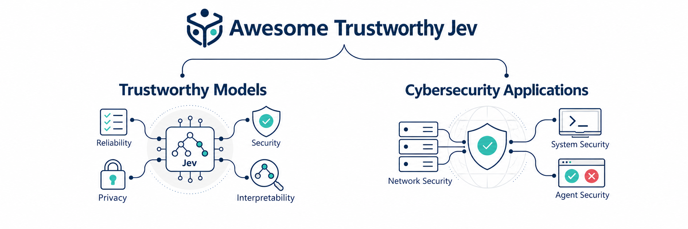
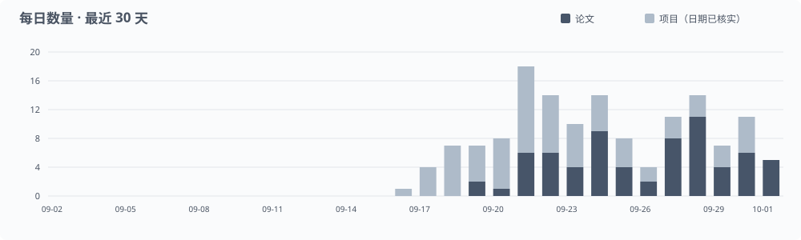
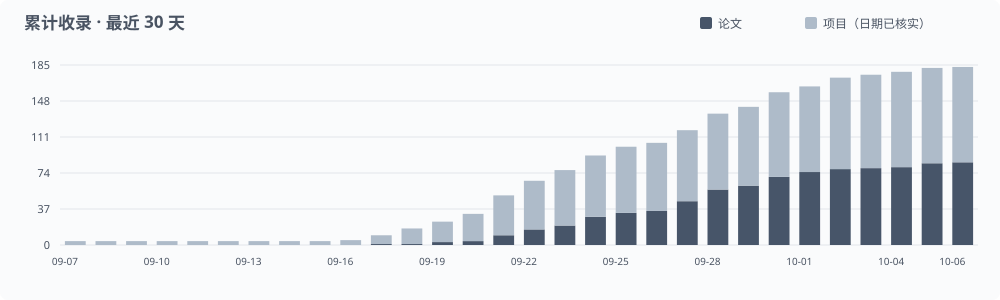

<p align="center"></p>

<p align="center"><a href="https://dongtsi.github.io/awesome-trustworthy-jev/?lang=zh"></a></p>

<p align="center">搜索论文 · 多维筛选 · 交互图表</p>

[](https://awesome.re)

[English](README.md) · [Chinese](README.zh-CN.md)

Jev 模型基础、自身可信性，以及网络与系统安全应用的论文、模型、项目和技术文档。

共 `344` 条资源 · `75` 篇论文 · `236` 个项目 · `23` 份官方文档 · `10` 篇文章

**[打开在线资料库 →](https://dongtsi.github.io/awesome-trustworthy-jev/?lang=zh)** · [每日论文](daily/README.zh-CN.md) · [RSS](feed.xml) · [提交资料](CONTRIBUTING.md)

给 AI：[Read & contribute](AGENTS.md) · [Catalog](data/catalog.json) · [Taxonomy](data/taxonomy.json)

## 目录

- [研究目录](#research)
  - [模型基础](#foundations)
    - [架构与训练](#架构与训练)
    - [决策接口](#决策接口)
    - [推理与效率](#推理与效率)
    - [决策框架](#决策框架)
  - [可信性](#trustworthiness)
    - [安全防护](#安全防护)
    - [危害控制](#危害控制)
    - [可靠性](#可靠性)
    - [隐私](#隐私)
    - [公平性](#公平性)
    - [透明性与可追责性](#透明性与可追责性)
  - [网络与系统安全应用](#applications)
    - [智能体与工具安全](#智能体与工具安全)
    - [代码与供应链安全](#代码与供应链安全)
    - [入侵与异常检测](#入侵与异常检测)
    - [钓鱼与欺诈检测](#钓鱼与欺诈检测)
    - [访问控制](#访问控制)
    - [工业与基础设施安全](#工业与基础设施安全)
    - [安全运营](#安全运营)
- [开放模型](#open-models)
- [数据集与基准](#datasets)
- [每日更新与统计](#activity)
- [参与贡献](#contributing)
- [引用](#citation)
- [相关目录](#related)
- [许可](#license)

<a id="research"></a>

## 研究目录

<a id="foundations"></a>

<details open>
<summary><strong>模型基础</strong></summary>

<a id="foundations-architecture"></a>

### 架构与训练

- [Bongard: Training Machine Intuition](https://arxiv.org/abs/2609.39111) — 开放 System One 模型通过表征学习和结果反馈训练判断能力。 `方法` · [PDF](https://arxiv.org/pdf/2609.39111v1)
- [OpenJev-RLCD: A Working RLCD Implementation](https://arxiv.org/abs/2609.38850) — 公开 RLCD 风格训练实现，研究适当评分规则与选择性预测。 `方法` · [PDF](https://arxiv.org/pdf/2609.38850v1) · [代码](https://github.com/ZimmyGao/openjev-rlcd)
- [Chinese-Jev: Bringing System One Model to Chinese-Language Tasks](https://arxiv.org/abs/2609.36965) — 研究中文任务的 System One 决策模型，提供多语言对照线索。 `方法` · [PDF](https://arxiv.org/pdf/2609.36965v1)
- [LAVOIR: Teaching a Single-Pass Decision Encoder When and What to Ask with Amortized Value of Information](https://arxiv.org/abs/2609.30706) — 训练模型判断何时值得追问信息，而不只在现有选项中猜测。 `方法` · [PDF](https://arxiv.org/pdf/2609.30706v1)
- [Universal Fractal Natural Language Decision Map: Real-Time Edge Triage Across Heterogeneous Domains](https://arxiv.org/abs/2609.25498) — 提出另类边缘决策实现与 JevBench 比较，作为外围对照。 `方法` · [PDF](https://arxiv.org/pdf/2609.25498v2)
- [this-that-model-1.0: A typed decision model that decides in 30 ms, for a millionth of a cent](https://arxiv.org/abs/2609.23886) — 开放有限候选决策模型，适合作为可训练对照。 `方法` · [PDF](https://arxiv.org/pdf/2609.23886v1)
- [Dyad: Extending Large Language Models with Native Typed Decision-Making](https://arxiv.org/abs/2609.36116) — 为大语言模型加入候选动作编码器，对比冻结骨干与联合强化学习的类型化决策能力。 `评测` · [PDF](https://arxiv.org/pdf/2609.36116v1)
- [OmniMed-Jev: Calibrating LVLM Confidence for Trustworthy Medical Multimodal Decisions via System One](https://arxiv.org/abs/2610.00381) — 以匹配骨干和数据的生成式基线检验多模态候选决策接口，研究校准改善及准确率取舍；接口和训练效应未完全分离。 `评测` · [PDF](https://arxiv.org/pdf/2610.00381v1)
- [Tron-1B: Fast, Calibrated Typed Decisions with a Set-Attention Option Head](https://zenodo.org/records/23066522) — 提出带集合注意力选项头的双向编码器；需区分使用基准训练集的结果与零样本托管服务的比较。 `模型` · [PDF](https://zenodo.org/api/records/23066522/files/tron-1b-paper.pdf/content)

**项目与技术资料**

- [takzen/kanari-decision-bench](https://github.com/takzen/kanari-decision-bench) — Can a small typed-decision model judge a chatbot security audit? Jev vs open models on Polish chatbot answers. `工具 · 评测`
- [agrogov/jev-system-one-study](https://github.com/agrogov/jev-system-one-study) — Black-box study of Jev plus controlled replays of the same ~8,300-request suites against open models Laya and SemIf (Qwen3.5-4B). `工具`
- [alperiox/audio-jevlike](https://github.com/alperiox/audio-jevlike) — Audio-native 'System One' reproduction (Prosodia). `工具`
- [convaiinnovations/laya](https://huggingface.co/convaiinnovations/laya) — 通过非自回归编码器和决策头为类型化问题评分。 `模型`
- [convaiinnovations/laya-multilingual](https://huggingface.co/convaiinnovations/laya-multilingual) — 使用多语言编码器完成跨语言类型化决策。 `模型`
- [convaiinnovations/laya-typed-decisions](https://huggingface.co/convaiinnovations/laya-typed-decisions) — 针对客服、账单、Agent 轨迹与安全事件决策微调 Laya。 `模型`
- [AlexWortega/openjev](https://huggingface.co/AlexWortega/openjev) — 以 Qwen 蕴含评分完成候选排序和类型化决策。 `模型`
- [Contrastive-LM/CLM-v0.1-8B](https://huggingface.co/Contrastive-LM/CLM-v0.1-8B) — 在冻结编码器上训练状态和动作投影头，可缓存候选表示。 `模型`
- [akhilaaa3/Jev-Omni](https://huggingface.co/akhilaaa3/Jev-Omni) — 通过多模态决策分类器对文本、图像、音频和视频问题的候选答案评分。 `模型`
- [SupersonicLabs/Julia-1](https://huggingface.co/SupersonicLabs/Julia-1) — 提供用于选项、布尔判断和有序评分的小型多语言模型。 `模型`
- [interfaze-ai/lev](https://huggingface.co/interfaze-ai/lev) — 通过 Qwen 的 LoRA 适配器实现类型化决策和兼容 Jev 的服务接口。 `模型`
- [cua-ai/cua-s1-forms](https://huggingface.co/cua-ai/cua-s1-forms) — 以小型选项评分器选择表单动作，执行顺序由外部代码控制。 `模型`
- [AgentBull/bongard-mini](https://huggingface.co/AgentBull/bongard-mini) — 基于编码器—解码器结构，在共享上下文上并行评分文本或图像决策。 `模型`
- [flock-io/this-that-model-1.2](https://huggingface.co/flock-io/this-that-model-1.2) — 单次前向完成类型化决策，并评测组合规则与措辞变化。 `模型`
- [autotrust/JEV-9B](https://huggingface.co/autotrust/JEV-9B) — 蒸馏 Jev 教师的类型化决策分布，同时保留独立的生成路径。 `模型`
- [autotrust/JEV-27B](https://huggingface.co/autotrust/JEV-27B) — 扩展教师蒸馏决策模型的规模，分别提供决策与生成路径。 `模型`
- [autotrust/JEV-27B-VL](https://huggingface.co/autotrust/JEV-27B-VL) — 将决策接口扩展到图像条件问题，同时支持文本生成。 `模型`
- [ZefanCai/Open-Jev-2B](https://huggingface.co/ZefanCai/Open-Jev-2B) — 将 Qwen LoRA 适配器与标量决策头结合，对用户提供的候选项评分。 `模型`
- [ZefanCai/Open-Jev-9B](https://huggingface.co/ZefanCai/Open-Jev-9B) — 提供较大规模的适配器与决策头，支持选择、布尔和有序问题。 `模型`
- [ZefanCai/Open-Jev-27B-v1.1](https://huggingface.co/ZefanCai/Open-Jev-27B-v1.1) — 发布训练后的适配器与标量头，并区分分布内和分布外评测。 `模型`
- [Maincode/matilda-jev-v1](https://huggingface.co/Maincode/matilda-jev-v1) — 整合骨干与决策读出层，处理文本、JSON 及可选图像上的类型化问题。 `模型`
- [TokenRhythm/NeoHorse-Jev-4B](https://huggingface.co/TokenRhythm/NeoHorse-Jev-4B) — 仅通过预填充推理，为 Agent 流程提供选择、布尔判断和评分。 `模型`
- [tasksource/tasksource-jev-nano-v0](https://huggingface.co/tasksource/tasksource-jev-nano-v0) — 通过 token 级后交互复用状态表示，对可变候选集合评分。 `模型`
- [HIT-TMG/JevEmbed-Qwen3-Embedding-0.6B](https://huggingface.co/HIT-TMG/JevEmbed-Qwen3-Embedding-0.6B) — 微调嵌入模型，通过配套提示与评分层实现类型化决策。 `模型`
- [chaoliangUNSW/Jev-Style-2B-Decision-v3](https://huggingface.co/chaoliangUNSW/Jev-Style-2B-Decision-v3) — 提供本地决策模型及运行时，支持兼容 System One 的 API。 `模型`
- [tarsur385/djev-distill-v4](https://huggingface.co/tarsur385/djev-distill-v4) — 将较长推理产生的分布蒸馏为 DiffusionGemma 上的单步类型化决策。 `模型`
- [Camellia86/Canopy-Jev-27B](https://huggingface.co/Camellia86/Canopy-Jev-27B) — 发布冻结 Qwen3.8-27B 上的共享前缀、独立分支决策适配器及概率先验；性能数值来自模型卡。 `模型`
- [nickprock/archai-jev-zagreus-0.4b-ita](https://huggingface.co/nickprock/archai-jev-zagreus-0.4b-ita) — 发布以交叉熵和 Brier 损失训练的意大利语 0.4B 决策适配器；模型卡的校准和时延主张尚需独立评估。 `模型`
- [shgao/rsi-jev-v5.0-vl-3b](https://huggingface.co/shgao/rsi-jev-v5.0-vl-3b) — 发布由 20 层 Qwen3.5-4B、选项头和校准参数组成的自包含多模态类型化决策权重。 `模型`
- [BricksDisplay/jevling-e2b-v1](https://huggingface.co/BricksDisplay/jevling-e2b-v1) — 发布 Gemma 系列并行类型化决策权重，温度缩放折入模型；所报告中文点餐评测使用合成派生数据。 `模型`

（另见：[LLM2Jev](https://arxiv.org/abs/2610.02076) · [PACT](https://arxiv.org/abs/2609.35865) · [PixelJev](https://arxiv.org/abs/2609.29283) · [laya-jev-eval](https://github.com/yuvrajrox/laya-jev-eval) · [jev-vs-ml](https://github.com/vianaR25/jev-vs-ml) · [jevlike](https://github.com/mustafasemi-ai/jevlike)）

<a id="foundations-interfaces"></a>

### 决策接口

- [LLM2Jev: LLMs Are Already Jev-Style Decision Models -- When and How to Fine-Tune Them](https://arxiv.org/abs/2610.02076) — 保留架构直接读候选概率，比较无需训练与针对性微调。 `评测` · [PDF](https://arxiv.org/pdf/2610.02076v1)
- [Benchmarking System One decision models against trained classifiers and language models for automated decision gates](https://arxiv.org/abs/2610.00346) — 匹配输入比较模型与监督分类器，排名随标签和读出条件变化。 `评测` · [PDF](https://arxiv.org/pdf/2610.00346v1)
- [Koa-action: Fast and Consistent Structured Decision Making with Generative LLMs](https://arxiv.org/abs/2609.36115) — 单 token 动作输出提供低延迟决策的对照路线。 `方法` · [PDF](https://arxiv.org/pdf/2609.36115v1)
- [From Text Decisions to Pixels: An Study of Jev-Style Visual Choice Model](https://arxiv.org/abs/2609.29283) — 视觉候选概率读出与生成式对照，分析格式和准确率收益来源。 `方法` · [PDF](https://arxiv.org/pdf/2609.29283v1)
- [Jev in Practice: A Composable Python Toolkit for TypeSafe’s System One Decision Model](https://zenodo.org/records/22921974) — 组合式工具包包含校准模块与批处理实验，可辅助复现。 `工具` · [PDF](https://zenodo.org/api/records/22921974/files/daf-jev_combined.pdf/content)
- [NumericJev: Jev-like LLM Numerical Decoding with Multiway Decision Trees](https://arxiv.org/abs/2609.28587) — 以多叉决策树逐步缩小数值区间，扩展有限选项接口。 `方法` · [PDF](https://arxiv.org/pdf/2609.28587v1)
- [AnyJev Technical Report](https://arxiv.org/abs/2610.00831) — 从预训练模型读出选项概率，以先验归一化和循环置换修正标签与位置偏差；多次前向带来额外成本。 `评测` · [PDF](https://arxiv.org/pdf/2610.00831v1)

**项目与技术资料**

- [dtduc-git/jevnav](https://github.com/dtduc-git/jevnav) — Browser-automation tool using Jev to pick page elements, with several small measured benchmarks. `工具 · 评测`
- [simonmesmith/jev-arc-agi-v1-experiment](https://github.com/simonmesmith/jev-arc-agi-v1-experiment) — Jev fully solved 4/400 ARC-AGI-1 public eval tasks (1.125% score) via per-cell Choice decisions, at $2.32 total cost. `工具 · 评测`
- [Introducing System One Models & Jev](https://typesafe.ai/blog/introducing-system-one-models-and-jev) — Official launch, RLCD claims, workflow evaluation and stated limitations. `文档`
- [TypeSafe · noul](https://docs.typesafe.ai/primitives/noul.md) — Official interface documentation and deployment guidance. `文档`
- [PerryLink/llm-jev-laya-bench](https://github.com/PerryLink/llm-jev-laya-bench) — Research paper/artifact: Jev and Laya as judgment layers score 0.225-0.90 on a 77-class battery; both fail tasks needing absence-detection. `工具`
- [evals.typesafe.ai](https://evals.typesafe.ai) — TypeSafe's four-workflow comparison of Jev against frontier models, 61.7% to 76.0% agreement. `文档`
- [TypeSafe · citation_check](https://docs.typesafe.ai/cookbooks/citation_check.md) — Official interface documentation and deployment guidance. `文档`
- [TypeSafe · choice](https://docs.typesafe.ai/primitives/choice.md) — Official interface documentation and deployment guidance. `文档`
- [gdchaochao/lunar-terminal](https://github.com/gdchaochao/lunar-terminal) — Measured 327 randomized Robocode decisions show Jev's action choice near-random (Pearson r=-0.099) while its yes/no judgments score 0.94-0.96 on atomic questions. `工具 · 评测`
- [TypeSafe · fan-out](https://docs.typesafe.ai/patterns/fan-out.md) — Official interface documentation and deployment guidance. `文档`
- [jev-typesafe-system-one-model-benchmark-2026](https://thoughts.jock.pl/p/jev-typesafe-system-one-model-benchmark-2026) — 40 hand-labeled tickets, routing, urgency and anger, against Haiku, Fable, Astra and Gemini Flash. `分析 · 评测`
- [TypeSafe · legal](https://docs.typesafe.ai/legal.md) — Official interface documentation and deployment guidance. `文档`
- [TypeSafe · sdk](https://docs.typesafe.ai/sdk.md) — Official interface documentation and deployment guidance. `文档`
- [TypeSafe · score](https://docs.typesafe.ai/primitives/score.md) — Official interface documentation and deployment guidance. `文档`
- [TypeSafe · system-one](https://docs.typesafe.ai/concepts/system-one.md) — Official interface documentation and deployment guidance. `文档`
- [TypeSafe · primitives](https://docs.typesafe.ai/primitives.md) — Official interface documentation and deployment guidance. `文档`
- [TypeSafe · state](https://docs.typesafe.ai/concepts/state.md) — Official interface documentation and deployment guidance. `文档`
- [TypeSafe · sde_cascade](https://docs.typesafe.ai/cookbooks/sde_cascade.md) — Official interface documentation and deployment guidance. `文档`
- [TypeSafe · models](https://docs.typesafe.ai/models.md) — Official interface documentation and deployment guidance. `文档`
- [TypeSafe · api](https://docs.typesafe.ai/api.md) — Official interface documentation and deployment guidance. `文档`
- [TypeSafe · how-to-build-with-system-one](https://docs.typesafe.ai/concepts/how-to-build-with-system-one.md) — Official interface documentation and deployment guidance. `文档`
- [TypeSafe · introduction](https://docs.typesafe.ai/introduction.md) — Official interface documentation and deployment guidance. `文档`

（另见：[calfram-bench](https://github.com/lorenzofamiglini/calfram-bench) · [Traffic Classification](https://arxiv.org/abs/2610.00376) · [Ordinal Bias](https://arxiv.org/abs/2609.38827) · [jev-dice](https://github.com/pobooo/jev-dice) · [JET](https://arxiv.org/abs/2609.33874) · [zh-decision-bench](https://github.com/CodyQin/zh-decision-bench) · [jevbench](https://github.com/GautamTalksDev/jevbench) · [Early Evidence Audit](https://arxiv.org/abs/2609.32160) · [JevOut](https://github.com/xzx34/JevOut) · [jev-field-report](https://github.com/manankumarthakkar/jev-field-report) · [jev-escalation-gate](https://github.com/manankumarthakkar/jev-escalation-gate) · [Jev in the Wild](https://arxiv.org/abs/2609.30216) · [Private Edge](https://papers.ssrn.com/sol3/papers.cfm?abstract_id=7500140) · [Jev-Persian-Benchmark](https://github.com/ArmanJR/Jev-Persian-Benchmark) · [Visual Jev](https://arxiv.org/abs/2609.25845) · [typesafe-ai-jev-example](https://github.com/ItBayMax/typesafe-ai-jev-example) · [jevshield](https://github.com/lgy1027/jevshield) · [this-that-model](https://arxiv.org/abs/2609.23886) · [jev-as-a-judge](https://github.com/danielgshea/jev-as-a-judge) · [jev-guard](https://github.com/leepokai/jev-guard) · [can-you-trust-jev-confidence](https://anth.us/blog/can-you-trust-jev-confidence) · [typesafe-jev-pre-registered-test](https://primeline.cc/blog/typesafe-jev-pre-registered-test) · [jev-arena](https://github.com/meetr1912/jev-arena) · [jev-noul-vs-choice](https://github.com/TakumiNoguchi2004/jev-noul-vs-choice) · [jev-deterministic-benchmark](https://github.com/etsabary/jev-deterministic-benchmark) · [jev-playground](https://github.com/kobashi/jev-playground) · [jev-audit](https://github.com/phuthuycoding/jev-audit) · [browser-jev](https://github.com/DowLucas/browser-jev) · [jev-synthetic-survey](https://github.com/jjd-lab/jev-synthetic-survey) · [jev-heart-risk-bench](https://github.com/rubinagentagi-tech/jev-heart-risk-bench) · [jev-behavior-study](https://github.com/RINNECODER/jev-behavior-study) · [jev-calibrate](https://github.com/smkrv/jev-calibrate) · [structured-decision-bench](https://github.com/zhengbangbo/structured-decision-bench) · [opencode-jev-compaction](https://github.com/JLegends/opencode-jev-compaction) · [jevfuzz](https://github.com/yottayoshida/jevfuzz) · [Jev-Calibration](https://github.com/AnthusAI/Jev-Calibration) · [jev-skills](https://github.com/WanLanglin/jev-skills) · [jev-probability-experiment](https://github.com/simonmesmith/jev-probability-experiment) · [jev-biomedical-evidence-screening](https://github.com/cx295410-dot/jev-biomedical-evidence-screening) · [Dyad](https://arxiv.org/abs/2609.36116) · [Calibration composition](https://zenodo.org/records/23064668)）

<a id="foundations-inference"></a>

### 推理与效率

- [JET: Justification Evaluation in Transformer](https://arxiv.org/abs/2609.33874) — 直接比较候选似然并复用计算，研究本地决策推理。 `方法` · [PDF](https://arxiv.org/pdf/2609.33874v2)
- [Harness Tokenomics: A Router for the Enterprise Agentic Control Plane](https://arxiv.org/abs/2609.28919) — 研究代理路由与缓存的整体费用，而非只看单次 API 单价。 `分析` · [PDF](https://arxiv.org/pdf/2609.28919v2)
- [Visual Jev: Accurate and Efficient Decisions from Shared Visual Context](https://arxiv.org/abs/2609.25845) — 共享视觉前缀提高批量效率，专用决策头未显示稳定准确率优势。 `评测` · [PDF](https://arxiv.org/pdf/2609.25845v1)

**项目与技术资料**

- [stillmarcus24/jev-verify](https://github.com/stillmarcus24/jev-verify) — Checks published Jev outputs against the L0/L1/L2 identities without live calls, structure-aware (multi-label and batch outputs excluded). `工具`
- [haricharan12/jev-voice-bridge](https://github.com/haricharan12/jev-voice-bridge) — Voice instructed recon tool using jev for real time little latency work. `工具`
- [xxlya/evaljev](https://github.com/xxlya/evaljev) — Runtime-assurance library for Jev decision workflows. `工具`

（另见：[JevSpawn](https://arxiv.org/abs/2610.00437) · [Decision Gates](https://arxiv.org/abs/2610.00346) · [Koa-action](https://arxiv.org/abs/2609.36115) · [NavJev](https://arxiv.org/abs/2609.34969) · [system-one-benchmark](https://github.com/yanng981/system-one-benchmark) · [Jev-Mobile](https://arxiv.org/abs/2609.30186) · [jev-langgraph-router](https://github.com/Sahil-coder-30/jev-langgraph-router) · [jev-router](https://github.com/Akashdb5/jev-router) · [Fractal Decision Map](https://arxiv.org/abs/2609.25498) · [jev-policy-engine](https://github.com/BhavinM/jev-policy-engine) · [jev-evaluation](https://github.com/willkelly/jev-evaluation) · [6G Orchestration](https://arxiv.org/abs/2609.23136) · [Edge Orchestration](https://arxiv.org/abs/2609.22753) · [jev-arc-agi-v1-experiment](https://github.com/simonmesmith/jev-arc-agi-v1-experiment) · [jev-as-a-judge](https://github.com/danielgshea/jev-as-a-judge) · [jev-eval](https://github.com/finnhll/jev-eval) · [jev-orderby-bench](https://github.com/yodablocks/jev-orderby-bench) · [sys1bench](https://github.com/rssr25/sys1bench) · [DddGgXuoLlL](https://www.threads.com/@ebrain.lab/post/DddGgXuoLlL) · [jev-transaction-guard](https://github.com/finrod21/jev-transaction-guard) · [jev-synthetic-survey](https://github.com/jjd-lab/jev-synthetic-survey) · [jev-korean-benchmark](https://github.com/mahlernim/jev-korean-benchmark) · [jev-calibration-audit](https://github.com/jujumilk3/jev-calibration-audit) · [jev-acento](https://github.com/marcosmartinez/jev-acento) · [pi-heed](https://github.com/nyarlathoteppppp/pi-heed) · [jev-skills](https://github.com/WanLanglin/jev-skills)）

<a id="foundations-frameworks"></a>

### 决策框架

- [JevSpawn: Adaptive Agentic Inference through Compositional Action Spaces](https://arxiv.org/abs/2610.00437) — 研究自然语言任务到有限动作空间的动态构造与恢复。 `系统` · [PDF](https://arxiv.org/pdf/2610.00437v1)
- [Mnemon: Raw Records, Fast Judgments, Slow Thoughts](https://arxiv.org/abs/2609.36059) — 用原始记录、快速判断和慢速推理分层组织代理记忆。 `系统` · [PDF](https://arxiv.org/pdf/2609.36059v1)
- [NavJev: Efficient Vision-Language Navigation via Action-Centric Visual Compression and Discriminative Action-Semantic Memory](https://arxiv.org/abs/2609.34969) — 通过动作中心表示与判别记忆研究高效视觉导航决策。 `系统` · [PDF](https://arxiv.org/pdf/2609.34969v1)
- [When Does Selection Replace Extraction? A Pre-Registered Test of Agent Memory with a Typed Decision Model](https://arxiv.org/abs/2609.34227) — 预注册记忆研究发现小上下文下筛选有效，但可能降低正确拒答。 `评测` · [PDF](https://arxiv.org/pdf/2609.34227v1)
- [Type-Safe Decision Frameworks for Agentic 5G Control: A Theory-Driven Testbed Characterization of Where They Can Be Applied](https://arxiv.org/abs/2609.33689) — 在控制回路中检验时限、选项合法性和升级可行性。 `系统` · [PDF](https://arxiv.org/pdf/2609.33689v1)
- [You Only Edit Once: Incentivizing In-Context Capability of LLMs via Local Demonstration Refinement](https://arxiv.org/abs/2609.33609) — 以决策模型辅助局部示例改写，提高上下文学习能力。 `系统` · [PDF](https://arxiv.org/pdf/2609.33609v1)
- [JevSoup: System-One Routing for Training-Free LoRA Composition](https://arxiv.org/abs/2609.30922) — 用 Jev 选择 LoRA 专家并进行无需训练的组合。 `系统` · [PDF](https://arxiv.org/pdf/2609.30922v1) · [代码](https://github.com/Leowang980/JevSoup.)
- [Jev in the Wild: A Data-Driven Analysis of the Jev Model's Functionality, Applications and Ecosystem](https://arxiv.org/abs/2609.30216) — 分析公开项目中 Jev 的接口用途、集成方式与采用情况。 `综述` · [PDF](https://arxiv.org/pdf/2609.30216v1)
- [Jev-Mobile: Jev as an Executor for Mobile GUI Agents](https://arxiv.org/abs/2609.30186) — 低频规划与高频有限动作执行分离，降低代理调用成本。 `系统` · [PDF](https://arxiv.org/pdf/2609.30186v1)
- [REFLEX with Jev for Efficient Selective Control in LLM Agents](https://arxiv.org/abs/2609.26532) — 低置信升级能减少强模型调用；授权边界和近似合法选项影响可靠性。 `系统` · [PDF](https://arxiv.org/pdf/2609.26532v1)
- [Jev-Mem: System-One-Controlled Agentic Memory for Efficient AI Agents](https://arxiv.org/abs/2609.23986) — 用 System One 控制记忆操作，研究代理记忆效率。 `系统` · [PDF](https://arxiv.org/pdf/2609.23986v1)
- [Fast Intent-Driven Service Orchestration with Jev for 6G Edge Networks](https://arxiv.org/abs/2609.23136) — 将决策等待纳入端到端时限，研究有限字段服务编排。 `系统` · [PDF](https://arxiv.org/pdf/2609.23136v1)
- [Replacing Large Language Models with Jev Decision Models for Low-Latency Edge Service Orchestration](https://arxiv.org/abs/2609.22753) — 新请求的有界合同解释受益于低延迟，宽合同限制替代范围。 `系统` · [PDF](https://arxiv.org/pdf/2609.22753v2)

**项目与技术资料**

- [Sahil-coder-30/jev-langgraph-router](https://github.com/Sahil-coder-30/jev-langgraph-router) — ⚡ Autonomous Multi-Model Routing Engine powered by TypeSafe Jev System One (<250ms, 97.4% cost savings), LangGraph State Machine, Dual-Tier In-Path Security Firewall, and real-time Mistral Large & Google Gemini execution. `工具`
- [Akashdb5/jev-router](https://github.com/Akashdb5/jev-router) — Jev-powered security screening and cost-aware routing for OpenAI, Anthropic, and OpenRouter LLMs. `工具`
- [somoore/interlock](https://github.com/somoore/interlock) — The kernel the LLM is not allowed to talk to. Capability kernel for untrusted agents — canaries, closed action space, Jev as the sensor. `工具`
- [m0rphtail/triagedy](https://github.com/m0rphtail/triagedy) — Alert triage as a UNIX filter: JSONL security alerts in, typed decisions out. Runs on TypeSafe Jev or a local model; policy routing stays in code. `工具`

（另见：[typesafe-quilts](https://github.com/SuperInstance/typesafe-quilts) · [system1-system2](https://github.com/Iskandeur/system1-system2) · [jevshield](https://github.com/lgy1027/jevshield) · [jev-evaluation](https://github.com/willkelly/jev-evaluation) · [jev-typesafe-system-one-model-benchmark-2026](https://thoughts.jock.pl/p/jev-typesafe-system-one-model-benchmark-2026) · [jevaluate](https://github.com/ElshinQ/jevaluate) · [jev-certify](https://github.com/nikkoxgonzales/jev-certify) · [jev-vs-sovereign-benchmark](https://github.com/azterizm/jev-vs-sovereign-benchmark)）

</details>

<a id="trustworthiness"></a>

<details open>
<summary><strong>可信性</strong></summary>

<a id="trustworthiness-security"></a>

### 安全防护

- [JevAdvBench: A Benchmark and Black-Box Attacks for Reinforcement Learning for Calibrated Decisions Models](https://arxiv.org/abs/2609.31142) — 单字段扰动对照重复噪声，量化翻转、概率变化和复核负载。 `评测 · 基准` · [PDF](https://arxiv.org/pdf/2609.31142v1)
- [JevOut: Natural Context Can Flip Decision Models](https://arxiv.org/abs/2609.30243) — 自然上下文增补经反馈搜索可诱导高置信目标错选。 `攻击 · 评测` · [PDF](https://arxiv.org/pdf/2609.30243v1)
- [Decision Hijacking: Prompt Injection Attacks on Jev's Typed Probabilistic Decisions](https://arxiv.org/abs/2609.28613) — 注入能推移目标概率；独立验证的目标选中率远低于搜索期峰值。 `攻击 · 评测` · [PDF](https://arxiv.org/pdf/2609.28613v1)

**项目与技术资料**

- [FrancoisChastel/skill-scanner](https://github.com/FrancoisChastel/skill-scanner) — Scan Agent Skills before your coding agent installs them. `工具`
- [cwhy/decision-injection-bench](https://github.com/cwhy/decision-injection-bench) — Prompt-injection attack suite on Jev, Winnow, SemIf and Laya classifiers. `工具`
- [zkousama/jagged](https://github.com/zkousama/jagged) — Pre-registered study on 486 Wikipedia deletion discussions finds Jev 1.13.0 96.5% accurate/0.230 ECE at baseline, collapses to 26.5% accuracy under a one-line prompt injection, and shows a mirrored-question probability gap. `工具`
- [Iskandeur/system1-system2](https://github.com/Iskandeur/system1-system2) — Confidence-gated Jev-then-LLM routing measured. `工具 · 评测`
- [fly2abhishek/jev-field-tests](https://github.com/fly2abhishek/jev-field-tests) — Twelve field tests plus follow-ups on Jev: 89% accuracy/0.03 ECE on 400 BoolQ items, overconfident 4-way calibration (0.998 stated vs 0.90 actual), counting/date weaknesses, and 27/28 SQL-injection and guardrail detection. `工具 · 防御`
- [willkelly/jev-evaluation](https://github.com/willkelly/jev-evaluation) — Preregistered adversarial evaluation of jev-1.13.0 (123,805 requests). `工具 · 评测`
- [KiishiAD/jev-loan-identity-benchmark](https://github.com/KiishiAD/jev-loan-identity-benchmark) — Synthetic bitemporal loan-matching benchmark with noisy/adversarial-style perturbations (typos, OCR corruption, sponsor confusion). `工具 · 评测`
- [Foshowithit/jev-rcos-study](https://github.com/Foshowithit/jev-rcos-study) — Falsification-first study of Jev as a capability router. `工具`
- [typesafe-jev-pre-registered-test](https://primeline.cc/blog/typesafe-jev-pre-registered-test) — About 9,750 calls with pass/fail bars written before the runs. `分析`
- [phuthuycoding/jev-audit](https://github.com/phuthuycoding/jev-audit) — Pre-commit auditor using Jev to catch secrets/vulnerabilities in code diffs. `工具 · 评测`
- [DowLucas/browser-jev](https://github.com/DowLucas/browser-jev) — Adversarial browser-exploration tool found narrow oracle questions score far better than broad ones (0.99 vs 0.30) and the same page state can score 0.72-0.87 across repeat calls. `工具`
- [anisselbd/jev-phishing-bench](https://github.com/anisselbd/jev-phishing-bench) — Jev vs Claude Haiku on 2,000 phishing emails: single verdict 62.6% vs 81.3% accuracy, but Jev's 5 decomposed signal questions fed into a logistic regression reach 95.0% vs Haiku's 93.2% (not statistically significant). `工具`
- [dopeCape/typesafe-ai-test](https://github.com/dopeCape/typesafe-ai-test) — Six-track stress test of Jev (~8,400 calls): confirms documented API limits exactly, finds it overconfident at low confidence bands but well-calibrated above 0.9, largely immune to prompt injection, and unable to count/sort/add. `工具`
- [heddendorp/jev-sort](https://github.com/heddendorp/jev-sort) — Jev-powered pairwise "fuzzy sort" library; a live 100-ticket benchmark got 92.85-98.38% pairwise-ordering agreement with a stated priority policy, and found non-transitive judgments. `工具 · 评测`
- [0xshin0221/openpoke-meets-jev](https://github.com/0xshin0221/openpoke-meets-jev) — Jev vs Claude Sonnet 4 in an email-triage/guardrail fork of OpenPoke. `工具 · 防御`
- [leepokai/llm-prompt-techniques-on-jev](https://github.com/leepokai/llm-prompt-techniques-on-jev) — Ports LLM prompting techniques (CoT, self-consistency, few-shot, GEPA) to Jev via DSPy and measures effect across LegalBench, BBH, MMLU-Pro and CLERC. `工具`
- [azterizm/jev-vs-sovereign-benchmark](https://github.com/azterizm/jev-vs-sovereign-benchmark) — Benchmarks Jev System One against a specialized sovereign RAG stack (DistilBERT/ColBERT/DeBERTa) on UK legal RAG. `工具 · 评测`
- [mertkayacs/jevoss](https://github.com/mertkayacs/jevoss) — 测试 Jev 兼容接口的选项顺序、注入指令、干扰文本、决策类型一致性与重复调用稳定性。 `基准 · 工具`
- [ankushchadha/system-one-security](https://github.com/ankushchadha/system-one-security) — 在合成引文核查场景测试 Jev、Clef 的状态截断、指令注入和事实修改；结论限于托管接口与已公开材料。 `评测 · 攻击`

（另见：[jev-security-playground](https://github.com/jeremymungai/jev-security-playground) · [lisa](https://github.com/turenlabs/lisa) · [Immune-Harness](https://github.com/Jalil-g/Immune-Harness) · [jev-security-scan](https://github.com/fukuda-deltax/jev-security-scan) · [jev-mail-safety-lab](https://github.com/JKasteele/jev-mail-safety-lab) · [jev-skill-router](https://github.com/aleksvega/jev-skill-router) · [Jev-Defense](https://github.com/prestonkakukdev/Jev-Defense) · [jev-engineering](https://github.com/eugeniughelbur/jev-engineering) · [jev-guard](https://github.com/leepokai/jev-guard) · [jev-benchmark](https://github.com/themsquared/jev-benchmark) · [jev-sec-bench](https://github.com/Gaurav-Gosain/jev-sec-bench) · [jev-transaction-guard](https://github.com/finrod21/jev-transaction-guard) · [jevfuzz](https://github.com/yottayoshida/jevfuzz) · [Laya Cybersec](https://huggingface.co/TextCortex/laya-cybersec) · [Laya Prompt Guard](https://huggingface.co/16sulphur/laya-prompt-guard) · [Jev guardrail benchmark](https://github.com/raxITlabs/jev-as-a-guardrails)）

<a id="trustworthiness-safety"></a>

### 危害控制

（另见：[RLCDAlignBench](https://arxiv.org/abs/2609.29429) · [opencode-jev-guard](https://github.com/CogFlux/opencode-jev-guard)）

<a id="trustworthiness-reliability"></a>

### 可靠性

- [Code Owns the Simulation, Jev Owns the Evaluation](https://arxiv.org/abs/2610.01834) — 能直接判断的选项与需要内部模拟的选项呈现能力分界。 `评测` · [PDF](https://arxiv.org/pdf/2610.01834v1)
- [Beyond Answer Confidence: A Controlled Audit of Self-Knowledge in a Black-Box Decision Model](https://arxiv.org/abs/2610.01006) — 缺信息或越过知识边界时，高置信不能可靠代表知道答案。 `评测` · [PDF](https://arxiv.org/pdf/2610.01006v1) · [代码](https://github.com/Syntheme/beyond-answer-confidence.)
- [A First Glance at Jev for Network Traffic Classification: Accuracy, Processing Time, and Cost](https://arxiv.org/abs/2610.00376) — 网络应用流量分类中，少样本 Jev 明显落后于监督树模型。 `评测` · [PDF](https://arxiv.org/pdf/2610.00376v1)
- [When the Right Answer Is Missing: An Arithmetic-Dependent Rejection Bottleneck in Jev](https://arxiv.org/abs/2609.39496) — 正确候选缺失时，即使有拒答选项也可能接受错误数值。 `评测` · [PDF](https://arxiv.org/pdf/2609.39496v1)
- [More Choices, Fewer Decisions: Ordinal-Scale Bias in JEV-like Direct-Decision Models](https://arxiv.org/abs/2609.38827) — 序数等级利用不足，增加选项并不保证更细致的实际决策。 `评测` · [PDF](https://arxiv.org/pdf/2609.38827v1) · [代码](https://github.com/Glax147/jev_ordinal_scale_bia)
- [Confident Where People Disagree: A preregistered, bias-corrected test of whether TypeSafe AI’s Jev lowers its confidence when humans disagree, on ChaosNLI](https://zenodo.org/records/23032384) — 研究人类意见分歧与模型置信度，并校正小样本校准噪声。 `评测` · [PDF](https://zenodo.org/api/records/23032384/files/jevbench_paper_Khosla_2026_v1.1.pdf/content)
- [Evaluating and Benchmarking the System One Model Jev](https://arxiv.org/abs/2609.37647) — 跨多类公开任务比较 Jev 的分类、校准和选择性预测，发现校准表现随接口与任务变化。 `评测 · 基准` · [PDF](https://arxiv.org/pdf/2609.37647v1)
- [A Noul Log Does Not Identify the Policy](https://papers.ssrn.com/sol3/papers.cfm?abstract_id=7525901) — 边际概率不能唯一确定联合事件，直接组合 Noul 可能改变策略。 `分析` · [PDF](https://papers.ssrn.com/sol3/Delivery.cfm/7525901.pdf?abstractid=7525901&mirid=1)
- [Jev thinks "I don't know'', but doesn't say it: Introducing Sys1Cal-v1 Dataset for Probability Calibration](https://arxiv.org/abs/2609.35342) — 已知真概率任务显示 Choice、Noul、Score 的数值含义不等价。 `评测 · 基准 · 数据集` · [PDF](https://arxiv.org/pdf/2609.35342v1)
- [Probability Contracts: Accuracy, Coherence, and Decisions Across LLM Interfaces](https://arxiv.org/abs/2609.37470) — 同一事件换接口可改变动作，概率平均改善不保证决策损失改善。 `评测` · [PDF](https://arxiv.org/pdf/2609.37470v1)
- [Do System One Decisions Add Up? A Study of Probabilistic Coherence](https://arxiv.org/abs/2609.33971) — 直接分类与分层重构的概率不一致，可改变准确率与校准。 `评测` · [PDF](https://arxiv.org/pdf/2609.33971v1)
- [Laya as a Typed Probabilistic Assessor: An Independent Reproduction and a Preregistered Study of Calibration and Selective Escalation](https://arxiv.org/abs/2609.33843) — 复现 Laya 校准并发现门控目标在保留集上未必达成。 `评测` · [PDF](https://arxiv.org/pdf/2609.33843v1)
- [Beyond Calibration: Do a Typed-Decision Model's Probabilities Obey the Probability Axioms?](https://arxiv.org/abs/2609.33209) — 逐项检测否定与互斥关系，发现校准之外的概率不一致。 `评测` · [PDF](https://arxiv.org/pdf/2609.33209v1)
- [PACT: Pairwise-Anchored Calibrated Tuning for Single-Token Typed Decisions](https://arxiv.org/abs/2609.35865) — 对比样本、置换一致性与证据必要性约束改善读出稳定性。 `方法` · [PDF](https://arxiv.org/pdf/2609.35865v1) · [代码](https://github.com/BennyLinntu/PACT-Pairwise-Anchored-Calibrated-Tuning-for-Single-Token-Typed-Decisions.)
- [Typed Decision Models: An Early Evidence Audit and Evaluation Checklist](https://arxiv.org/abs/2609.32160) — 梳理早期 Jev 研究，讨论读出方式、训练适配和评测设计如何影响结论。 `综述` · [PDF](https://arxiv.org/pdf/2609.32160v1)
- [How far can a commercial decision model’s probabilities be trusted? A calibration audit of Jev against open and general-purpose classifiers](https://escholarship.org/uc/item/4t4449jv) — 提问形式、标签定义与对照训练暴露均影响校准和模型排名。 `评测` · [PDF](https://escholarship.org/content/qt4t4449jv/qt4t4449jv.pdf)
- [JEV vs. LLMs as Rubric Judges: Cheaper, Faster, and Wrong in the Same Places](https://arxiv.org/abs/2609.29769) — Jev 与 LLM 裁判常犯相同错误，升级后备模型未必修复高置信错判。 `评测` · [PDF](https://arxiv.org/pdf/2609.29769v2)
- [Same Scores, Different Decisions: Evaluating JEV and Language Models for Legal Document Understanding](https://arxiv.org/abs/2609.27678) — 合同推断中平均分数相近仍可出现逐项决策变化和稳定错误。 `评测` · [PDF](https://arxiv.org/pdf/2609.27678v1) · [代码](https://github.com/ZF-Utokyo/Jev-Benchmark)
- [When a Judgment Layer's Self-Reported Fields Lie: Cost, Latency and the Failure Boundary of Three Judgment Layers on the Same Items](https://doi.org/10.5281/zenodo.22901853) — 审计裁判层成本、时延与自报字段，区分接入层缺陷和模型错误，并检验配对错误互补性。 `评测` · [PDF](https://zenodo.org/api/records/22901853/files/paper-en.pdf/content) · [代码](https://doi.org/10.5281/zenodo.22901248)
- [Type-Safe Is Not Error-Free: A Constrained Decision Head Follows the Option Name, Not the Rubric Bound to It](https://arxiv.org/abs/2609.26758) — 选项名称可能压过绑定规则，合法输出仍可能语义错误。 `评测` · [PDF](https://arxiv.org/pdf/2609.26758v2)
- [JEV-as-a-Judge: Accept When Confident, Escalate When Unsure](https://arxiv.org/abs/2609.26550) — 置信度门控在部分裁判任务节约费用，但复杂错误与阈值迁移仍是难点。 `评测` · [PDF](https://arxiv.org/pdf/2609.26550v3)
- [Jev for Scientific Decisions: Evaluating Semantic Choices and Their Consequences](https://arxiv.org/abs/2609.24965) — 分别检查语义选择、中间计算与最终标签，揭示仅看最终答案可能漏掉的错误。 `评测` · [PDF](https://arxiv.org/pdf/2609.24965v2)
- [Evaluating Decision Models for Text Annotation in Computational Social Science](https://arxiv.org/abs/2609.24574) — 对比决策模型与大模型的文本标注、校准和分流；部分任务可用置信度分流，但高置信错误集中在特定任务。 `评测` · [PDF](https://arxiv.org/pdf/2609.24574v2) · [代码](https://github.com/hazemibrahim97/decision-models-css)
- [Calibrated Decisions at Scale: Converting Police Crash Narratives into Probabilistic Crash Variables with a System One Model (Jev)](https://arxiv.org/abs/2609.24052) — 以盲审人工标签核验 Jev 概率，检验后校准、离散概率分辨率及人工复核预算。 `评测` · [PDF](https://arxiv.org/pdf/2609.24052v1) · [代码](https://github.com/pozapas/jev-calibrated-narrative-coding)
- [Jev in Medicine: A Benchmark Evaluation](https://arxiv.org/abs/2609.34024) — 在四类医学基准上审计 Jev 1.13 的准确率、校准、选择性预测和无法回答问题的处理；结论依赖任务。 `评测` · [PDF](https://arxiv.org/pdf/2609.34024v2)
- [Calibration Does Not Compose, Types Destroy Vagueness: The Hidden-Markov and Fuzzy Primitives Missing from System-One Decision Models](https://zenodo.org/records/23064668) — 在显式假设和合成实验下分析潜在状态漂移、重复阈值化如何破坏决策管线的组合可靠性；不是 Jev API 实测。 `分析` · [PDF](https://zenodo.org/api/records/23064668/files/paper.pdf/content)

**项目与技术资料**

- [sohithk10/jev-trace-evaluator](https://github.com/sohithk10/jev-trace-evaluator) — CLI trace evaluation with JEV, LangChain integration, security checks, and confidence-based review. `工具 · 评测`
- [lorenzofamiglini/calfram-bench](https://github.com/lorenzofamiglini/calfram-bench) — External calibration audit of Jev on 25 public benchmarks at natural prevalence using CalFram (ECE, ECI, Brier, log score), with contamination annotation, a GLiClass baseline and a cross-fitted recalibration study. `工具 · 评测`
- [andre-langchain/calibration-probe](https://github.com/andre-langchain/calibration-probe) — Does a System One model's confidence drop when the evidence cannot answer the question? Each question asked with and without an explicit insufficient_evidence abstain option (Jev, SemIf, Claude Sonnet 5 baseline). `工具`
- [SuperInstance/typesafe-quilts](https://github.com/SuperInstance/typesafe-quilts) — Zero-dependency System One calibration instrument live against jev-1.13.0. `工具`
- [pobooo/jev-dice](https://github.com/pobooo/jev-dice) — Does Jev play dice? Tests non-determinism and option-position bias on Choice, with and without a single correct answer. `工具`
- [Mazukriez/Jev-AI-Security-Architecture-](https://github.com/Mazukriez/Jev-AI-Security-Architecture-) — Security project using typed decisions. `工具 · 评测`
- [CodyQin/zh-decision-bench](https://github.com/CodyQin/zh-decision-bench) — First Chinese-language calibration benchmark for Jev-class System One decision models, asking not just whether the answer is right but whether the reported probabilities can be trusted. `工具 · 评测`
- [yanng981/system-one-benchmark](https://github.com/yanng981/system-one-benchmark) — Zero-shot accuracy, calibration (ECE) and latency of System One decision models (Jev 1.13, Kev-0.8B, Von 1.2, Laya English/multilingual/router, GLiNER2.5) put through one common Jev-style POST /v1/systemone contract with the same examples and typed questions. `工具 · 评测`
- [GautamTalksDev/jevbench](https://github.com/GautamTalksDev/jevbench) — Preregistered, bias-corrected test of whether Jev lowers its confidence where humans disagree. `工具`
- [zachlandes/jev-dialect-bias](https://github.com/zachlandes/jev-dialect-bias) — Reproduces Hofmann et al. (Nature 2024) dialect-prejudice probes on Jev. `工具`
- [xzx34/JevOut](https://github.com/xzx34/JevOut) — JevOut ('Natural Context Can Flip Decision Models'). `工具`
- [manankumarthakkar/jev-field-report](https://github.com/manankumarthakkar/jev-field-report) — Why eleven audits of one model report 44.7% to 95.9% accuracy and ECE 0.023 to 0.793. `工具 · 评测`
- [gazelle93/decision-models-under-pressure](https://github.com/gazelle93/decision-models-under-pressure) — Seven decision models compared as the same task gets harder three ways. `工具`
- [san3ncrypt3d/jev-security-prioritization](https://github.com/san3ncrypt3d/jev-security-prioritization) — Reproducible experiment: can TypeSafe's Jev decision model prioritize SCA and SAST findings from context? Frozen benchmark, 50k scale run, frontier-model comparison, raw data and blog. `工具 · 评测`
- [SupratimSircar05/jev-zig-cli](https://github.com/SupratimSircar05/jev-zig-cli) — Unofficial Jev-powered Zig terminal agent with deterministic policy gates and encrypted audit trails. `工具 · 评测`
- [JoasASantos/Raze](https://github.com/JoasASantos/Raze) — Offensive-security agent built on Raze, a System One model in the Jev family — turns target state into typed, calibrated judgments (exploitability, impact, novelty, next action) gated by deterministic validators. `工具`
- [manankumarthakkar/jev-escalation-gate](https://github.com/manankumarthakkar/jev-escalation-gate) — 检查负例构造如何影响决策门控的准确性与校准评测。 `工具`
- [BeyondModels/requirements-deep-agent](https://github.com/BeyondModels/requirements-deep-agent) — Security requirements analysis with JEV, LangChain Deep Agent review via LLM, and deterministic Python reporting. `工具`
- [pawarbi/jev-bias-audit](https://github.com/pawarbi/jev-bias-audit) — Counterfactual bias audit; on a value-laden binary question the first-listed option gains 0.37; BBQ 1,012 items 98.7% ambiguous / 96.5% disambiguated. `工具 · 评测`
- [brida-ai/reflexbench](https://github.com/brida-ai/reflexbench) — Harness reporting semantic accuracy, calibration, language consistency and option-order robustness separately on a frozen 111-case cohort. `工具`
- [gkastanis/d3code-calibration](https://github.com/gkastanis/d3code-calibration) — At stated 0.85 only 45% are yes; ranking holds up better than the number; calibration does not transfer across datasets. `工具`
- [ashp15205/decision-guard](https://github.com/ashp15205/decision-guard) — Security & calibration middleware for System 1 AI models like jev & laya. `工具`
- [intelliDean/reflexgate](https://github.com/intelliDean/reflexgate) — Ultra-fast, sub-100ms API & webhook guardrail and triage gateway powered by TypeSafe AI System One (Jev). Parallel 7-dimension speculative evaluation, deterministic policy router, zero-dependency SQLite audit trail, and automated outbound dispatch. `工具 · 评测 · 防御`
- [treadkex1/decision-model-security](https://github.com/treadkex1/decision-model-security) — Security research on typed-decision models (Jev/Kev). `工具 · 防御`
- [bismawy/pi-jev-eye](https://github.com/bismawy/pi-jev-eye) — Ultra-lean supervisor for Pi: zero-token regex guardrails, test verification tracking, and TypeSafe Jev semantic slop gate. `工具 · 防御`
- [4nt0ineb/typed-decision-bench](https://github.com/4nt0ineb/typed-decision-bench) — English vs French intents: Jev loses 1 point where others lose 4 to 8; ECE 0.07 EN, 0.06 FR. `工具`
- [ArmanJR/Jev-Persian-Benchmark](https://github.com/ArmanJR/Jev-Persian-Benchmark) — 480 authored Persian (Farsi + Finglish) questions. `工具 · 评测`
- [ringzerosec/jev-runtime-security](https://github.com/ringzerosec/jev-runtime-security) — Security project using typed decisions. `工具 · 评测`
- [cmd-siri-bot/llm-gateway](https://github.com/cmd-siri-bot/llm-gateway) — A Jev-powered request router: one parallel call triages every query for security risk, intent, and complexity, then routes it to a cheap model, an escalation tier, or blocks it outright. `工具`
- [altanapps/security-sandbox-jev](https://github.com/altanapps/security-sandbox-jev) — Security project using typed decisions. `工具 · 评测`
- [123Satyajeet123/jev-wide](https://github.com/123Satyajeet123/jev-wide) — Measures Jev's behavior when ranking/reranking beyond its per-call limits. `工具`
- [turenlabs/jast](https://github.com/turenlabs/jast) — JAST is an experimental SAST (static application security testing) desktop app that uses TypeSafe AI's Jev System One model. `工具 · 评测`
- [FlorianRiquelme/jev-kit](https://github.com/FlorianRiquelme/jev-kit) — Typed client + benchmark harness for Jev; the shipped example run against 15 real-project fixtures gets 81.7% overall accuracy but shows one question ('needs_human', an indirect compound judgment) scoring 46.7% - worse than a coin flip - which the harness itself flags. `工具 · 评测 · 基准`
- [ItBayMax/typesafe-ai-jev-example](https://github.com/ItBayMax/typesafe-ai-jev-example) — Comparing hand-authored mock probabilities to 28 real Jev calls. `工具`
- [erendikmenn/jev-rag-benchmark](https://github.com/erendikmenn/jev-rag-benchmark) — Jev vs Cohere Rerank 3.5 as a RAG reranker on 1,044 Turkish XQuAD questions; both recover the identical number of gold passages into top-5, with Jev 60.6% cheaper, but a candidate-order permutation audit shows real sensitivity (mean Spearman 0.262). `工具 · 评测`
- [colinmcnamara/jev-first-look](https://github.com/colinmcnamara/jev-first-look) — First-look at Jev: reproduces vendor jaggedness examples exactly, finds P(x)+P(not x) sums 0.93-1.19 over 20 negation pairs, and measures ECE ~0.09 on SST-2/AG News, comparable to a self-hosted Qwen 27B baseline that is 1.8-4.5x slower. `工具`
- [yakubmurcek/should-i-jev](https://github.com/yakubmurcek/should-i-jev) — Recorded Jev answers matched hand-authored expectations only 6/27 at first. `工具`
- [priorbench/jev](https://github.com/priorbench/jev) — Pre-registered independent evaluation of Jev (5,721 calls, 21 experiments). `工具 · 评测`
- [sshariqali/jev-abstentionbench](https://github.com/sshariqali/jev-abstentionbench) — Runs Meta's AbstentionBench against Jev and compares to 20 published 2025 LLM systems. `工具`
- [Running-Dolphins/jev-bench](https://github.com/Running-Dolphins/jev-bench) — Calibration/accuracy benchmark of Jev on 12 public classification tasks (500 ex each); reliability tables show over/under-confidence varies sharply by task (e.g. banking77 0.9-1.0 band: stated 0.98, actual 0.90). `工具 · 评测`
- [tfolkman/jev-village](https://github.com/tfolkman/jev-village) — Life-sim of 60 villagers decided by live Jev: ~109x cheaper than a simulated frontier LLM, but wording of criteria flipped correct behavior entirely. `工具`
- [scienthoon/jev-ood-calibration](https://github.com/scienthoon/jev-ood-calibration) — Calibration test of Jev on 3 public benchmarks plus a contamination-free synthetic rule task; synthetic ECE is 4.4x the noise floor and the unknowable-label question is confidently wrong. `工具 · 评测`
- [phuryn/experiments](https://github.com/phuryn/experiments) — Hardens TypeSafe's own invoice showcase to 50 documents. `工具 · 评测`
- [BhavinM/jev-policy-engine](https://github.com/BhavinM/jev-policy-engine) — Jev Policy Engine is the first universal Policy-as-Code SDK built for TypeSafe AI's Jev System One model. It allows RevOps, DevOps, and Security teams to define strict, deterministic AI governance rules in YAML, and execute them at high speed. `工具`
- [yodablocks/duckdb-jev](https://github.com/yodablocks/duckdb-jev) — DuckDB extension gating semantic SQL functions on Jev's calibration. `工具`
- [danielgshea/jev-as-a-judge](https://github.com/danielgshea/jev-as-a-judge) — Compares Jev, GPT-5.6 Luna/Terra and Claude Sonnet 4.6 as agent-eval judges on accuracy, repeat-score variance, cost and latency. `工具`
- [raulahumada/security-jev](https://github.com/raulahumada/security-jev) — Security project using typed decisions. `工具 · 评测`
- [Maxi91f/jev_testing](https://github.com/Maxi91f/jev_testing) — Exploratory failure analysis of jev-1.13.0 from 17 to 18 September 2026. `工具`
- [jourdanlabs/assay-001](https://github.com/jourdanlabs/assay-001) — Calibration audit: Jev's chosen-option probabilities are calibrated on CLINC150 (ECE 0.0204) but overconfident on Banking77 (ECE 0.0936), with zero type errors across 8,576 responses. `工具 · 评测`
- [wondertwins/jev-benchmark](https://github.com/wondertwins/jev-benchmark) — Two capability-boundary probes on Jev: chess (worse-than-random from a raw FEN board, ~950 Elo once given hand-computed tactical facts) and NPC-addressee detection (F1 0.96 clean text, 0.93 noisy speech-to-text). `工具 · 评测`
- [can-you-trust-jev-confidence](https://anth.us/blog/can-you-trust-jev-confidence) — Calibration by question type on 8,801 labeled sentiment examples: Noul stated 79.0% vs 72.3% actual, Choice 91.4% vs 76.1%; the 50 to 95% confidence band was only 50 to 57% correct. `分析`
- [finnhll/jev-eval](https://github.com/finnhll/jev-eval) — 282-trial harness testing Jev's documented claims via OpenRouter. `工具`
- [AHTOOOXA/jev-cyrillic-audit](https://github.com/AHTOOOXA/jev-cyrillic-audit) — Jev's accuracy and calibration in Russian vs English on XNLI (n=600 paired). `工具 · 评测`
- [simonmesmith/jev-bbq-experiment](https://github.com/simonmesmith/jev-bbq-experiment) — Jev answers all 58,492 public BBQ bias-benchmark questions at 97.28% accuracy (99.96% on ambiguous, 94.60% on informative), with position-reversal changing only 1/484 paired answers. `工具 · 评测`
- [meetr1912/jev-arena](https://github.com/meetr1912/jev-arena) — Calibration arena posing questions with analytically known ground-truth probabilities. `工具`
- [yodablocks/jev-orderby-bench](https://github.com/yodablocks/jev-orderby-bench) — Measures whether ORDER BY over a Jev probability gives a defensible sort. `工具 · 防御`
- [bro789/typed-decision-coherence](https://github.com/bro789/typed-decision-coherence) — 提供测试类型化决策模型概率一致性的数据与分析代码。 `工具`
- [TakumiNoguchi2004/jev-noul-vs-choice](https://github.com/TakumiNoguchi2004/jev-noul-vs-choice) — Root-causes a known Jev miscalibration (fair-die "choice" collapses to ~77% confidence on one face) and shows it is specific to the Choice primitive. `工具`
- [KantaHayashiAI/jev-does-not-play-dice](https://github.com/KantaHayashiAI/jev-does-not-play-dice) — Jev assigns 82.9% mean probability to its chosen option on a fair 6-sided die (true rate 16.7%) while accuracy stays near chance (19.0%), showing reported probabilities do not reflect known uncertainty. `工具`
- [etsabary/jev-deterministic-benchmark](https://github.com/etsabary/jev-deterministic-benchmark) — 测试多类推理任务中的重复决策，包括状态更新与精确计数。 `工具 · 评测`
- [scarif-labs/jev-software-decision-benchmark](https://github.com/scarif-labs/jev-software-decision-benchmark) — Independent AUROC study of Jev vs DeepSeek Flash and static rules for dependency-update auto-merge decisions. `工具 · 评测`
- [Adilmp/does-jev-confidence-mean-anything](https://github.com/Adilmp/does-jev-confidence-mean-anything) — Audits Jev's stated confidence against human-annotated ground truth (civil_comments) rather than another model's opinion. `工具 · 评测`
- [typesafe-jev-typed-decision-model-calibration-decompo](https://beri.net/article/typesafe-jev-typed-decision-model-calibration-decompo) — Pulls together the phishing study (62.6% as one question, 95.0% decomposed into five) and the 900-ticket OOD calibration test (ECE 0.107, 4.4x the noise floor). `分析`
- [rssr25/sys1bench](https://github.com/rssr25/sys1bench) — Pip-installable benchmark suite (suites A-I) running Jev 1.13.0 and Laya 0.3.4 on identical generated manifests (n=500), measuring calibration, wording sensitivity, and cost/latency scaling. `工具 · 评测 · 基准`
- [yuvrajrox/laya-jev-eval](https://github.com/yuvrajrox/laya-jev-eval) — Byte-identical-prompt bake-off of Laya vs Jev on email-intent classification. `工具`
- [kobashi/jev-playground](https://github.com/kobashi/jev-playground) — 研究输入编码和任务歧义如何影响 Jev 对音乐片段的判断。 `工具`
- [DddGgXuoLlL](https://www.threads.com/@ebrain.lab/post/DddGgXuoLlL) — 40 Korean sentences: 40/40 when sent one per call, matching Claude Opus at about 1/24 the cost; 62% when the whole document went in one call. `分析`
- [ajanm007/jevrag](https://github.com/ajanm007/jevrag) — Calibration-first evaluation of Jev across five RAG mid-pipeline decisions. `工具 · 评测`
- [UgurcanAkkok/yks-bench](https://github.com/UgurcanAkkok/yks-bench) — Jev on the 2026 Turkish university entrance exam (593 text-only questions, contamination-free). `工具`
- [jjd-lab/jev-synthetic-survey](https://github.com/jjd-lab/jev-synthetic-survey) — Jev vs GPT-4.1 as synthetic survey respondents on Twin-2K-500. `工具`
- [rubinagentagi-tech/jev-heart-risk-bench](https://github.com/rubinagentagi-tech/jev-heart-risk-bench) — Jev scored on 5,000 real CDC heart-risk survey respondents vs logistic regression, a chat LLM, and base rate; Jev's AUC trails a chat LLM (0.7725 vs 0.7935) and its stated probabilities are badly miscalibrated (Brier skill -1.315). `工具`
- [copyleftdev/jev-labs](https://github.com/copyleftdev/jev-labs) — TLA+-verified pharmacy-decision consensus kernel wrapping Jev. `工具 · 评测`
- [RINNECODER/jev-behavior-study](https://github.com/RINNECODER/jev-behavior-study) — 11,621-request field guide to Jev 1.13.0: arithmetic accuracy 88.0% when the correct option is listed first vs 57.4% when last, and a single wording change moved travel-choice accuracy from 0/20 to 20/20. `工具`
- [system-one-models-jev](https://www.datacamp.com/blog/system-one-models-jev) — 500/500 agreement with a human oracle across repeated runs. `分析`
- [gordan-code/jev-entropy-gate](https://github.com/gordan-code/jev-entropy-gate) — Code-migration triage tool found rewriting a task's phrasing alone flipped the same code site from "auto" (0.81, deterministic) to "manual" (0.50, judgment) with no code change. `工具`
- [mahlernim/jev-korean-benchmark](https://github.com/mahlernim/jev-korean-benchmark) — 100-question-per-cell sample check of Jev in Korean vs English and vs GPT-5.6 Luna. `工具 · 评测`
- [Selmar/typesafe-jev-calibrate-for-code-review](https://github.com/Selmar/typesafe-jev-calibrate-for-code-review) — Two days calibrating Jev as a C# code reviewer. `工具`
- [ElshinQ/jevaluate](https://github.com/ElshinQ/jevaluate) — Jev integration notes: 60 multilingual routing phrases show 0 confidently-wrong answers (all misses flagged low-confidence), splitting one decision into 3 questions destroys calibration (0.55/0.42 vs merged 1.00), and Jev drives a QA walk 6.9-13.8x cheaper than a vision model. `工具 · 评测`
- [smkrv/jev-calibrate](https://github.com/smkrv/jev-calibrate) — CLI that grades whether a Jev question's answers are usable against labels. `工具`
- [Zaious/jev-capability-atlas](https://github.com/Zaious/jev-capability-atlas) — Bilingual capability atlas synthesizing own tests and third-party benchmarks into an axis of "signal-sufficient vs needs-external-knowledge". `工具 · 评测`
- [jujumilk3/jev-calibration-audit](https://github.com/jujumilk3/jev-calibration-audit) — API-only audit: removing the abstain option collapses accuracy from 0.950 to 0.000 and ECE from 0.023 to 0.793; option order, batching and Korean-language instructions show negligible effect. `工具 · 评测`
- [pycodinglec/jev-csat-math-probe](https://github.com/pycodinglec/jev-csat-math-probe) — Three Korean CSAT math problems used to probe where Jev stops working as a reasoner and works only as a typed decision model. `工具`
- [scd13150/jev-field-notes](https://github.com/scd13150/jev-field-notes) — Multi-domain measurement project (fighting game, TTS, SVG geometry) plus an 8,000-call empirical boundary study. `工具`
- [yubol-bobo/jev-as-a-judge](https://github.com/yubol-bobo/jev-as-a-judge) — Public research artifact. `工具`
- [zhengbangbo/structured-decision-bench](https://github.com/zhengbangbo/structured-decision-bench) — 比较 Jev、Qwen 和 Laya 的重复类型化决策及推理延迟。 `工具`
- [nikkoxgonzales/jev-certify](https://github.com/nikkoxgonzales/jev-certify) — Applies conformal prediction and prediction-powered inference to Jev's intent-routing confidence on CLINC150. `工具`
- [sumleo/RLCDAlignBench](https://github.com/sumleo/RLCDAlignBench) — 提供使用 RLCD 模型检测 AI 对齐失败的基准与代码。 `工具`
- [marcosmartinez/jev-acento](https://github.com/marcosmartinez/jev-acento) — Spanish-language audit: swapping only the input text from English to Spanish costs Jev 3.0-6.4pp accuracy and roughly doubles calibration error on the hardest two of four datasets; writing instructions in Spanish does not help. `工具 · 评测`
- [TomRichner/can-jev-bayes](https://github.com/TomRichner/can-jev-bayes) — Tests Jev on multi-armed bandit sequential decision-making against Bayesian baselines (Thompson sampling, Bayes-UCB). `工具`
- [JLegends/opencode-jev-compaction](https://github.com/JLegends/opencode-jev-compaction) — Context-compaction plugin found noul-style judgments unreliable on subjective questions (0.996 on hard facts vs 0.003-0.28 on judgment calls) and that a statement and its negation both scored ~0.95 with noul, fixed by switching to explicit-criteria choice questions. `工具`
- [SYED-M-HUSSAIN/jev-experimental](https://github.com/SYED-M-HUSSAIN/jev-experimental) — Test suite on jev-1.13 covering capability limits, meaning-vs-wording, accuracy/calibration and consistency. `工具 · 评测`
- [TypeSafe · confidence](https://docs.typesafe.ai/confidence.md) — Official interface documentation and deployment guidance. `文档`
- [nyarlathoteppppp/pi-heed](https://github.com/nyarlathoteppppp/pi-heed) — Runtime rule-enforcement layer for a coding agent that uses Jev for narrow judgments. `工具 · 评测 · 防御`
- [PavelRavvich/jev-bench](https://github.com/PavelRavvich/jev-bench) — 从准确性、校准、延迟与成本评测 Jev 和 LLM。 `工具`
- [consistency_choice_cookbook](https://docs.typesafe.ai/cookbooks/consistency_choice_cookbook) — Repeats 8 Choice questions on one ambiguous post across seven conditions. `文档`
- [RastislavDujava/jev-classification-prompting](https://github.com/RastislavDujava/jev-classification-prompting) — Nine prompt-engineering ablations on jev-1.13.0. `工具`
- [wotai-dev/typesafe-jev-tools](https://github.com/wotai-dev/typesafe-jev-tools) — Claude Code hook that judges whether code needs a model at all. `工具 · 评测`
- [meetr1912/jev-vickrey](https://github.com/meetr1912/jev-vickrey) — A sealed-bid auction simulator finds live TypeSafe Jev under-confident on value-threshold probes (ECE 0.1321, Brier 0.1391 vs a perfectly-calibrated oracle's 0.0132/0.0559), causing it to overbid and lose money in second-price auctions. `工具`
- [consistency_noul_cookbook](https://docs.typesafe.ai/cookbooks/consistency_noul_cookbook) — Repeats 14 Noul questions 15 times each on one insurance claim. `文档`
- [vianaR25/jev-vs-ml](https://github.com/vianaR25/jev-vs-ml) — Jev and Laya (zero-shot) vs classic trained ML on three Kaggle datasets. `工具`
- [SamuelSacco/jev-exploration](https://github.com/SamuelSacco/jev-exploration) — Evidence-ledger meta-analysis recomputing every published Jev ECE against its sampling noise floor, plus original experiments. `工具 · 评测`
- [Tsagaanbayr1/jev-tetris](https://github.com/Tsagaanbayr1/jev-tetris) — Jev can't judge a Tetris board from raw text (0.71 confidence on the worst option) but ranks well when given computed outcome features instead. `工具`
- [a-first-look-at-typesafes-jev](https://lindfors.no/blog/a-first-look-at-typesafes-jev) — 24 Norwegian public-hearing documents: stance 20/24 correct, 97% agreement with a reference model at 0.7 to 0.9 confidence; a stricter question wording worsened ECE from 0.040 to 0.116. `分析`
- [jev-1.13](https://docs.typesafe.ai/model-jaggedness/jev-1.13) — TypeSafe's own list of nine failure modes: literal reading, counting, numeric and date comparison, indirection, distracting state, adversarial content, contradictory criteria, non-guaranteed invariants, generation. `文档`
- [AnthusAI/Jev-Calibration](https://github.com/AnthusAI/Jev-Calibration) — Calibration study on 8,801 labeled sentiment examples: Jev's raw Noul/Choice probabilities are overconfident (ECE 0.117 for Noul-as-P(positive), worse for Choice), isotonic regression cuts ECE to 0.008, and calibrated Jev beats Llama 3.1-8B at separating right from wrong answers. `工具`
- [eggmasonvalue/jev-takes-mauboussin](https://github.com/eggmasonvalue/jev-takes-mauboussin) — Ran jev-latest through Mauboussin's 50-question human calibration quiz. `工具`
- [WanLanglin/jev-skills](https://github.com/WanLanglin/jev-skills) — Coding-agent skill pack measuring Jev's own calibration. `工具`
- [simonmesmith/jev-probability-experiment](https://github.com/simonmesmith/jev-probability-experiment) — Tested jev-1.13.0 on 68 probability problems (coins, dice, cards); Noul gives the closest probability estimate (MAE 5.56pp) vs outcome-Choice (MAE 21.14pp); numerical-answer Choice got 60/60 correct when the answer was an offered option. `工具 · 评测`
- [pozapas/jev-calibrated-narrative-coding](https://github.com/pozapas/jev-calibrated-narrative-coding) — Research code for 'Calibrated Decisions at Scale'. `工具 · 评测`
- [TypeSafe · confidence-routing](https://docs.typesafe.ai/patterns/confidence-routing.md) — Official interface documentation and deployment guidance. `文档`
- [orq-ai/jev-judge](https://github.com/orq-ai/jev-judge) — Judge-repeatability study scoring 12 frozen agent-run cases 100x each. `工具`
- [cx295410-dot/jev-biomedical-evidence-screening](https://github.com/cx295410-dot/jev-biomedical-evidence-screening) — Frozen Jev predictions scored for discrimination, calibration and high-recall screening workload on SYNERGY systematic-review data. `工具`
- [jev-poker](https://backnotprop.com/blog/jev-poker) — 30 solver-checked poker spots: matched the solver 63% of the time, 15 to 30 point probability swings from relabelling the same hand, bet into a made flush 16 of 16 times. `分析`
- [2100463318209048850](https://x.com/i/article/2100463318209048850) — 544 legal documents, 109 labelled yes/no judgments. `分析`
- [RcyuH/Jev_brainrot](https://github.com/RcyuH/Jev_brainrot) — 提供路由条件校准复现流程，含 bootstrap、多重检验控制与数据去重差异记录；流程实现不等于复现结果。 `评测 · 工具`
- [mustafasemi-ai/jevlike](https://github.com/mustafasemi-ai/jevlike) — 用 Qwen3-1.7B 决策复现模型检验分布漂移下的校准；结果针对该开放复现，不等同于托管 Jev。 `评测`
- [maanik-chandela/Jev-decision-control](https://github.com/maanik-chandela/Jev-decision-control) — 研究概率驱动的回答、转交和拒答控制；当前仅有 50 例手工试验，尚未验证分布漂移鲁棒性。 `评测`
- [B-Deforce/jev-clef-calibration](https://github.com/B-Deforce/jev-clef-calibration) — 在匹配的情感与脱敏短信样本上比较 Jev、Clef 概率并做配对 bootstrap；代码可复现流程，不能冻结托管输出。 `评测 · 工具`

（另见：[LLM2Jev](https://arxiv.org/abs/2610.02076) · [HydroJEV](https://arxiv.org/abs/2610.02048) · [Jev-IDS](https://arxiv.org/abs/2610.01079) · [OpenJev-RLCD](https://arxiv.org/abs/2609.38850) · [kanari-decision-bench](https://github.com/takzen/kanari-decision-bench) · [Decision Gates](https://arxiv.org/abs/2610.00346) · [Persona & Language](https://arxiv.org/abs/2609.36399) · [Argument & Letterhead](https://arxiv.org/abs/2609.35286) · [Trace Security](https://arxiv.org/abs/2609.34862) · [Selection vs Extraction](https://arxiv.org/abs/2609.34227) · [Video Anomaly Readouts](https://arxiv.org/abs/2609.34180) · [jev-secret-guard](https://github.com/BasmaAbouzied0/jev-secret-guard) · [5G Control Gates](https://arxiv.org/abs/2609.33689) · [Agent Security Decisions](https://arxiv.org/abs/2609.33401) · [jevsec](https://github.com/s3m3y4z4/jevsec) · [Authorization Boundary](https://zenodo.org/records/22952571) · [jev-security-playground](https://github.com/jeremymungai/jev-security-playground) · [lisa](https://github.com/turenlabs/lisa) · [jevgate-action](https://github.com/Tech-Byte-Frontier/jevgate-action) · [Immune-Harness](https://github.com/Jalil-g/Immune-Harness) · [JevAdvBench](https://arxiv.org/abs/2609.31142) · [LAVOIR](https://arxiv.org/abs/2609.30706) · [daf-jev](https://zenodo.org/records/22921974) · [jev-sec-audit](https://github.com/DhanushNehru/jev-sec-audit) · [jev-mail-safety-lab](https://github.com/JKasteele/jev-mail-safety-lab) · [REFLEX](https://arxiv.org/abs/2609.26532) · [jevnav](https://github.com/dtduc-git/jevnav) · [jev-skill-router](https://github.com/aleksvega/jev-skill-router) · [jagged](https://github.com/zkousama/jagged) · [system1-system2](https://github.com/Iskandeur/system1-system2) · [CallScreenBench](https://arxiv.org/abs/2609.23959) · [jevshield](https://github.com/lgy1027/jevshield) · [jev-field-tests](https://github.com/fly2abhishek/jev-field-tests) · [jev-decision-benchmarks](https://github.com/baibizhe/jev-decision-benchmarks) · [Jcyber](https://github.com/undeemed/Jcyber) · [yolo-shell](https://github.com/riz007/yolo-shell) · [jev-evaluation](https://github.com/willkelly/jev-evaluation) · [jev-loan-identity-benchmark](https://github.com/KiishiAD/jev-loan-identity-benchmark) · [jev-rcos-study](https://github.com/Foshowithit/jev-rcos-study) · [jev-shield](https://github.com/caiovicentino/jev-shield) · [jev-benchmark](https://github.com/themsquared/jev-benchmark) · [jev-sec-bench](https://github.com/Gaurav-Gosain/jev-sec-bench) · [Phoenix-MCP](https://github.com/leecaochang/Phoenix-MCP) · [typesafe-jev-pre-registered-test](https://primeline.cc/blog/typesafe-jev-pre-registered-test) · [companies-are-putting-jev-in-charge-of-ai-age](https://venturebeat.com/security/companies-are-putting-jev-in-charge-of-ai-age) · [jev-audit](https://github.com/phuthuycoding/jev-audit) · [browser-jev](https://github.com/DowLucas/browser-jev) · [jev-transaction-guard](https://github.com/finrod21/jev-transaction-guard) · [jev-bias-bench](https://github.com/Fox-Islam/jev-bias-bench) · [jev-typesafe-system-one-model-benchmark-2026](https://thoughts.jock.pl/p/jev-typesafe-system-one-model-benchmark-2026) · [typesafe-ai-test](https://github.com/dopeCape/typesafe-ai-test) · [jev-sort](https://github.com/heddendorp/jev-sort) · [openpoke-meets-jev](https://github.com/0xshin0221/openpoke-meets-jev) · [jev-vs-sovereign-benchmark](https://github.com/azterizm/jev-vs-sovereign-benchmark) · [jevfuzz](https://github.com/yottayoshida/jevfuzz) · [COGNIT-Guard](https://arxiv.org/abs/2609.33671) · [OmniMed-Jev](https://arxiv.org/abs/2610.00381) · [AnyJev](https://arxiv.org/abs/2610.00831) · [Canopy-Jev-27B](https://huggingface.co/Camellia86/Canopy-Jev-27B) · [Archai JEV Italian](https://huggingface.co/nickprock/archai-jev-zagreus-0.4b-ita) · [RSI-Jev v5.0-VL 3B](https://huggingface.co/shgao/rsi-jev-v5.0-vl-3b) · [Tron-1B](https://zenodo.org/records/23066522) · [JevOss](https://github.com/mertkayacs/jevoss) · [Jevling-E2B-v1](https://huggingface.co/BricksDisplay/jevling-e2b-v1)）

<a id="trustworthiness-privacy"></a>

### 隐私

- [Typed Decisions at the Edge: A Privacy-Preserving Hybrid Architecture for Everyday Decision Support](https://papers.ssrn.com/sol3/papers.cfm?abstract_id=7500140) — 以封闭标签和分桶状态减少上传信息，保留为隐私架构研究。 `系统` · [PDF](https://papers.ssrn.com/sol3/Delivery.cfm/7500140.pdf?abstractid=7500140&mirid=1)

**项目与技术资料**

- [namazso/windows-privacy-by-jev](https://github.com/namazso/windows-privacy-by-jev) — Windows 11 privacy and security settings as graded by Jev. `工具`

（另见：[opencode-jev-guard](https://github.com/CogFlux/opencode-jev-guard) · [barmkin-mod](https://github.com/samfrmr/barmkin-mod)）

<a id="trustworthiness-fairness"></a>

### 公平性

- [Calibrated to Whom? Persona and Language Effects on Cultural Values in JEV](https://arxiv.org/abs/2609.36399) — 文化价值回答受角色与语言影响；高重复性不等于无偏。 `评测` · [PDF](https://arxiv.org/pdf/2609.36399v1)
- [The Argument and the Letterhead: Source-Position Coherence in AI Evaluation](https://arxiv.org/abs/2609.35286) — 检查内容评分是否受署名与立场一致性影响，Jev 补充结果较有限。 `评测` · [PDF](https://arxiv.org/pdf/2609.35286v1)

**项目与技术资料**

- [Fox-Islam/jev-bias-bench](https://github.com/Fox-Islam/jev-bias-bench) — Counterfactual fairness benchmark: swaps 29 demographic attributes (140 levels) one at a time across 10 high-stakes decision scenarios (hiring, lending, bail, clinical triage, etc.) on Jev (11,984 calls) and Claude Opus 5 (2,984 calls), measuring which swaps move the decision beyond the model's own noise. `工具 · 评测`

<a id="trustworthiness-accountability"></a>

### 透明性与可追责性

（另见：[jev-zig-cli](https://github.com/SupratimSircar05/jev-zig-cli) · [reflexgate](https://github.com/intelliDean/reflexgate)）

</details>

<a id="applications"></a>

<details open>
<summary><strong>网络与系统安全应用</strong></summary>

<a id="applications-agents"></a>

### 智能体与工具安全

- [JEV as a Judge for Agent Trace Security: An Empirical Comparison with Generative LLM Judges](https://arxiv.org/abs/2609.34862) — 在多个代理轨迹基准上比较安全裁判，联合考察检测质量、有效输出与调用成本。 `评测` · [PDF](https://arxiv.org/pdf/2609.34862v1)
- [Evaluating System One Models for Agent Security Decisions: Reliability, Calibration, and Selective Automation](https://arxiv.org/abs/2609.33401) — 平均校准掩盖攻击族盲区，严格漏检约束下自动放行受限。 `评测` · [PDF](https://arxiv.org/pdf/2609.33401v2)
- [Just Ask Jev: Reinforcement Learning for Calibrated Decisions as a Zero-Shot Detector of AI Alignment Failures](https://arxiv.org/abs/2609.29429) — 跨多类对齐失败评测 Jev 检测能力，概率排序与硬阈值表现应分开。 `评测 · 基准` · [PDF](https://arxiv.org/pdf/2609.29429v1) · [代码](https://github.com/sumleo/RLCDAlignBench.)
- [COGNIT-Guard: Calibrated Standalone Direct-Decision Guardrails with Heterogeneous CPU-NPU Confidence Cascading under Explicit Latency and False-Positive Constraints](https://arxiv.org/abs/2609.33671) — 以校准后的 CPU 门控和 Laya CPU-NPU 级联筛查提示风险，同时评估误报、时延与域外迁移。 `评测` · [PDF](https://arxiv.org/pdf/2609.33671v1)

**项目与技术资料**

- [entscheidung-bot/jev-security-posture](https://github.com/entscheidung-bot/jev-security-posture) — Executive Security Posture Architecture and Report Engine powered by Jev (TypeSafe System 1). `工具`
- [rajatrao/jevshield](https://github.com/rajatrao/jevshield) — JevShield uses Ollama's native Jev-style decision-model API to perform fast, typed security decisions locally. `工具`
- [Sarim-MBZUAI/awesome-jev-security](https://github.com/Sarim-MBZUAI/awesome-jev-security) — Curated list of papers on the security, robustness, and safety of TypeSafe Jev / System One models. `工具`
- [youdotcom-oss/cve-triage-agent](https://github.com/youdotcom-oss/cve-triage-agent) — Security-advisory triage agent — You.com real-time search × TypeSafe Jev decision model. `工具`
- [schwarzschlyle/immune](https://github.com/schwarzschlyle/immune) — Immune - a python runtime security SDK for LLM applications. `工具`
- [khaledhikmat/security-events-analyzer](https://github.com/khaledhikmat/security-events-analyzer) — Security Events Analyzer using Jev. `工具`
- [esterhuizen/laya-packet-analyser](https://github.com/esterhuizen/laya-packet-analyser) — Real-time network security analyser for your laptop. `工具`
- [blacksinisterx/jev-guard](https://github.com/blacksinisterx/jev-guard) — a security decision layer sitting between an AI agent and tool execution. `工具`
- [olivdx/jev-mcp](https://github.com/olivdx/jev-mcp) — Jev-powered decision layer for coding agents. Analyze code and diffs, assess bugs, security, risk, and breaking changes, and return structured decisions for automated continue, fix, retry, or human-review workflows. `工具`
- [fallow-rs/fallow-verdict](https://github.com/fallow-rs/fallow-verdict) — Structured triage for fallow security candidates using Jev. `工具`
- [binbandit/simple-review](https://github.com/binbandit/simple-review) — A small Bun CLI that reviews Git diffs with Jev for security issues, bugs, and AI slop. `工具`
- [cernst11/graphql-classifier](https://github.com/cernst11/graphql-classifier) — Scan a GraphQL schema and flag PII, auth gaps, N+1 risk, and naming/doc issues using TypeSafe's Jev model. `工具`
- [knowlet/JevGuard-NSFA](https://github.com/knowlet/JevGuard-NSFA) — Experimental System One implementation of the SingGuard-NSFA agent-security taxonom. `工具 · 评测`
- [v4fs/awesome-jev-security](https://github.com/v4fs/awesome-jev-security) —  Basic triage for security issues using SSVC and Jev. `工具`
- [Robertzu43/system-one-security-triage](https://github.com/Robertzu43/system-one-security-triage) — Recorded comparison of Jev, Terra, and Opus on 100 synthetic security-triage cases, five passes each, with a static inspectable dashboard. `工具`
- [luantak/is-malicious](https://github.com/luantak/is-malicious) — A codebase scanner that helps you not run malicous code. `工具`
- [AkashPriyadarshii/jev-git](https://github.com/AkashPriyadarshii/jev-git) — Sub-second Git pre-commit & pre-push semantic reflex gate powered by TypeSafe AI Jev. `工具`
- [devanshbatham/commit-miner](https://github.com/devanshbatham/commit-miner) — Classify Git commit diffs and messages with Jev. Bug fixes, security fixes/CWEs, and change types. `工具`
- [supercorp-ai/supercov](https://github.com/supercorp-ai/supercov) — Coverage, security and code quality for coding agents. `工具`
- [TypeSafe · llm_guardrails](https://docs.typesafe.ai/cookbooks/llm_guardrails.md) — Official interface documentation and deployment guidance. `文档`
- [TextCortex/laya-cybersec](https://huggingface.co/TextCortex/laya-cybersec) — 微调 Laya，检测提示注入、指令劫持和数据外传企图。 `模型`
- [16sulphur/laya-prompt-guard](https://huggingface.co/16sulphur/laya-prompt-guard) — 面向注入与越狱检测微调 Laya，并保留独立校准划分。 `模型`
- [samfrmr/barmkin-mod](https://github.com/samfrmr/barmkin-mod) — 将秘密脱敏、污点跟踪和工具消息筛查与可选 Jev 兼容分类网关结合，用于编码智能体防护。 `防御 · 工具`
- [raxITlabs/jev-as-a-guardrails](https://github.com/raxITlabs/jev-as-a-guardrails) — 提供冻结护栏数据和评测流程；使用时需区分逐来源许可、混合标签来源与已披露的划分重叠。 `基准 · 数据集`
- [jhaveri-bhavya/jev-safety-eval](https://github.com/jhaveri-bhavya/jev-safety-eval) — 开发基于 Aegis 的安全评测，拟比较 Jev、Gemma 裁判及监督基线；当前仅报告环境与 API 冒烟检查，尚无评测结果。 `基准`

（另见：[skill-scanner](https://github.com/FrancoisChastel/skill-scanner) · [Authorization Boundary](https://zenodo.org/records/22952571) · [jev-security-playground](https://github.com/jeremymungai/jev-security-playground) · [Decision Hijacking](https://arxiv.org/abs/2609.28613) · [jev-skill-router](https://github.com/aleksvega/jev-skill-router) · [Jev-Defense](https://github.com/prestonkakukdev/Jev-Defense) · [jev-field-tests](https://github.com/fly2abhishek/jev-field-tests) · [jev-guard](https://github.com/leepokai/jev-guard) · [jev-sec-bench](https://github.com/Gaurav-Gosain/jev-sec-bench) · [jev-transaction-guard](https://github.com/finrod21/jev-transaction-guard) · [openpoke-meets-jev](https://github.com/0xshin0221/openpoke-meets-jev) · [Gatewise](https://github.com/ApexYash11/Gatewise) · [System One security experiments](https://github.com/ankushchadha/system-one-security)）

<a id="applications-code"></a>

### 代码与供应链安全

- [JevVibe: Efficient Classification-Guided Secure Code Generation](https://arxiv.org/abs/2609.34963) — CWE 分类引导代码修复，提高检测器测得的安全通过率。 `系统` · [PDF](https://arxiv.org/pdf/2609.34963v1)

**项目与技术资料**

- [BasmaAbouzied0/jev-secret-guard](https://github.com/BasmaAbouzied0/jev-secret-guard) — Claude Code hook that stops your agent from writing, committing or sending secrets. Known keys blocked locally. `工具`
- [turenlabs/lisa](https://github.com/turenlabs/lisa) — LISA: Leak, Injection & Simplicity Auditor. GitHub Action that uses TypeSafe Jev (a system one model) to flag secrets, security vulnerabilities, and unneeded complexity in pull requests. `工具 · 评测`
- [Tech-Byte-Frontier/jevgate-action](https://github.com/Tech-Byte-Frontier/jevgate-action) — GitHub Action for JevGate: a code-review gate that annotates pull requests with maintainability, test, security and documentation findings. `工具`
- [JevForge/jev-security-sentinel](https://github.com/JevForge/jev-security-sentinel) — Gate SAST, SCA, IaC, secrets, and container findings with Jev. Returns PASS, WARN, BLOCK, or REVIEW without hiding findings. `工具`
- [DhanushNehru/jev-sec-audit](https://github.com/DhanushNehru/jev-sec-audit) — Lightning-fast AI supply chain security auditor using Jev (System 1 models). Catch typosquatting and malicious scripts in milliseconds. `工具 · 评测`
- [fukuda-deltax/jev-security-scan](https://github.com/fukuda-deltax/jev-security-scan) — Standalone multi-agent security scanner: Jev-triaged component sweep + adversarial verification panel over headless agent CLIs. `工具`
- [Mazukriez/Jev-AI-Model-Security-protection-tool](https://github.com/Mazukriez/Jev-AI-Model-Security-protection-tool) —  Jev AI Model (Typesafe.ai) security protection and vulnerability scanner tools. `工具 · 防御`
- [undeemed/Jcyber](https://github.com/undeemed/Jcyber) — Agent-driven bug bounty / pentest framework: one gated chain over five systems (Caido, HexStrike, Jev, Memgraph, TencentDB, Prometheus). `工具`
- [win4r/jev-security-scan](https://github.com/win4r/jev-security-scan) — Reviews agent skills and MCP code using Jev and static checks. `工具`
- [Gaurav-Gosain/jev-sec-bench](https://github.com/Gaurav-Gosain/jev-sec-bench) — Blind security benchmarks for Jev, TypeSafe's System One model. `工具 · 评测`
- [murderszn/cerberus](https://github.com/murderszn/cerberus) — Security scanner and Jev-guided review agent with Pollinations-paid inference. `工具`
- [mhaskar/JevImpact](https://github.com/mhaskar/JevImpact) — 用 Jev 类型化判断分诊漏洞报告；示例为合成材料，自定义影响评分不是 CVSS，也不验证真实可利用性。 `工具 · 系统`
- [ApexYash11/Gatewise](https://github.com/ApexYash11/Gatewise) — 用版本化 Jev 问题路由拉取请求风险和安全审查，将行动规划与执行分离；内置标签仅用于流程冒烟测试。 `系统 · 工具`

（另见：[Pentest Harness](https://arxiv.org/abs/2609.28940) · [jev-audit](https://github.com/phuthuycoding/jev-audit) · [typesafe-jev-calibrate-for-code-review](https://github.com/Selmar/typesafe-jev-calibrate-for-code-review)）

<a id="applications-intrusion"></a>

### 入侵与异常检测

- [Jev-IDS: System One Models for Network Intrusion Detection](https://arxiv.org/abs/2610.01079) — 低标签入侵检测有潜力，但证据来自 NSL-KDD 小规模试验。 `评测` · [PDF](https://arxiv.org/pdf/2610.01079v1) · [代码](https://github.com/jev-ids/jev-ids)
- [Decision Readouts for Text-Mediated Video Anomaly Detection: An Exploratory Evaluation of Jev and Qwen](https://arxiv.org/abs/2609.34180) — 固定视频文本证据比较读出方式，不同数据集结论相反。 `评测` · [PDF](https://arxiv.org/pdf/2609.34180v1)

**项目与技术资料**

- [jev-sec/jev-ids](https://github.com/jev-sec/jev-ids) — 使用 Jev 实现网络入侵检测。 `工具`
- [finrod21/jev-transaction-guard](https://github.com/finrod21/jev-transaction-guard) — Financial anomaly-detection gate using Jev resists an in-memo prompt-injection bait (99% probability circuit-breaker trip) and beats GLM 5.3 Flash 8-23x on latency/cost at matching verdicts across attack scenarios. `工具`
- [yottayoshida/jevfuzz](https://github.com/yottayoshida/jevfuzz) — Fuzzer that renames/reorders question IDs, Choice options and JSON keys and checks whether Jev's decision changes. `工具 · 评测`
- [ccjmcc/jevsec](https://github.com/ccjmcc/jevsec) — 以本地 Qwen3-4B 决策后端和规则做 Web 行为安全分诊；回放结果支持增加审查覆盖，风险排序能力仍弱。 `系统 · 评测`

（另见：[HydroJEV](https://arxiv.org/abs/2610.02048)）

<a id="applications-phishing"></a>

### 钓鱼与欺诈检测

- [Open-Jev Judgments on CallScreenBench: Calibrated One-Pass Scam Screening with a Small Language Model](https://arxiv.org/abs/2609.23959) — 小模型单次读出用于诈骗电话筛查，并报告校准和决策时机。 `评测 · 基准` · [PDF](https://arxiv.org/pdf/2609.23959v1)

**项目与技术资料**

- [jeremymungai/jev-security-playground](https://github.com/jeremymungai/jev-security-playground) — Fast, calibrated "System 1" AI decision experiments for SOC triage, phishing detection, BEC, and prompt injection defense using TypeSafe Jev. `工具 · 评测 · 防御`
- [JKasteele/jev-mail-safety-lab](https://github.com/JKasteele/jev-mail-safety-lab) — Put JEV under pressure. Explore phishing, prompt injection and model escalation in an open-source email security lab. `工具`
- [YuyaForest/JEV-Dual-Spectrum-Phishing-Guardian](https://github.com/YuyaForest/JEV-Dual-Spectrum-Phishing-Guardian) — 使用 Jev 检测涉及社会工程和 AI 冒充的欺诈与定向钓鱼。 `工具`
- [Kandarp-Joshi-007/firstlight](https://github.com/Kandarp-Joshi-007/firstlight) — 以品牌规则和 Jev 筛查证书日志中的仿冒域名；报告的特定阈值检出收益与低于规则基线的整体 AUC 同时存在。 `系统 · 评测`

（另见：[typesafe-jev-typed-decision-model-calibration-decompo](https://beri.net/article/typesafe-jev-typed-decision-model-calibration-decompo) · [jev-phishing-bench](https://github.com/anisselbd/jev-phishing-bench)）

<a id="applications-access"></a>

### 访问控制

- [Jev at the Agent Authorization Boundary: Evaluating TypeSafe’s Decision Model on Allow, Hold, and Deny](https://zenodo.org/records/22952571) — 以明确策略比较放行、暂缓和拒绝，避免仅用总准确率评价授权。 `评测` · [PDF](https://zenodo.org/api/records/22952571/files/arxiv-preprint.pdf/content)

**项目与技术资料**

- [xlennart/dsh-auto-review-jev](https://github.com/xlennart/dsh-auto-review-jev) — Permission review for DeepSeek Harness with Jev, other System One backends, low-confidence policies and allowlists. `工具`
- [sapoepsilon/wazuh-security-analyst](https://github.com/sapoepsilon/wazuh-security-analyst) — Always-on Wazuh alert analyst: local-model triage via Pi, optional Jev gating, Telegram approvals, bounded timed firewall response. `工具`
- [s3m3y4z4/jevsec](https://github.com/s3m3y4z4/jevsec) — Decision-support tooling for authorized security testing — local, gated, no autonomous execution. `工具`
- [Jalil-g/Immune-Harness](https://github.com/Jalil-g/Immune-Harness) — Can we stop AI agents from going rogue before they take over the world?. `工具`
- [koppert/opencode-security-guard](https://github.com/koppert/opencode-security-guard) — Linux-only OpenCode shell permission guard using Jev. `工具`
- [CogFlux/opencode-jev-guard](https://github.com/CogFlux/opencode-jev-guard) — OpenCode 2 plugin that sends every shell command (local or via FarHand) to TypeSafe's Jev and asks you first when it leaves files outside the project, installs software globally, changes global settings, is harmful or exposes private data. `工具`
- [CMaintz/jev-guard](https://github.com/CMaintz/jev-guard) — Vets an LLM agent's tool calls through TypeSafe AI's Jev before they run — allow, block, or hold, failing safe on uncertainty. `工具`
- [catpotd/agy-jevgate](https://github.com/catpotd/agy-jevgate) — Fail-closed PreToolUse safety hook for Antigravity shell commands using TypeSafe Jev. `工具`
- [sk123qaq/hermes-plugin-jev-approval](https://github.com/sk123qaq/hermes-plugin-jev-approval) — A Hermes plugin that asks Jev to approve or block flagged commands and notifies the user when a decision needs attention. `工具`
- [aleksvega/jev-skill-router](https://github.com/aleksvega/jev-skill-router) — Jev-powered skill router & security auditor for any AI agent (Codex, Claude Code, OpenCode, Hermes). `工具 · 评测`
- [prestonkakukdev/Jev-Defense](https://github.com/prestonkakukdev/Jev-Defense) — A Jev-powered security guard for AI agents: blocks dangerous tool calls, strips prompt injection, scans skills. Works with Claude Code, Codex, Copilot CLI, Gemini CLI, Cursor, and OpenCode. `工具 · 防御`
- [uberto/jev-brig](https://github.com/uberto/jev-brig) — A Claude Code hook that judges Bash commands against a session policy level, and answers allow/ask/deny with a reason. `工具`
- [eugeniughelbur/jev-engineering](https://github.com/eugeniughelbur/jev-engineering) — A Jev-backed tool-call safety gate for coding agents resists blunt prompt injection (0/30 dangerous commands passed) but 'authority' injection (claimed human approval) got up to 3/30 dangerous commands through, at ~400ms/$0.00002 per check. `工具`
- [lgy1027/jevshield](https://github.com/lgy1027/jevshield) — Sub-100ms security gate for AI agent tool calls, powered by TypeSafe's Jev (System-1) decision model. `工具 · 评测`
- [raniellimontagna/jev-guard-mcp](https://github.com/raniellimontagna/jev-guard-mcp) — A guarded MCP layer for Jev-powered browser decisions with isolated Playwright execution and explicit human approval. `工具`
- [baibizhe/jev-decision-benchmarks](https://github.com/baibizhe/jev-decision-benchmarks) — JEV vs GPT/Llama/Qwen/xLAM on tool-selection and abstention benchmarks (MetaTool, When2Call, BFCL). `工具 · 评测`
- [riz007/yolo-shell](https://github.com/riz007/yolo-shell) — Intercepts destructive shell commands before they run. ~2ms local fast-path, context-aware risk scoring via TypeSafe Jev, deterministic offline fallback. Single Rust binary for zsh, bash and fish. `工具`
- [godspede/construct-auto-classifier](https://github.com/godspede/construct-auto-classifier) — Effect-based safety gate for AI coding agents' shell commands (OpenCode, Antigravity). `工具`
- [agent-chaperone/agent-chaperone](https://github.com/agent-chaperone/agent-chaperone) — Screens an AI agent's tool calls before they run and tool results before the agent reads them. An MCP proxy plus a hooks adapter for a client's built-in tools. `工具`
- [caiovicentino/jev-shield](https://github.com/caiovicentino/jev-shield) — Semantic MCP firewall powered by Jev — screens every tool call, tool result, and tool description with calibrated System One verification. 94% block recall, 0 false positives, ~$0.00002/check. `工具`
- [leepokai/jev-guard](https://github.com/leepokai/jev-guard) — Auto mode for every coding agent, built on Jev. `工具`
- [themsquared/jev-benchmark](https://github.com/themsquared/jev-benchmark) — Jev classifying agent tool-call risk (readonly/destructive/privileged/exfiltration). `工具 · 评测`
- [leecaochang/Phoenix-MCP](https://github.com/leecaochang/Phoenix-MCP) — Scoped, least-privilege MCP access to Home Assistant. Per-token permissions, capabilities, approvals, auditing, and a per-entity semantic safety layer. Uses a built-in client, Voice Assist, or external clients. `工具 · 评测`
- [hellozenstrategist-lab/eutrya](https://github.com/hellozenstrategist-lab/eutrya) — Jev-native AI security harness for autonomous research, multi-agent swarms, persistent hunt boards, and long-running agent workflows. CLI-first, open source, and built for authorized security research. `工具`
- [companies-are-putting-jev-in-charge-of-ai-age](https://venturebeat.com/security/companies-are-putting-jev-in-charge-of-ai-age) — Reports an engineer's test of Jev as an agent action gate. `分析`

（另见：[REFLEX](https://arxiv.org/abs/2609.26532)）

<a id="applications-industrial"></a>

### 工业与基础设施安全

- [HydroJEV: A one-second, training-free screen for cyber-attack and fault attribution in water distribution networks](https://arxiv.org/abs/2610.02048) — 水系统异常归因中，规则确认的良性分流可减少 LLM 复核负载。 `系统` · [PDF](https://arxiv.org/pdf/2610.02048v1)

<a id="applications-operations"></a>

### 安全运营

- [Calibrated Decision Models for Autonomous Penetration-Testing Harnesses: JEV and Laya as System One Decision Layers for LLM-Driven Pentest Agents](https://arxiv.org/abs/2609.28940) — 研究漏洞确认、严重性、代理裁剪和复核四个决策点。 `系统` · [PDF](https://arxiv.org/pdf/2609.28940v1)

</details>

<a id="open-models"></a>

## 开放模型

| 模型 | 发布形式 | 模型卡许可 | 方法 |
|---|---|---|---|
| [Laya](https://huggingface.co/convaiinnovations/laya) · [权重](https://huggingface.co/convaiinnovations/laya/tree/main) | 模型权重 | Apache-2.0 | 通过非自回归编码器和决策头为类型化问题评分。 |
| [Laya Multilingual](https://huggingface.co/convaiinnovations/laya-multilingual) · [权重](https://huggingface.co/convaiinnovations/laya-multilingual/tree/main) | 模型权重 | Apache-2.0 | 使用多语言编码器完成跨语言类型化决策。 |
| [Laya Typed-Decisions](https://huggingface.co/convaiinnovations/laya-typed-decisions) · [权重](https://huggingface.co/convaiinnovations/laya-typed-decisions/tree/main) | 模型权重 | Apache-2.0 | 针对客服、账单、Agent 轨迹与安全事件决策微调 Laya。 |
| [OpenJev (AlexWortega)](https://huggingface.co/AlexWortega/openjev) · [权重](https://huggingface.co/AlexWortega/openjev/tree/main) | 模型权重 | MIT | 以 Qwen 蕴含评分完成候选排序和类型化决策。 |
| [CLM v0.1 8B](https://huggingface.co/Contrastive-LM/CLM-v0.1-8B) · [权重](https://huggingface.co/Contrastive-LM/CLM-v0.1-8B/tree/main) | 投影头 | Apache-2.0 | 在冻结编码器上训练状态和动作投影头，可缓存候选表示。 |
| [Jev-Omni](https://huggingface.co/akhilaaa3/Jev-Omni) · [权重](https://huggingface.co/akhilaaa3/Jev-Omni/tree/main) | 模型权重 | Apache-2.0 | 通过多模态决策分类器对文本、图像、音频和视频问题的候选答案评分。 |
| [Julia 1](https://huggingface.co/SupersonicLabs/Julia-1) · [权重](https://huggingface.co/SupersonicLabs/Julia-1/tree/main) | 模型权重 | Apache-2.0 | 提供用于选项、布尔判断和有序评分的小型多语言模型。 |
| [lev](https://huggingface.co/interfaze-ai/lev) · [权重](https://huggingface.co/interfaze-ai/lev/tree/main) | 适配器与决策头 | Apache-2.0 | 通过 Qwen 的 LoRA 适配器实现类型化决策和兼容 Jev 的服务接口。 |
| [Cua-S1 Forms](https://huggingface.co/cua-ai/cua-s1-forms) · [权重](https://huggingface.co/cua-ai/cua-s1-forms/tree/main) | 模型权重 | MIT | 以小型选项评分器选择表单动作，执行顺序由外部代码控制。 |
| [Bongard-mini](https://huggingface.co/AgentBull/bongard-mini) · [权重](https://huggingface.co/AgentBull/bongard-mini/tree/main) | 模型权重 | Gemma | 基于编码器—解码器结构，在共享上下文上并行评分文本或图像决策。 |
| [this-that-model 1.2](https://huggingface.co/flock-io/this-that-model-1.2) · [权重](https://huggingface.co/flock-io/this-that-model-1.2/tree/main) | 模型权重 | MIT | 单次前向完成类型化决策，并评测组合规则与措辞变化。 |
| [autotrust JEV-9B](https://huggingface.co/autotrust/JEV-9B) · [权重](https://huggingface.co/autotrust/JEV-9B/tree/main) | 模型权重 | Apache-2.0 | 蒸馏 Jev 教师的类型化决策分布，同时保留独立的生成路径。 |
| [autotrust JEV-27B](https://huggingface.co/autotrust/JEV-27B) · [权重](https://huggingface.co/autotrust/JEV-27B/tree/main) | 模型权重 | Apache-2.0 | 扩展教师蒸馏决策模型的规模，分别提供决策与生成路径。 |
| [autotrust JEV-27B-VL](https://huggingface.co/autotrust/JEV-27B-VL) · [权重](https://huggingface.co/autotrust/JEV-27B-VL/tree/main) | 模型权重 | Apache-2.0 | 将决策接口扩展到图像条件问题，同时支持文本生成。 |
| [Open-Jev 2B](https://huggingface.co/ZefanCai/Open-Jev-2B) · [权重](https://huggingface.co/ZefanCai/Open-Jev-2B/tree/main) | 适配器与决策头 | Apache-2.0 | 将 Qwen LoRA 适配器与标量决策头结合，对用户提供的候选项评分。 |
| [Open-Jev 9B](https://huggingface.co/ZefanCai/Open-Jev-9B) · [权重](https://huggingface.co/ZefanCai/Open-Jev-9B/tree/main) | 适配器与决策头 | Apache-2.0 | 提供较大规模的适配器与决策头，支持选择、布尔和有序问题。 |
| [Open-Jev 27B v1.1](https://huggingface.co/ZefanCai/Open-Jev-27B-v1.1) · [权重](https://huggingface.co/ZefanCai/Open-Jev-27B-v1.1/tree/main) | 适配器与决策头 | Apache-2.0 | 发布训练后的适配器与标量头，并区分分布内和分布外评测。 |
| [MATILDA-jev](https://huggingface.co/Maincode/matilda-jev-v1) · [权重](https://huggingface.co/Maincode/matilda-jev-v1/tree/main) | 模型权重 | Apache-2.0 | 整合骨干与决策读出层，处理文本、JSON 及可选图像上的类型化问题。 |
| [NeoHorse-Jev-4B](https://huggingface.co/TokenRhythm/NeoHorse-Jev-4B) · [权重](https://huggingface.co/TokenRhythm/NeoHorse-Jev-4B/tree/main) | 模型权重 | Apache-2.0 | 仅通过预填充推理，为 Agent 流程提供选择、布尔判断和评分。 |
| [Laya Cybersec](https://huggingface.co/TextCortex/laya-cybersec) · [权重](https://huggingface.co/TextCortex/laya-cybersec/tree/main) | 模型权重 | 自定义（见模型卡） | 微调 Laya，检测提示注入、指令劫持和数据外传企图。 |
| [Laya Prompt Guard](https://huggingface.co/16sulphur/laya-prompt-guard) · [权重](https://huggingface.co/16sulphur/laya-prompt-guard/tree/main) | 模型权重 | Apache-2.0 | 面向注入与越狱检测微调 Laya，并保留独立校准划分。 |
| [Tasksource-JEV-Nano](https://huggingface.co/tasksource/tasksource-jev-nano-v0) · [权重](https://huggingface.co/tasksource/tasksource-jev-nano-v0/tree/main) | 模型权重 | Apache-2.0 | 通过 token 级后交互复用状态表示，对可变候选集合评分。 |
| [JevEmbed 0.6B](https://huggingface.co/HIT-TMG/JevEmbed-Qwen3-Embedding-0.6B) · [权重](https://huggingface.co/HIT-TMG/JevEmbed-Qwen3-Embedding-0.6B/tree/main) | 模型权重 | Apache-2.0 | 微调嵌入模型，通过配套提示与评分层实现类型化决策。 |
| [Jev-Style 2B v3](https://huggingface.co/chaoliangUNSW/Jev-Style-2B-Decision-v3) · [权重](https://huggingface.co/chaoliangUNSW/Jev-Style-2B-Decision-v3/tree/main) | 模型权重 | Apache-2.0 | 提供本地决策模型及运行时，支持兼容 System One 的 API。 |
| [djev-distill-v4](https://huggingface.co/tarsur385/djev-distill-v4) · [权重](https://huggingface.co/tarsur385/djev-distill-v4/tree/main) | 模型权重 | Apache-2.0 | 将较长推理产生的分布蒸馏为 DiffusionGemma 上的单步类型化决策。 |
| [Canopy-Jev-27B](https://huggingface.co/Camellia86/Canopy-Jev-27B) · [权重](https://huggingface.co/Camellia86/Canopy-Jev-27B/tree/main) | 适配器与决策头 | Apache-2.0 | 发布冻结 Qwen3.8-27B 上的共享前缀、独立分支决策适配器及概率先验；性能数值来自模型卡。 |
| [Archai JEV Italian](https://huggingface.co/nickprock/archai-jev-zagreus-0.4b-ita) · [权重](https://huggingface.co/nickprock/archai-jev-zagreus-0.4b-ita/tree/main) | 适配器与决策头 | Apache-2.0 | 发布以交叉熵和 Brier 损失训练的意大利语 0.4B 决策适配器；模型卡的校准和时延主张尚需独立评估。 |
| [RSI-Jev v5.0-VL 3B](https://huggingface.co/shgao/rsi-jev-v5.0-vl-3b) · [权重](https://huggingface.co/shgao/rsi-jev-v5.0-vl-3b/tree/main) | 模型权重 | Apache-2.0 | 发布由 20 层 Qwen3.5-4B、选项头和校准参数组成的自包含多模态类型化决策权重。 |
| [Jevling-E2B-v1](https://huggingface.co/BricksDisplay/jevling-e2b-v1) · [权重](https://huggingface.co/BricksDisplay/jevling-e2b-v1/tree/main) | 模型权重 | Apache-2.0 | 发布 Gemma 系列并行类型化决策权重，温度缩放折入模型；所报告中文点餐评测使用合成派生数据。 |

<a id="datasets"></a>

## 数据集与基准

| 数据集／基准 | 入口类型 | 使用它的研究 |
|---|---|---|
| [A-OKVQA](https://arxiv.org/abs/2609.29283) | 论文说明 | [PixelJev](https://arxiv.org/abs/2609.29283) |
| [ATBench500](https://arxiv.org/abs/2609.34862) | 论文说明 | [Trace Security](https://arxiv.org/abs/2609.34862) |
| [AgentHarm](https://huggingface.co/datasets/ai-safety-institute/AgentHarm) | 数据集 | [Agent Security Decisions](https://arxiv.org/abs/2609.33401) |
| [Banking77](https://github.com/PolyAI-LDN/task-specific-datasets) | 数据集 | [LLM2Jev](https://arxiv.org/abs/2610.02076) · [Judgment Layers](https://doi.org/10.5281/zenodo.22901853) · [AnyJev](https://arxiv.org/abs/2610.00831) · [Tron-1B](https://zenodo.org/records/23066522) |
| [BoolQ](https://github.com/google-research-datasets/boolean-questions) | 数据集 | [Jev-37](https://arxiv.org/abs/2609.37647) |
| [CLINC150](https://github.com/clinc/oos-eval) | 数据集 | [LLM2Jev](https://arxiv.org/abs/2610.02076) · [Tron-1B](https://zenodo.org/records/23066522) |
| [CSS annotation suite (Ziems et al.)](https://github.com/hazemibrahim97/decision-models-css) | 研究材料 | [Decision Models for CSS](https://arxiv.org/abs/2609.24574) |
| [ChaosNLI](https://github.com/easonnie/ChaosNLI) | 数据集 | [ChaosNLI Audit](https://zenodo.org/records/23032384) |
| [CommonsenseQA](https://arxiv.org/abs/2609.37647) | 论文说明 | [Jev-37](https://arxiv.org/abs/2609.37647) |
| [CyberSecEval Instruct](https://arxiv.org/abs/2609.34963) | 论文说明 | [JevVibe](https://arxiv.org/abs/2609.34963) |
| [DTD](https://www.robots.ox.ac.uk/~vgg/data/dtd/) | 数据集 | [PixelJev](https://arxiv.org/abs/2609.29283) |
| [DUCS-Bench](https://github.com/moyuan10086/cascaded-guardrail-npu) | 基准 | [COGNIT-Guard](https://arxiv.org/abs/2609.33671) |
| [EPANET C-Town](https://arxiv.org/abs/2610.02048) | 论文说明 | [HydroJEV](https://arxiv.org/abs/2610.02048) |
| [EPANET Net1](https://arxiv.org/abs/2610.02048) | 论文说明 | [HydroJEV](https://arxiv.org/abs/2610.02048) |
| [EPANET Net3](https://arxiv.org/abs/2610.02048) | 论文说明 | [HydroJEV](https://arxiv.org/abs/2610.02048) |
| [GQA](https://cs.stanford.edu/people/dorarad/gqa/about.html) | 数据集 | [Visual Jev](https://arxiv.org/abs/2609.25845) |
| [HellaSwag](https://rowanzellers.com/hellaswag/) | 数据集 | [Jev-37](https://arxiv.org/abs/2609.37647) |
| [JevAdvBench](https://arxiv.org/abs/2609.31142) | 论文说明 | [JevAdvBench](https://arxiv.org/abs/2609.31142) |
| [Judgment-layer audit battery](https://doi.org/10.5281/zenodo.22901248) | 研究材料 | [Judgment Layers](https://doi.org/10.5281/zenodo.22901853) |
| [MCPHunt](https://arxiv.org/abs/2609.34862) | 论文说明 | [Trace Security](https://arxiv.org/abs/2609.34862) |
| [NSL-KDD](https://www.unb.ca/cic/datasets/nsl.html) | 数据集 | [Jev-IDS](https://arxiv.org/abs/2610.01079) |
| [Oxford-IIIT Pets](https://www.robots.ox.ac.uk/~vgg/data/pets/) | 数据集 | [PixelJev](https://arxiv.org/abs/2609.29283) |
| [Public JevBench](https://arxiv.org/abs/2610.02076) | 论文说明 | [LLM2Jev](https://arxiv.org/abs/2610.02076) · [AnyJev](https://arxiv.org/abs/2610.00831) |
| [R-Judge](https://github.com/Lordog/R-Judge) | 数据集 | [Trace Security](https://arxiv.org/abs/2609.34862) · [Agent Security Decisions](https://arxiv.org/abs/2609.33401) |
| [SNLI-VE](https://github.com/necla-ml/SNLI-VE) | 数据集 | [Visual Jev](https://arxiv.org/abs/2609.25845) |
| [SST-2](https://arxiv.org/abs/2609.37647) | 论文说明 | [Jev-37](https://arxiv.org/abs/2609.37647) |
| [SafetyBench-ZH](https://github.com/thu-coai/SafetyBench) | 基准 | [COGNIT-Guard](https://arxiv.org/abs/2609.33671) |
| [ScienceQA](https://scienceqa.github.io/) | 数据集 | [PixelJev](https://arxiv.org/abs/2609.29283) |
| [Scientific semantic-choice cases](https://arxiv.org/abs/2609.24965) | 论文说明 | [Scientific Decisions](https://arxiv.org/abs/2609.24965) |
| [Sys1Cal-v1](https://arxiv.org/abs/2609.35342) | 论文说明 | [Sys1Cal-v1](https://arxiv.org/abs/2609.35342) |
| [Texas crash narratives / human audit](https://github.com/pozapas/jev-calibrated-narrative-coding) | 研究材料 | [Calibrated Decisions at Scale](https://arxiv.org/abs/2609.24052) |
| [TextVQA](https://textvqa.org/) | 数据集 | [Visual Jev](https://arxiv.org/abs/2609.25845) |
| [TraceSafe subset](https://arxiv.org/abs/2609.34862) | 论文说明 | [Trace Security](https://arxiv.org/abs/2609.34862) |
| [WAInjectBench](https://arxiv.org/abs/2609.33401) | 论文说明 | [Agent Security Decisions](https://arxiv.org/abs/2609.33401) |
| [WinoGrande](https://arxiv.org/abs/2609.37647) | 论文说明 | [Jev-37](https://arxiv.org/abs/2609.37647) |
| [jev-as-a-guardrails](https://huggingface.co/datasets/raxITLabs/jev-as-a-guardrails) | 数据集 | [Jev guardrail benchmark](https://github.com/raxITlabs/jev-as-a-guardrails) |
<a id="activity"></a>

## 每日更新与统计

[每日论文](daily/README.zh-CN.md) · [RSS](feed.xml)





<a id="contributing"></a>

## 参与贡献

[提交资料](CONTRIBUTING.md) · [AI 贡献指南](AGENTS.md)

<a id="citation"></a>

## 引用

[引用格式](CITATION.cff)

```bibtex
@misc{dongtsi_awesome_trustworthy_jev,
  author = {dongtsi},
  title = {Awesome Trustworthy Jev},
  year = {2026},
  url = {https://github.com/dongtsi/awesome-trustworthy-jev}
}
```

<a id="related"></a>

## 相关目录

- [Awesome Jev Robustness](https://github.com/Yifan-Lan/awesome-jev-robustness)
- [Awesome Jev Security](https://github.com/Sarim-MBZUAI/awesome-jev-security)
- [Awesome Jev Papers](https://github.com/OmniJev/awesome-jev-papers)

部分项目描述改写自 Awesome Jev Robustness 的 CC0 目录。

<a id="license"></a>

## 许可

原创整理与分析采用 [CC BY-NC 4.0](LICENSE)，原创网页代码采用 [PolyForm Noncommercial](LICENSE-CODE)。

[打开在线资料库 →](https://dongtsi.github.io/awesome-trustworthy-jev/?lang=zh)

